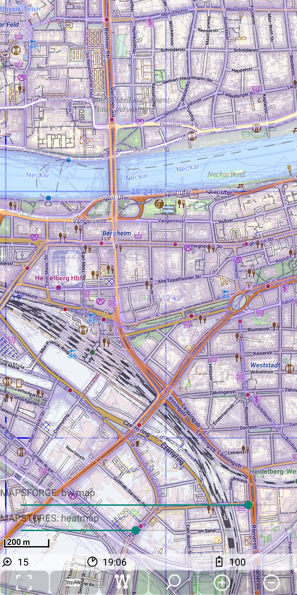

# MGMapViewer
This app is based on the [mapsforge](https://github.com/mapsforge/mapsforge) library available via github. 

## Examples
&nbsp; 

## License 
This software is licensed under [LGPLv3](./LICENSE). This app and its author do not provide any maps. Please check carefully that you use only use maps and map sources in accordance with
the license of these maps!

## User documentation
You will find the documentation on [GitHub Pages](https://mg4gh.github.io/MGMapViewer/) or directly on [GitHub](./docs/index.md).

