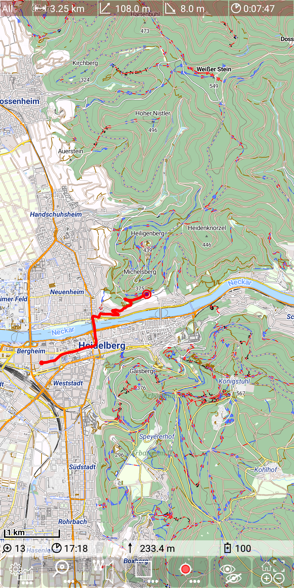
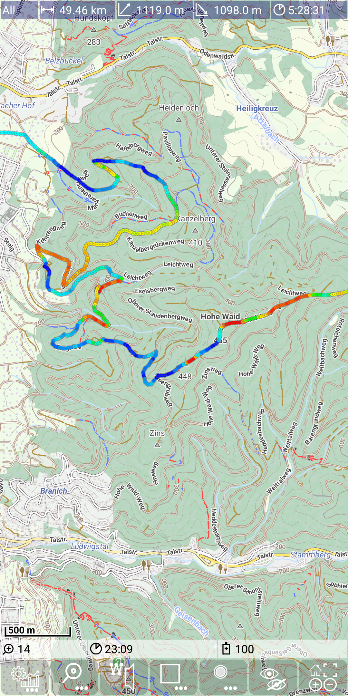
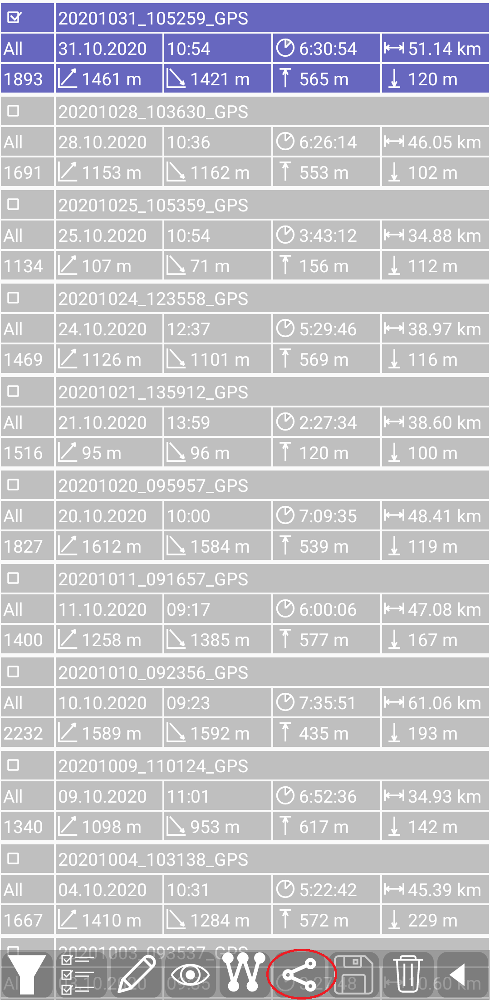

# MGMapViewer
This app is mainly intended for biking and hiking. It is based on the [mapsforge](https://github.com/mapsforge/mapsforge) library available via github.

## Plan - Record - View - Share
Based on the great offline maps from (e.g. from [openandromaps](https://www.openandromaps.org/)) you can plan, record, view and share
your tracks ... and much more.

&nbsp;&nbsp;

&nbsp;

## License 
This software is licensed under [LGPLv3](./LICENSE). This app and its author do not provide any maps. Please check carefully that you use only maps and map sources in accordance with
the license of these maps!

## User documentation
You will find the documentation on [GitHub Pages](https://mg4gh.github.io/MGMapViewer/) or directly on [GitHub](./docs/index.md).

## Download latest apk
Here you can [download](./docs/download.md) latest apk.

