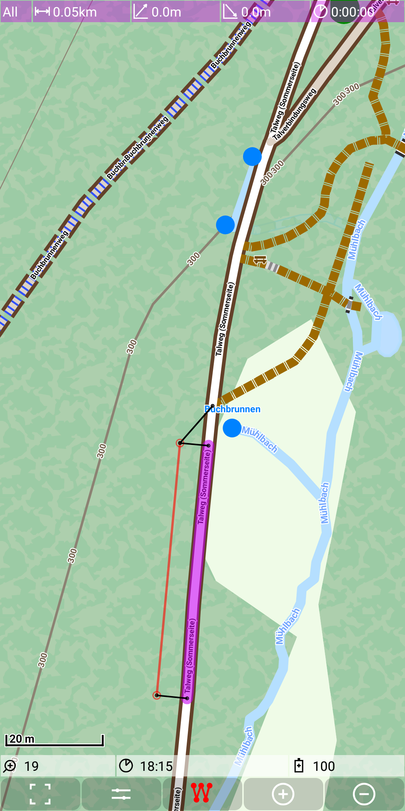
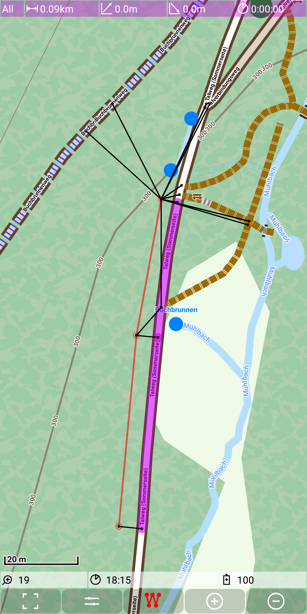
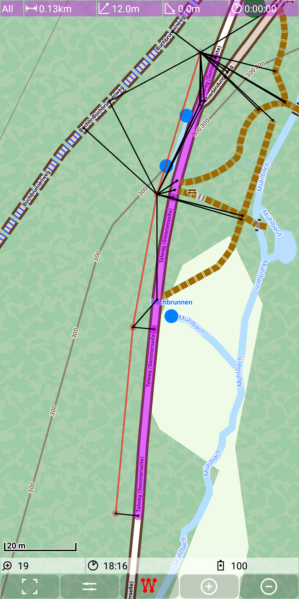
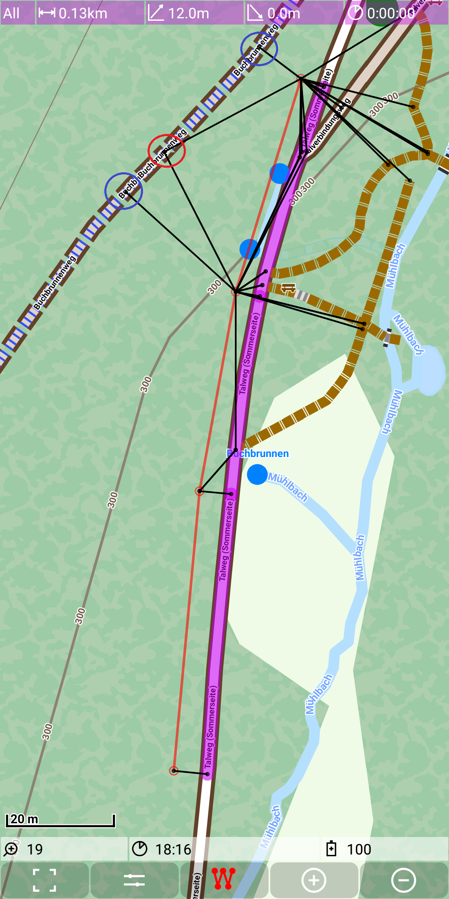

## Developer Features: approaches

The [marker track](../../MainTrackFeatures/MarkerTrack/markertrack.md) is the basis for the 
[routing](../../MainTrackFeatures/Routing/routing.md). It takes always two
consecutive points from the marker track and tries to calculate the route. 
But the routing can only operate with the graph and the marker track points are somewhere at a 
free geographical position. So we need a method to calculate from a given free maker track point
the corresponding node of the graph.

For this purpose the surrounding tile graph is analyzed, whether there is a *close* way nearby.
If so, then the closest point to the way is calculated and if this is between two existing nodes of the graph,
then there will be an extra point added in the graph. This is called approach, the closest point is the approach node.
Furthermore there might be multiple *close* ways and concequently there might be multiple approaches for one given point.

Approaches are visualized as thin black lines from the marker point to the approach point. The approach point is marked with an
additional thin black circle. Approaches are visible only, if the zoom level is at least 19 and only if they are calculated 
in the context of the route calculation. The following figure gives an examples:
 
&nbsp;

We see one marker point with a single approach and a second one with two approaches. By default the approach with the shortest distance
to the approach point will be selected for the routing. 

In the next examples we see a third and a fourth marker point with more approaches. 
 
&nbsp;
&nbsp;

Some of the approaches may look obvious. Here it is to mention that there is also an algorithm to 
ensure that a graph segment (no junction) provides only it's best approach. Because of this the 
red marked approach seem wrong, since the blue marked approaches
are better and there is no junction to be seen. The reason for those approaches is visible in the next figure - it's the tile boarder.
And since each graph segment is fully inside of a tile, this point is similar to  a junction. 

&nbsp;
&nbsp;

