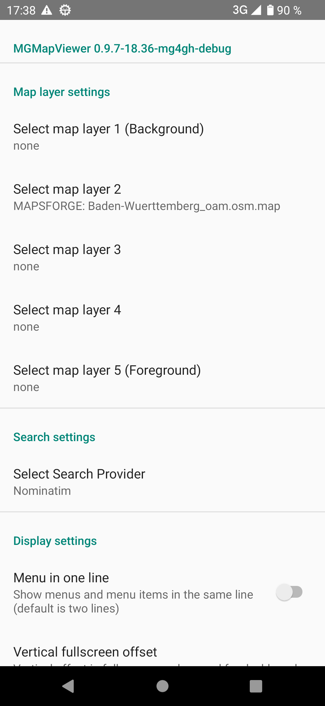
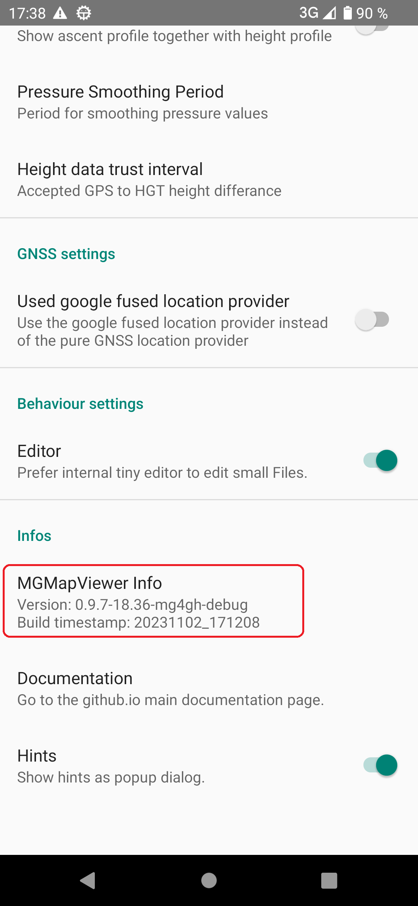
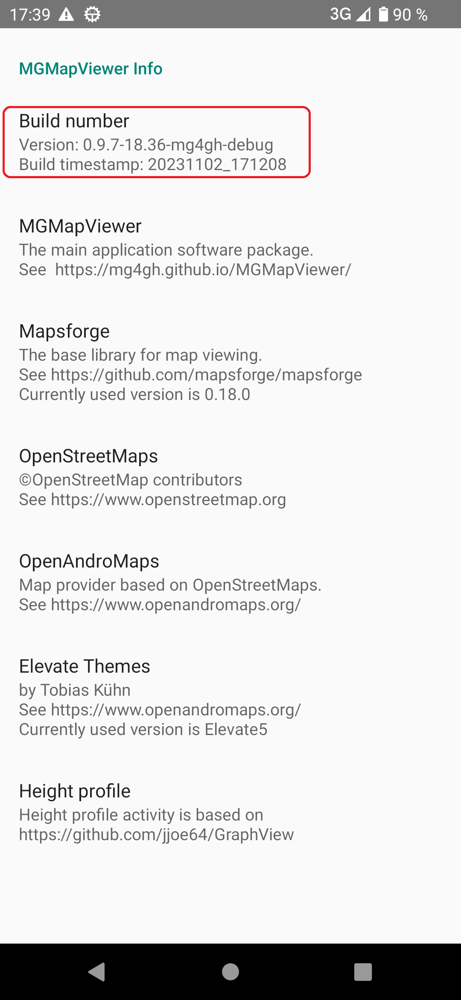
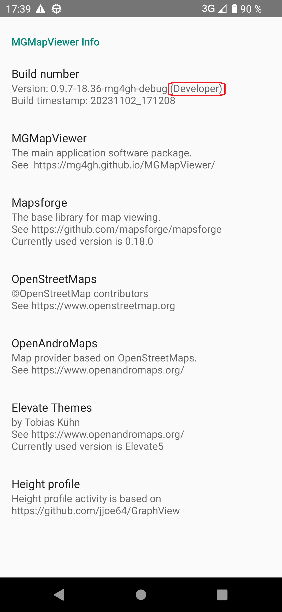
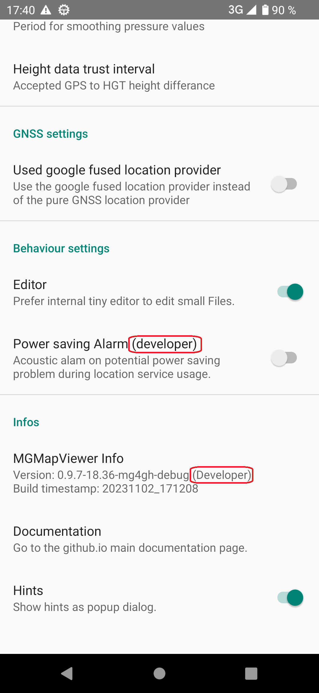

<small><small>[Back to Index](../../../index.md)</small></small>

## Developer Features: How to become a developer

Press  and  to open the settings preference screen.
Scroll down and tap on *MGMapViewer Info*. 

&nbsp;
&nbsp;

Now tap seven times on *Build number*.

&nbsp;

That's it: Now you are a developer: 

&nbsp;

Go back to the main setting preference screen. Also here the *MGMapViewer Info* entry reflects this state.
Additionally you will see some more settings marked as *developer*. These setting allow to activate the developer features.

&nbsp;

You can switch off this developer mode exactly in the same way: Tap again seven times on the *Build number* in the info preference screen. 

<small><small>[Back to Index](../../../index.md)</small></small>