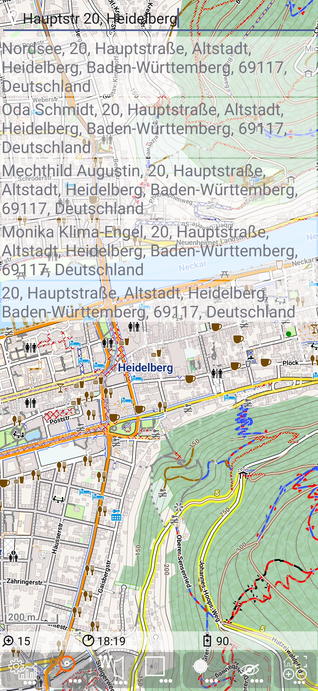
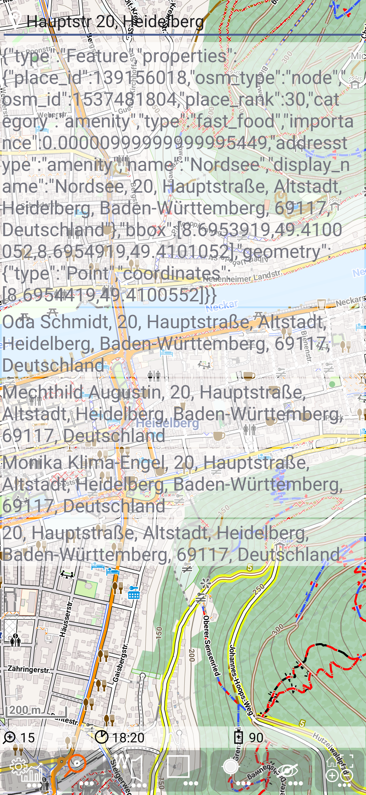

<small><small>[Back to Index](../../../index.md)</small></small>

## Developer Features: search details

Make sure that you have enabled [developer](../Developer/developer.md) mode. 

Use  + 
to open the main settings preference screen. Scroll down to the *Search settings*
preference catecory and switch on *Search details*.

For demonstration purposes we take the same search provider (Nominatim) and search term (Hauptstr 20, Heidelberg) as 
in the forward search section of the [geocode](../../FurtherFeatures/Geocode/geocode.md) feature.

&nbsp;

Now double tap on the first search result entry ... and you'll get the full json data as answerd by the search provider:

&nbsp;

<small><small>[Back to Index](../../../index.md)</small></small>