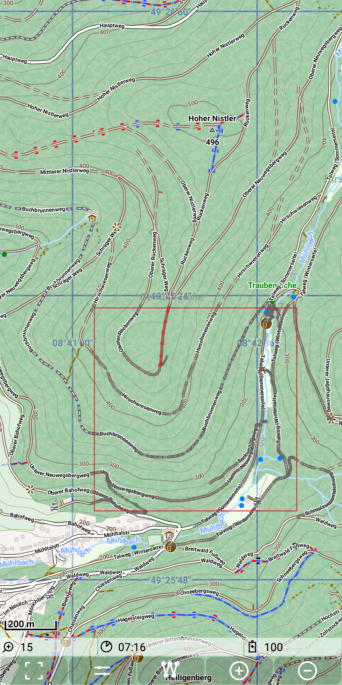
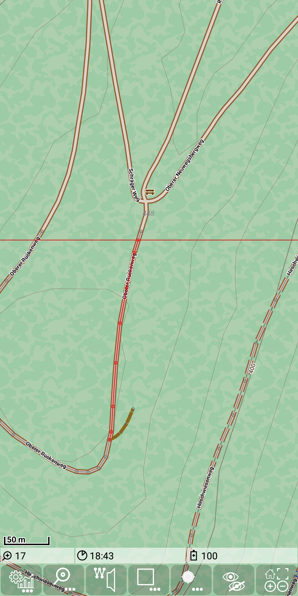

<small><small>[Back to Index](../../../index.md)</small></small>

## Developer Features: way data

This feature supports development of the
[routing](../../MainTrackFeatures/Routing/routing.md) feature. The basis of the routing algorithm is a graph. 
But if routing fails, this is related to a bug in the data or the
routing process caused the problem. To distinguish these cases it is necessary to investigate the relevant
graph data. So how to investigate a special situation, where routing doesn't provide the desired result.
For this purpose it is possible to visualize the way raw data from the tiles.

Use   +  and switch on *Way details*.

When you go back to the map, then the *way details* mode is enabled: If you tap to the marked position, you get following result:

&nbsp;
&nbsp;

The rectangle visualize the size of the current tile. All way entries of the tile are shown.
This is done with a small gray circle for each point and a thin gray connecting line.
Out of these data the [graph](../Developer/Graph.png) is setup. A graph segment can be
considered as a set of consecutive nodes each with exactly two neighbours (no junctions).
Due to the tap on the graph the tapped graph segment will be highlighted with red color.
If this segment cross the tile boarder, then the graph of the tile will be limited to this boarder.
This might require an extra node for the graph.

Zooming a few steps in, this becomes better visible:

&nbsp;

This visualization helps to understand the results of the routing process.

<small><small>[Back to Index](../../../index.md)</small></small>