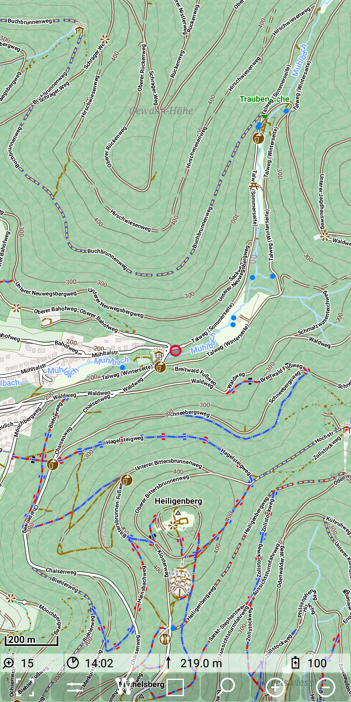
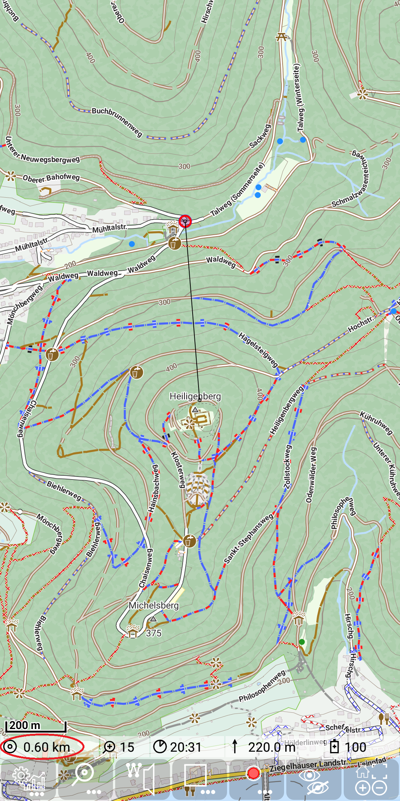

<small><small>[Back to Index](../../../index.md)</small></small>

## Further Features: beeline distance

If you have switched on GPS directly or via track recording, then you can determine the 
beeline distance (direct air distance) from your position to a point of interest.

Just move the center of the map (marked with a small black circle) to this point of interest.
There will be a thin line between your position an the center position. The air distance will be 
shown in the status line.

&nbsp;
&nbsp;

<small><small>[Back to Index](../../../index.md)</small></small>