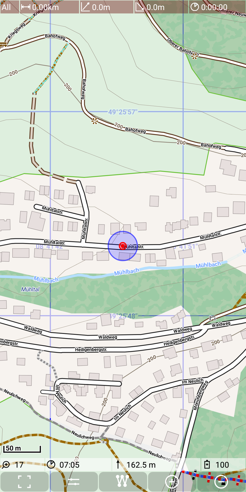
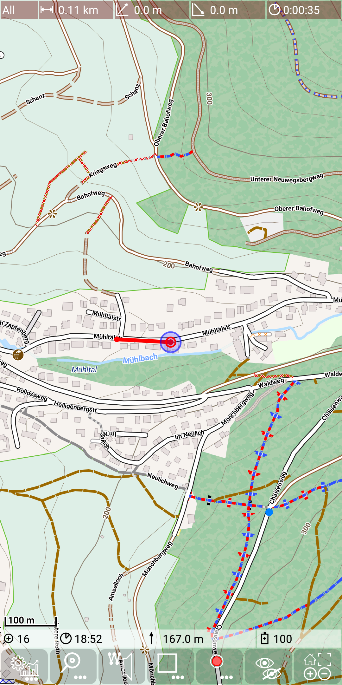
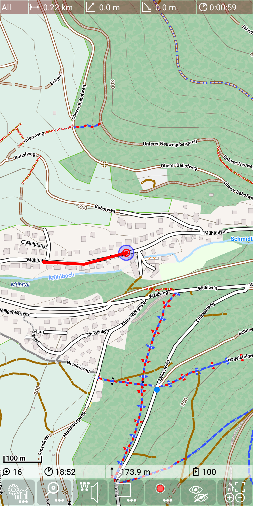
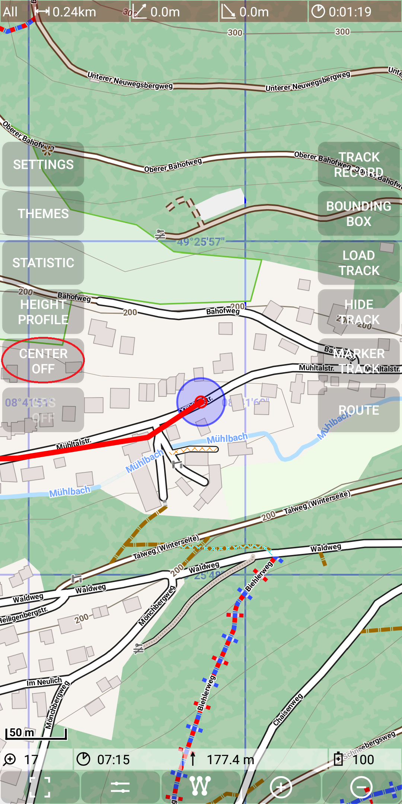
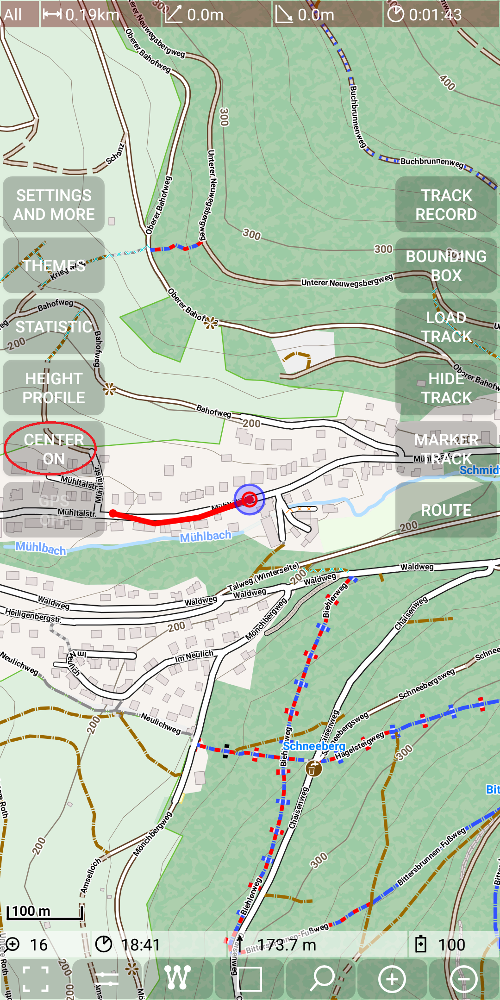

## Further Features: center automatically current gps position

By default this feature is switched on. This means that for every new GPS 
position the map will be aligned in a way that the new position is in the center
of the map.

The following sequence shows the alignment of the map with each newly detected position:

&nbsp;
&nbsp;
&nbsp;
&nbsp;

This is a usually a nice feature since it's not necessary to align the map 
manually to the current position. But if you want to check some other area
e.g. to verify the route, it might be annoying if you scroll to a certain position
and then the app jumps back due to a new location from GPS sensor. Therefore this
feature allows to disable/enable this function to automatically center GPS position.
This is done with *Menu | Center off* and 
*Menu | Center on*.

&nbsp;
&nbsp;
