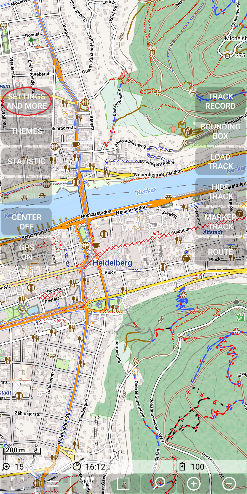
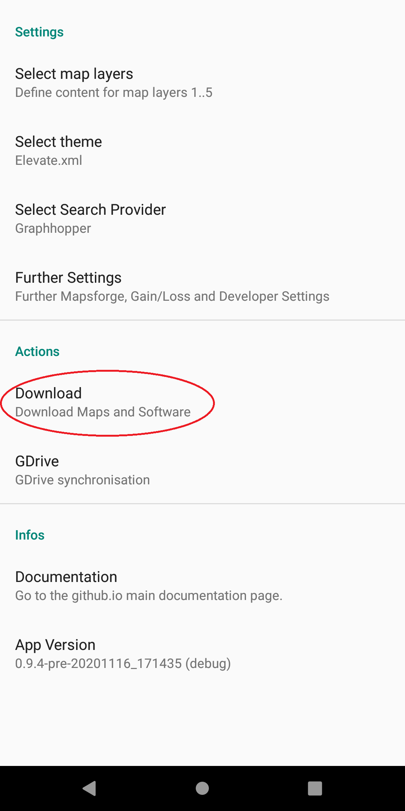
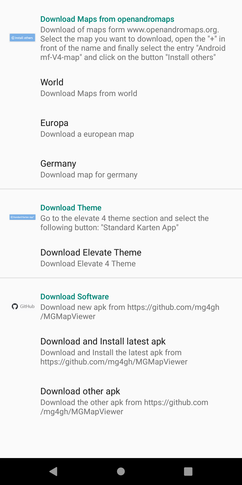
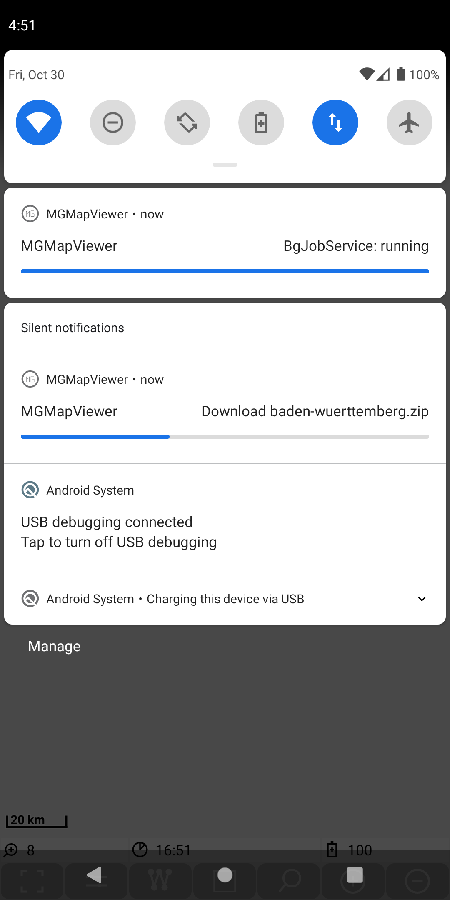

<small><small>[Back to Index](../../../index.md)</small></small>

## Further Features: Download maps and software

#### Download maps and themes

The action page to trigger downloads is accessible via
*Menu | Settings and more | Download*. It provides access to all relevant download actions.

&nbsp;
&nbsp;
&nbsp;

The map download and the theme download are already well documented in the [Getting Started](../../../GettingStarted/GettingStarted.md).

Remark: There is a notification informing about the progress of the download. Since each download runs as a background job, there is a second notification indicating
this BgJobService is running. The progress bar of this notification indicates, whether there are further not yet started background jobs. While this is not the case
for a single map download, it is helpful in case of tile downloads for mapstore instances.

&nbsp;

#### Download software

Be aware, that once you have installed a debug apk, you can update it only with a debug apk. Vice versa, if you have a release apk installed,
you need can only update with a release apk.

There are two options:
- Download and Install latest apk  
Usually you can select this option. It downloads the latest apk (debug or release) depending on your installation. And it automatically
triggers the installation process. If you run this process the fist time, you need to give the app the necessary permissions.
- Download other apk  
Then the mapsforge page (debug or release) with the latest apk versions is called. There you can manually download the required apk and install it via the file manager.

Anyway the android system
requires that you confirm the installation process. After installing you can reopen the newly installed version.

<small><small>[Back to Index](../../../index.md)</small></small>