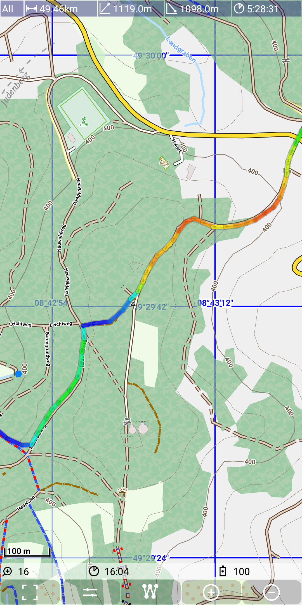
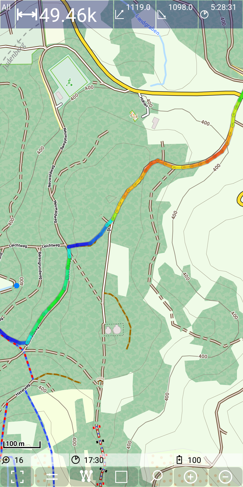
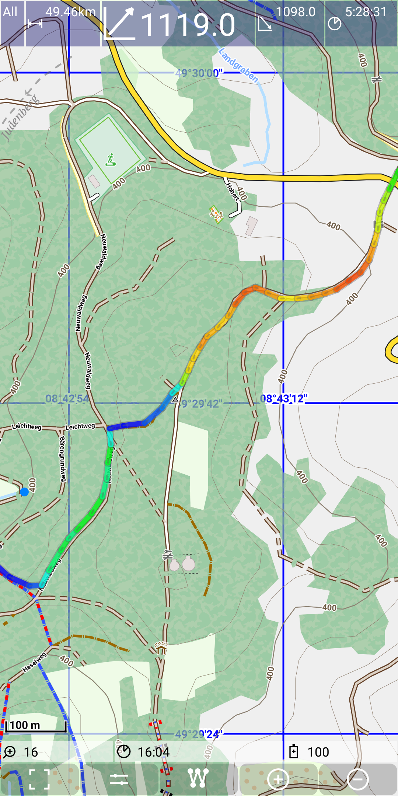
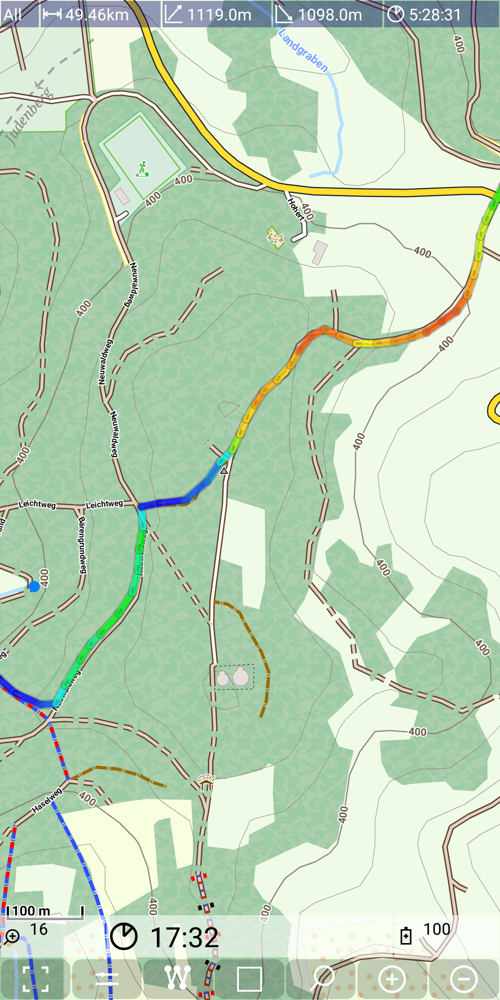

## Further Features: storage location
 
This feature allows to enlarge temporary a dashboard view entry or a status line entry. 
In both cases you just tap on the entry an the selected entry becomes enlarged for 1.5s.
You can even double or triple tap on it and the enlarge works multiple times.

So what is this feature good for? If you have perfect eyes, then for nothing. If you are 
on a mountain bike tour without reading glasses, then it may become very useful.

The following figures illustrate this:

- the first figure shows all fields in normal size,
- the second figure shows the enlarged overall distance field,
- the third figure shows the enlarged elevation gain field,
- the fourth figure shows the enlarged time field,

&nbsp;
&nbsp;

&nbsp;
&nbsp;

