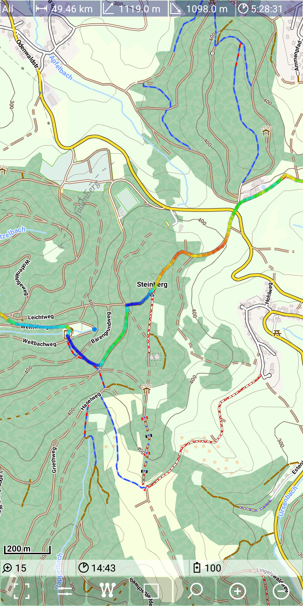
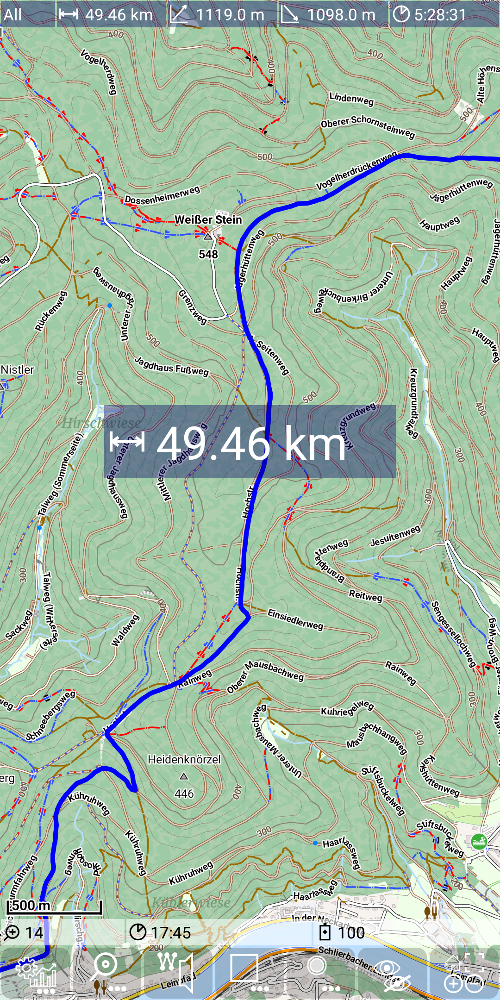
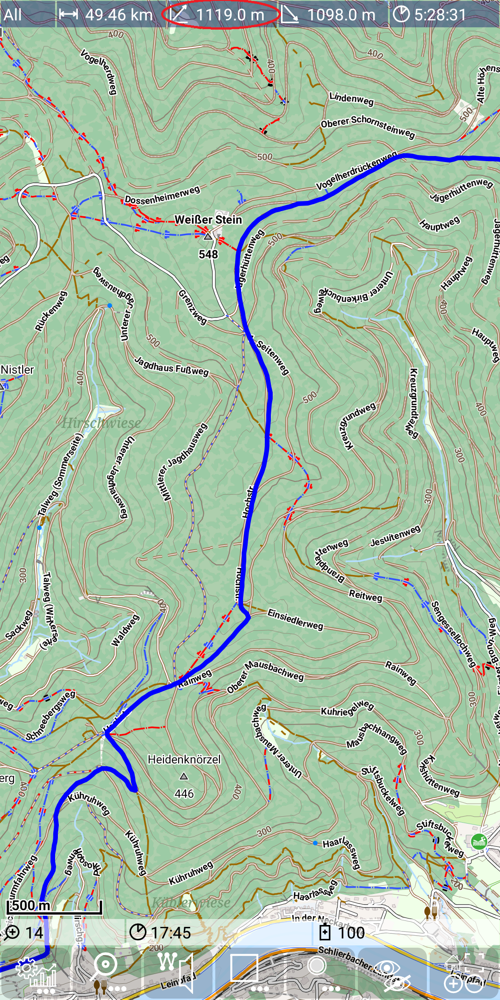
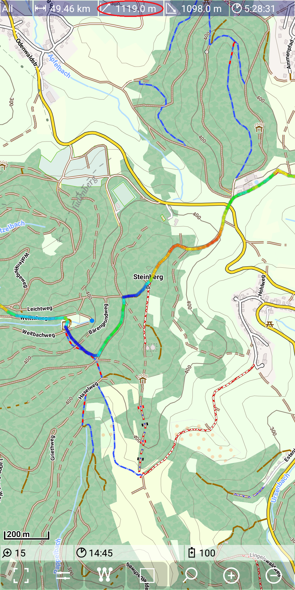
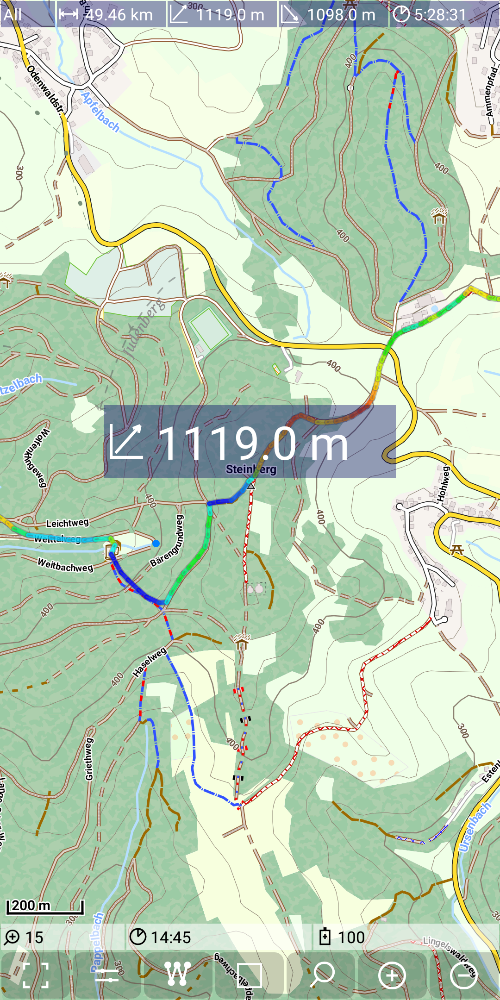
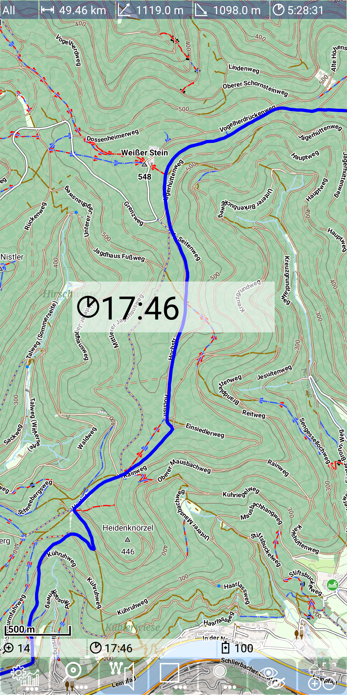

<small><small>[Back to Index](../../../index.md)</small></small>

## Further Features: enlarge temporary a view value
 
This feature allows to enlarge temporary a value of a dashboard entry or a status line entry.
In both cases just tap on the entry and this entry value will be visible for 1.5s
in a central view on the Screen.

So what is this feature good for? If you have perfect eyes, then for nothing. If you are 
on a mountain bike tour without reading glasses, then it's really valuable.

The following figures illustrate this - press on the length value and it will be enlarged.

&nbsp;
&nbsp;

Similar press on the height gain value and it will be enlarged too.

&nbsp;
&nbsp;

But this work also for the status line, e.g. for the time:

&nbsp;
&nbsp;

<small><small>[Back to Index](../../../index.md)</small></small>