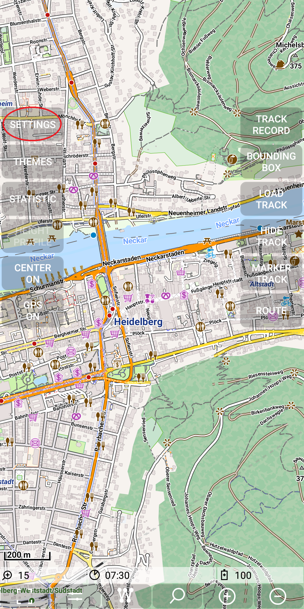
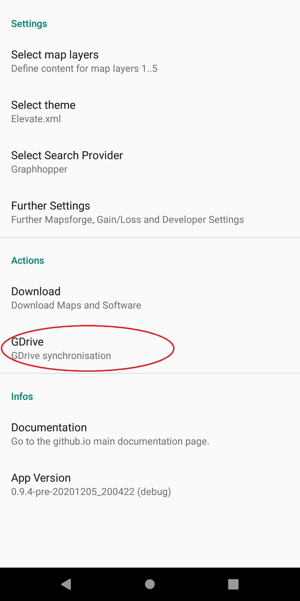
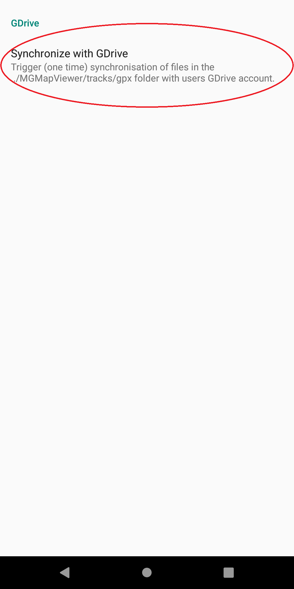
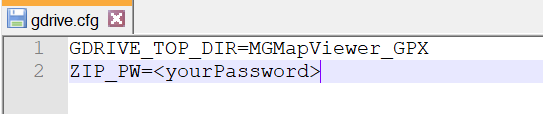
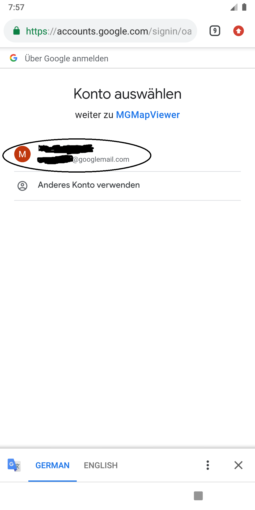
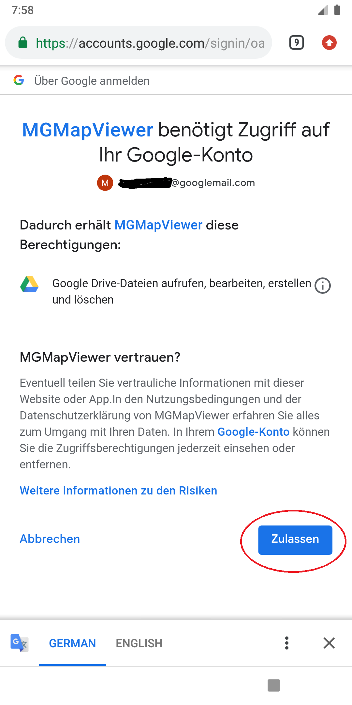
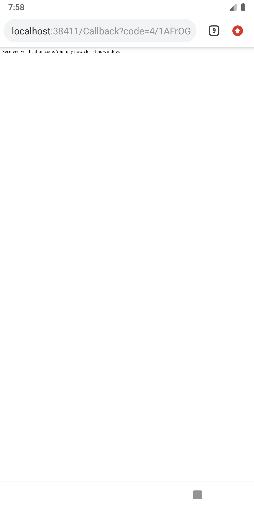
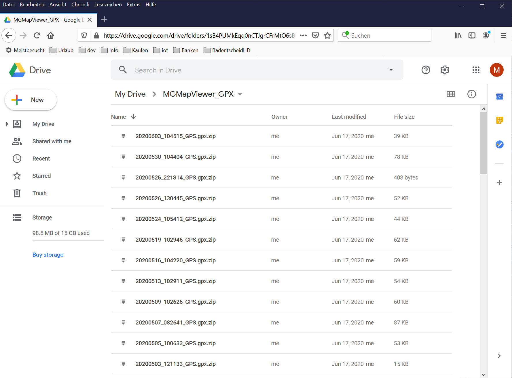

<small><small>[Back to Index](../../../index.md)</small></small>

## Further Features: GDrive Synchronisation

This feature allows the synchronisation of gpx TrackLogs with a folder on your Google Drive account.

Currently this synchronisation has to be triggered manually. 
An automatic synchronisation might be implemented in future. To start the GDrive synchronization process use
*Menu | GDrive | Synchronize with GDrive*;

The synchronisation process takes all files from the ./MGMapViewer/track/gpx
directory into account. It tries to synchronize them to a (configurable) folder on your Google Drive.
To protect your personal data each gpx file will be zip-packed with password that you 
have to configure. So on your Google Drive you will find after the synchronization all the filenames 
but with the extra extension ".zip".

The configuration file (./MGMapViewer/config/gdrive.cfg) might look like this:

The entry with the key **GDRIVE_TOP_DIR** defines the top directory on your Google Drive account that is used to store the data from 
this app. It has to be a simple foldername (no subfolders). The default for this name is "MGMapViewer".
 
The second configuration parameter **ZIP_PW** defines the password for zip encryption/decryption process.
The default value for this passwort is "geheimXgeheim!"

When you trigger the synchronisation for the first time you have to allow this app the access to your Google Drive.
(Remark: Unfortunately there is no option to get access ONLY to the configured top level directory.)

For this process a browser opens automatically and you have to confirm that this app is allowed to access your Google Drive account.
If you feel uncomfortable with this, no problem, just don't use this feature. Everything else works without limitations.

&nbsp;&nbsp;&nbsp;&nbsp;&nbsp;&nbsp;
&nbsp;&nbsp;&nbsp;&nbsp;&nbsp;&nbsp;
&nbsp;

When you got the third screen just go back to the MGMapViewer app. This procedure is only necessary, when you synchronize the first time.

Now the synchronisation process is triggered. This process creates per file, which is no available on the other side an Upload or Download job.
These jobs will run in background and there is a notification that visualize the number of open jobs.

After the synchronization process your Google Drive may look like this:

&nbsp;

So why is only gpx data synchronized?
  1. Your gpx files are the most valuable data handled in the app.
  2. All other data (maps, themes) you can download again from the original sources (e.g. openandromaps)
  3. Uploading of large maps would take a long time / it would be annoying anyway.
  
So if you have lost data on your device, you can simply restore the gpx files from your Google Drive. 
Be aware that the download job will only be successful, if your configured password fits to the zip files!

<small><small>[Back to Index](../../../index.md)</small></small>