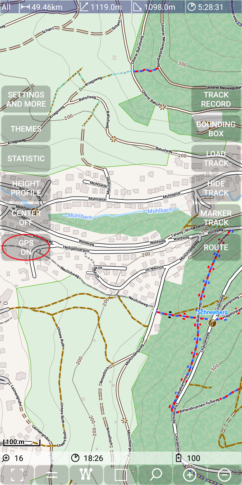
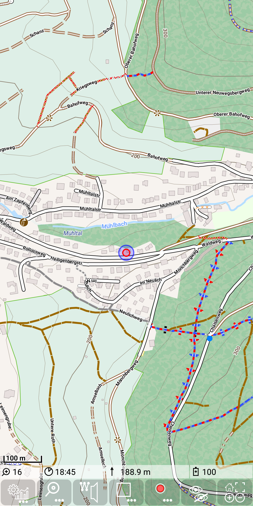
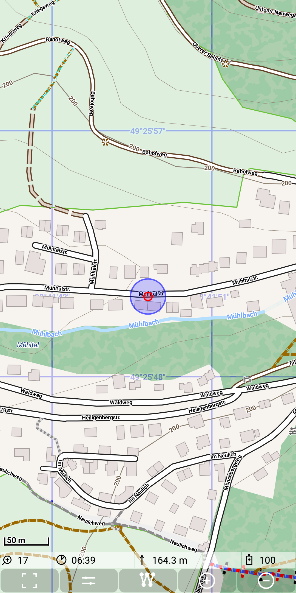
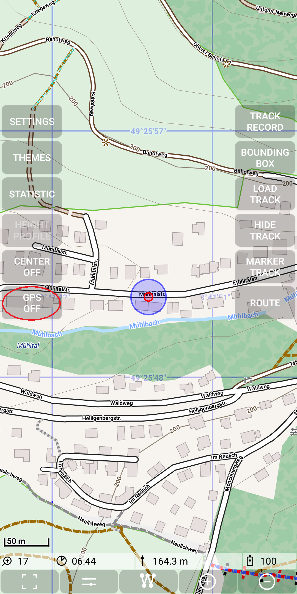
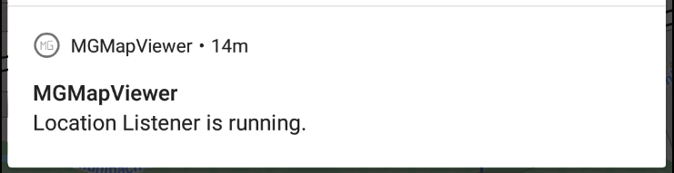

## Further Features: toggle gps

Beside the option to record a track, it is also possible to "just" switch on the GPS 
function. This can be done with *Menu | GPS on*.

&nbsp;
&nbsp;

The red circle has a fixed size with the center on the actual position.
The blue circle reflects the accuracy of the given gps measurement in meter. 
Therefore the size of the circle is changing with zooming as we ca see here:

&nbsp;

After the usage switch off this function with *Menu | GPS off*.

&nbsp;

**Note**: As long as the GPS is switched on there is a Notification active. It disappears after switching the GPS off.

&nbsp;
