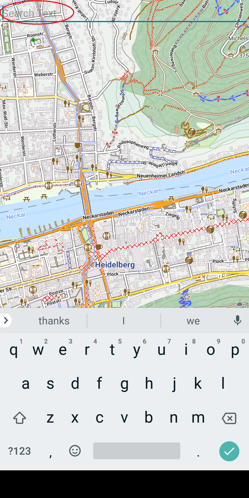
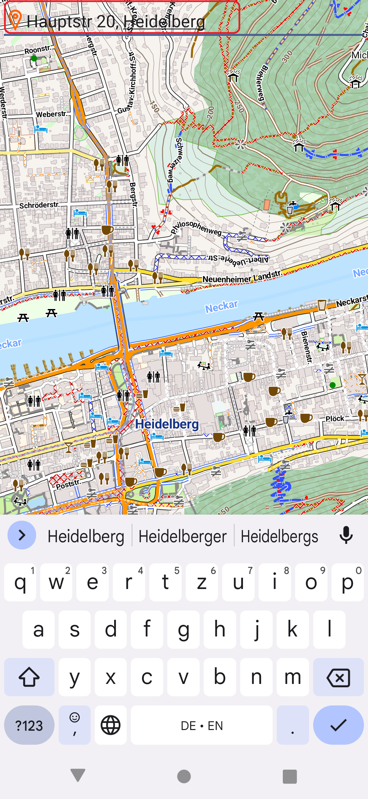
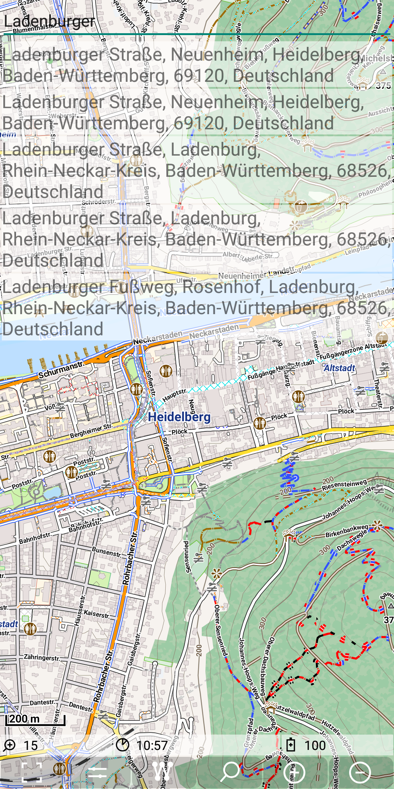
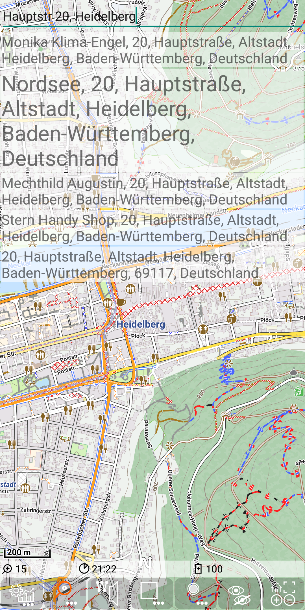
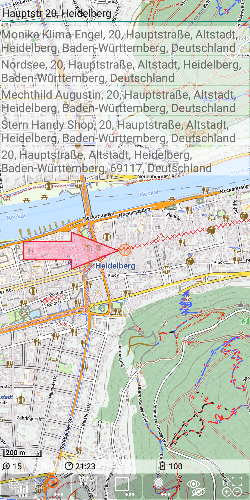
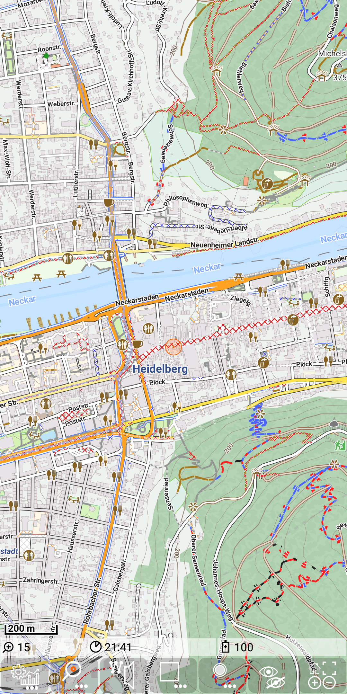
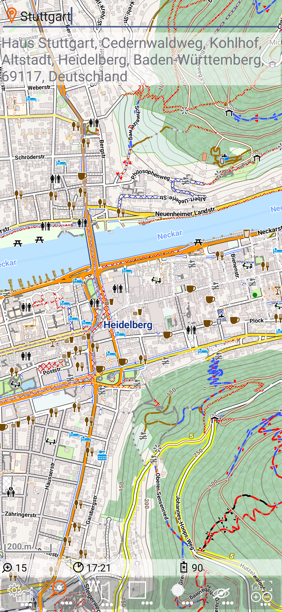
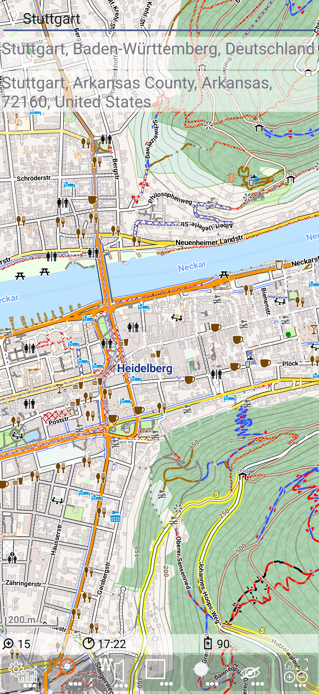
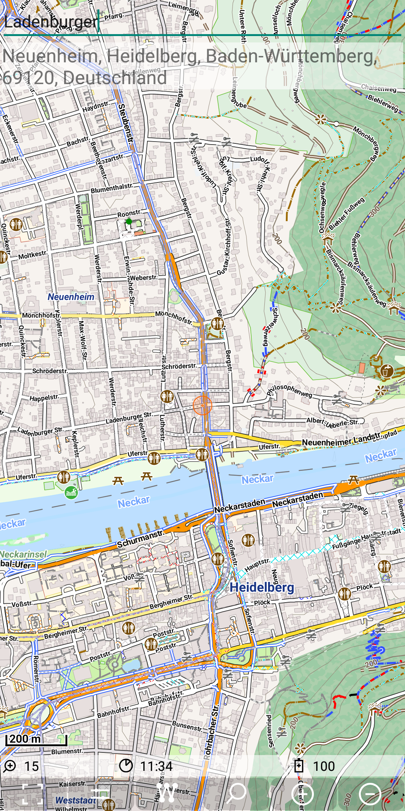

<small><small>[Back to Index](../../../index.md)</small></small>

## Further Features: geocode
 
The feature "Geocode" provides the ability to search 
- a location (lat,lon) by name (with and without a given base location) and
- an entity (address/street/amenity) by a given location.

Since google claims the search location would be the precise location (which is obviously only the case, when you do a geocode request on your current position), this transfer is by default disabled.
If you want to use it, simply install following [geocode.zip](mgmap-install://mg4gh.github.io/MGMapViewer/Features/FurtherFeatures/Geocode/geocode.zip) configuration.

So obviously there is the need of a kind of database to support this feature.
Depending on whether the geocoding search is limited to some special Points (POIs) or whether 
this search shell be able to find each address, the amount of data and the required processing power may 
vary drastically.

Nevertheless it is possible to use this feature basically in the same way independent on the geocode service 
provider. So there is an internal API to support easy addition of further geocode service providers.

Currently there the following geocode providers implemented:
- [Nominatim](./nominatim.md): the geocode service of [OpenStreetMap](https://www.openstreetmap.de/) is called [Nominatim](https://nominatim.org/)
- [Pelias](./pelias.md):  the routing engine [OpenRouteService](https://openrouteservice.org/) provides the geocode service [Pelias](https://github.com/pelias/pelias)
- [Graphhopper](./graphhopper.md): the service of [graphhopper](https://www.graphhopper.com/) provides a routing engine and a geocode API too.
- [GeoLatLong](./geolatlong.md) provider to find paces by the explicit usage of the latitude and longitude values.

For the first three providers you will need internet access! 
The abilities and the quality of the results is a wide range, up to now the graphhopper engine is my personal favorite provider.

### Configuration

For each geocode provider there has to be a corresponding <ProviderName>.cfg file in the path "./MGMapViewer/config/search/".
So if you want to be able to use all of them, you need the files 

```
     MGMapViewer/config/search/Graphhopper.cfg 
                              /Nominatim.cfg
                              /Pelias.cfg
                              /GeoLatLong.cfg
```

### State visualisation

There are three states related to the geocode feature:
- search mode on/off (switched on, if the search menu shows  or  )
- location based serach (switched on, if the icon in front of the search text is  
- show search result mode (switched on, if the search menu shows  or  )


## General Usage

The usage will be explained with the nominatim geocode provider.


Switch on the search mode with  + .

Once you have switched on search mode, there will be a text view on top of the screen, where you can enter your
search term.

&nbsp;

#### Forward search 

E.g. if your current map position is Heidelberg and you enter "Hauptstr 20, Heidelberg" and the ok Button of the soft keyboard, then
upto 5 search results will be shown.

&nbsp;
&nbsp;

Please notice, that the state of the search quick control changed from 
to , which reflects, that the search mode is switched on.

A long tap on a search result will temporary enlarge the result (just for the case you don't have the glasses with you).

&nbsp;

A short tap on a search result jump to the objects position. The "show search result mode" is automatically switched on.
This means, that the map will be centered to the position of the object. This search result position will be highlighted with an orange circle.
 
&nbsp;

Again this state change will be reflected in the search quick control (change from 
to )

If the keyboard is shown and you decide to abort your search, then you cannot directly switch off the search edit mode, since the
quick controls are hidden due to the soft keyboard. Then you can either trigger a (senseless) search via ok button to get rid of the keyboard or you can just
wait 10s. Then the keyboard will disappear automatically. Once you tap again on the input text field, the keyboard is shown again.

Switch off the search mode with  + .

&nbsp;

As you can easily notice, the search text fields (input and output) disappeared. The search result remains still visible, since the "show search result mode"
is still "on". This behaviour is also reflected in the search quick control (changed from 
to )

So you can still use the searched position for orientation and route planning.


Once you are finished with this, you can switch off the "show search result mode"
with  + .
Then the orange circle will disappear.

The search quick control will change from 
to .

If you recognize later that you need again the last search position, then you can also
switch on again the "show search result mode" ( + ).
In this case you'll get again the orange circle and the map will be aligned to this position.


#### <a name="fsls">Forward</a> search - location based and none location based

You may have noticed the  icon in front of the search text. As the state visualisation chapter explains, 
this reflects that the location based search is switched on.

Now we want to see the difference between location based seach and none location based search. For this purpose the current map position is Heidelberg and
we enter the search term "Stuttgart". With the nominatim search provider we only get one result, the "Haus Stuttgart" in Heidelberg, but we do not see the
town Stuttgart as a result. 

&nbsp;

But if we switch off location based search (with  + ),
then the result is changing and the city of stuttgart is provied as a result. Please notice also the state change in the icon in front of the search text.

&nbsp;
  

#### Reverse Search

Beside the search for a given term, there is also a reverse search possible.

Switch on again the search mode with  + .
And (just for demonstration) switch also on again the "show search result mode" ( + ).

Just make a long tap on any map position and a reverse search for this position will be triggered.
For explanation purposes tap on the previous search result position on the map.

You will get the result like this.

&nbsp;

The number and the quality of the search results may vary drastically between different search providers!

#### Geo Intents

Do you have the address of a friend stored in your device? Go to this contact and tap on the address - select MGMapViewer as the app to open with.
And (hopefully) you see this place on your phone. How does this work?  Read this chapter ... If it fails, continue reading till the end of the chapter.
 
Android allows to use "geo" intents: 
This is a list of [allowed patterns](https://developer.android.com/guide/components/intents-common#java) explained on examples:

The examples point all to the coordinates lat=49.406953 andlon=8.678815, which is the address "Kirchstr. 16, 69115 Heidelberg"
<table>
<tr><td>geo:latitude,longitude</td><td><a href="geo:49.406953,8.678815">geo:49.406953,8.678815</a></td></tr>
<tr><td>geo:latitude,longitude?z=zoom</td><td><a href="geo:49.406953,8.678815?z=15">geo:49.406953,8.678815?z=15</a></td></tr> 
<tr><td>geo:0,0?q=lat,lng(label)</td><td><a href="geo:0,0?q=49.406953,8.678815(Kulturfenster)">geo:0,0?q=49.406953,8.678815(Kulturfenster)</a></td></tr>
<tr><td>geo:0,0?q=my+street+address<br/>geo:0,0?q=my street address</td>
  <td><a href="geo:0,0?q=Kirchstr+16+Heidelberg">geo:0,0?q=Kirchstr+16+Heidelberg</a><br/><a href="geo:0,0?q=Kirchstr 16 Heidelberg">geo:0,0?q=Kirchstr 16 Heidelberg</a></td></tr>
<tr><td>geo:lat,lng?q=lat,lng<br/>
  used by WhatsApp</td><td><a href="geo:49.406953,8.678815?q=49.406953,8.678815">geo:49.406953,8.678815?q=49.406953,8.678815</a></td></tr>
</table>

The search for the address of a contact is based on the address text. If you switch on Search after tapping on the address, you'll get the address as offered
as search text, since it was the last search text that was used. If this search text finds no result, then the search cannot visualize any result. If the first 
search result points to a different place then expected, then the search result will show this point. <br/>
**Attention:** For address search it is highly recommended to switch of location based search 
(with  + ).


<small><small>[Back to Index](../../../index.md)</small></small>