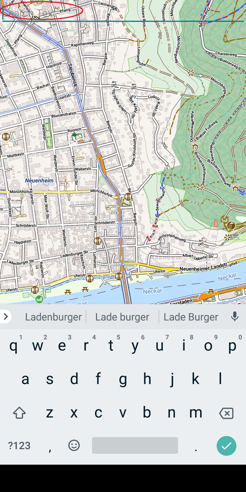
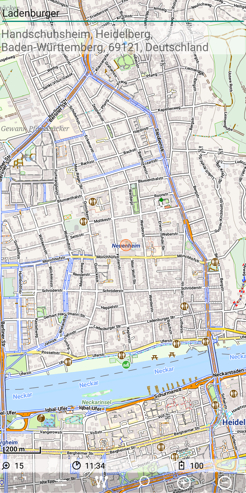

## Further Features: geocode
 
The feature "Geocode" provides the ability to search 
- a location (lat,lon) by name and
- an entity (address/street/amenity/POI) by a given location.

So obviously there is the need of a kind of database to support this feature.
Depending on whether the geocoding search is limited to some special Points (POIs) or whether 
this search shell be able to find each address, the amount of data and the required processing power may 
vary drastically.

Nevertheless it is possible to use this feature basically in the same way independent on the geocode service 
provider. So there is an internal API to support easy addition of further geocode service providers.

Currently there are 4 different geocode providers implemented:
- [Nominatim](./nominatim.md): the geocode service of [OpenStreetMap](https://www.openstreetmap.de/) is called [Nominatim](https://nominatim.org/)
- [Pelias](./pelias.md):  the routing engine [OpenRouteService](https://openrouteservice.org/) provides the geocode service [Pelias](https://github.com/pelias/pelias)
- [Graphhopper](./graphhopper.md): the service of [graphhopper](https://www.graphhopper.com/) provides a routing engine and a geocode API too.
- [POI](./poi.md): a geocode service via POI files from [openandromaps](https://www.openandromaps.org/)

For the first three providers you will need internet access! The fourth one works with a local poi database file.
The abilities and the quality of the results is a wide range, up to now the graphhopper engine is my personal favorite provider.

### Configuration

For each geocode provider there has to be a corresponding <ProviderName>.cfg file in the path "./MGMapViewer/config/search/".
So if you want to be able to use all of them, you need the files 

```
   ./MGMapViewer/config/search/Graphhopper.cfg 
                              /Nominatim.cfg
                              /Pelias.cfg
                              /POI.cfg
```

### General Usage

The usage will be explained with the nominatim geocode provider.

The geocode feature can be used via a quick control. Use it to toggle the visibility of geocode related input and output views.
Once you have pressed the quick control to enable geocode search, there will be a text view on top of the screen, where you can enter your
search term.

&nbsp;
&nbsp;

#### Forward search 

E.g. if your current map position is Heidelberg and you enter "Ladenburger" and the ok Button of the soft keyboard, then
upto 5 search results will be shown.

&nbsp;
&nbsp;

A short tap to a search result will temporary enlarge the result (just for the case you don't have the glasses with you).

&nbsp;

A long tap to a search result jump to the objects position. This means, that the map will be centerd to the position of the object.
Additionally this position will be highlited with an orange circle.
 
&nbsp;

If the keyboard is shown and you decide to abort your search, then you cannot directly toggle the quick control, since it is hided 
due to the soft keyboard. Then you can either trigger a (senseless) search via ok button to get rid of the keyboard or you can just 
wait 10s. Then the keyboard will disappear automatically. 

Once you tap again on the input text field, the keyboard is shown again.

#### Reverse Search

Beside the search for with a given term, there is also a reverse search possible. Just make a long tap on the previous search result
on the map and a reverse search for this position will be triggered. 

You will get the result as seen. A long tap on this result lets the map jump again to this position of the search result.

&nbsp;
&nbsp;

