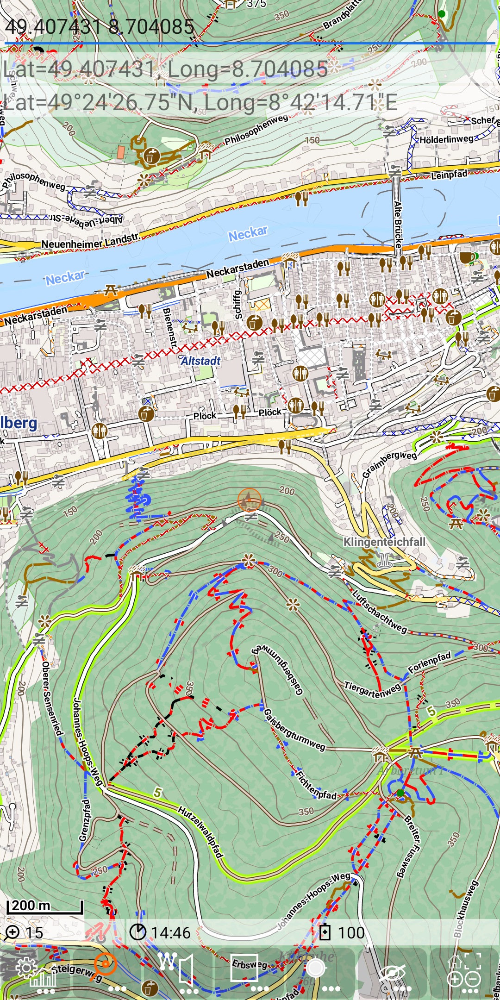

<small><small>[Back to Index](../../../index.md)</small></small>

## Further Features: geocode provider - GeoLatLong

This is a special type of geocode provider. It allows to search a place in the map by explicitly enter the latitude and longitude values.
Vice versa it can visualise those values for a given point.

Enable this feature by creation of an empty file: ./MGMapViewer/config/search/GeoLatLong.cfg

#### Forward search

Enter a value of the latitude, then a whitespace for separation and then the longitude value.

So if you enter: 49.407431 8.74085, you'll get this:

&nbsp;

Both search entries reflect the same point, just the visualisation is different. While the first entry shows
the coordinates with double values for latitude and longitude, the second entry shows both values with degrees, minutes and seconds.
With a long press the map will be centered at this point:

&nbsp;

An alternative option for the input is that the values will be given with degrees, minutes and seconds - so e.g. start
typing "49°26'2...". Since special character like "°" might be hard to find on the smartphone keyboard, you can als use d for degree,
m for minute and s for second. So the same input might also start with: "49d26m2..."

&nbsp;
&nbsp;

Entering a value that is neither compatible with the double figures nor with the degrees, minutes, seconds format will be reflected with the
latitude and longitude values of 0. E.g. the value "49d242m2..." contains 242 minutes while the valid range is 0..59.

&nbsp;

#### Reverse Search 

The reverse search provides the latitude and longitude values of a selected position.
So, e.g. a long tap an the "Riesenstein" is producing the following output:

&nbsp;

The coordinate values are visualised again with both formats (double values and degrees ,minutes ,seconds).

#### Summary

This option can be useful e.g. for geocache activities.

<small><small>[Back to Index](../../../index.md)</small></small>