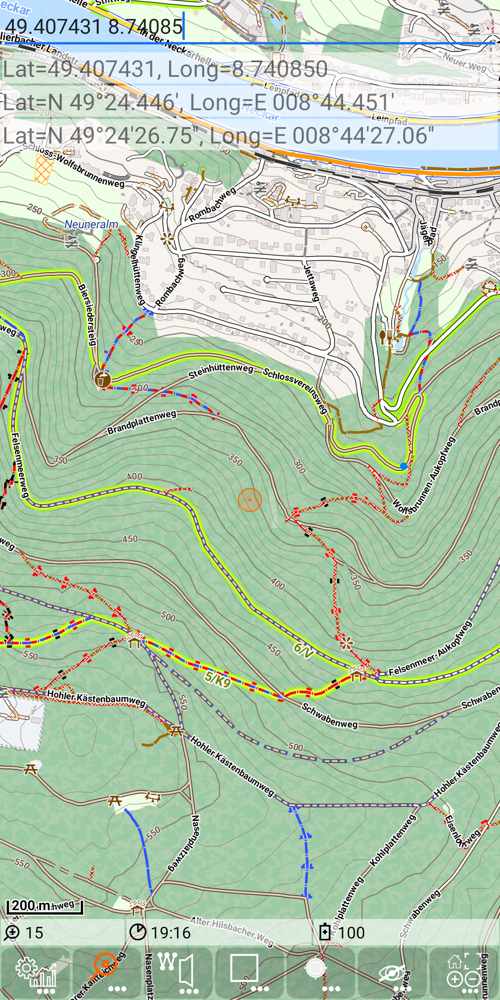
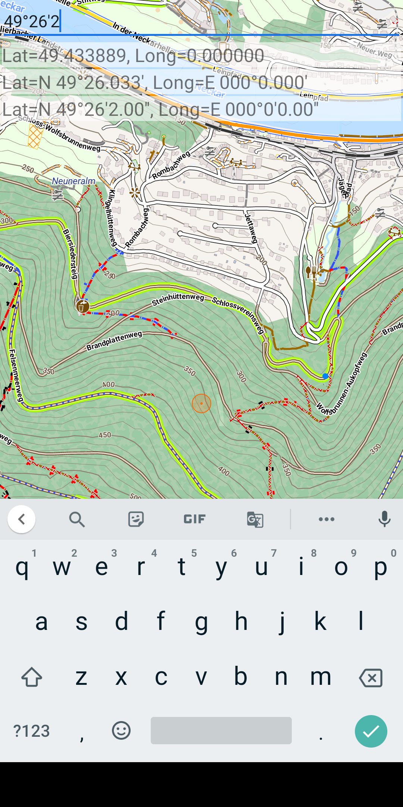
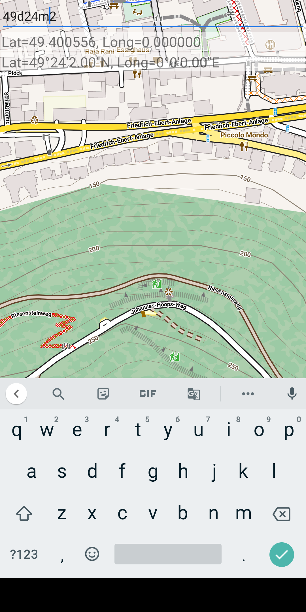
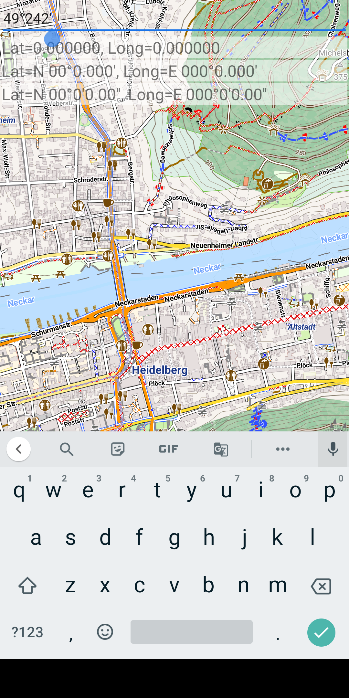
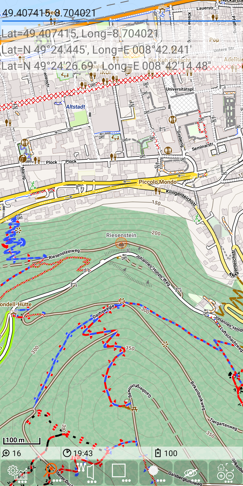

<small><small>[Back to Index](../../../index.md)</small></small>

## Further Features: geocode provider - GeoLatLong

This is a special type of geocode provider. It allows to search a place in the map by explicitly enter the latitude and longitude values.
Vice versa it can visualise those values for a given point.

Enable this feature by creation of the file: ./MGMapViewer/config/search/GeoLatLong.cfg. It may contain the setting
autoCenter (default is true), or it might be empty.
```
autoCenter=false
```

#### Forward search

Enter a value of the latitude, then a whitespace for separation and then the longitude value.

So if autoCenter is enabled and you enter: 49.407431 8.74085 in zoom level 15, you'll get this:

&nbsp;

All three search entries reflect the same point, just the visualisation is different. While the first entry shows
the coordinates with double values for latitude and longitude, the second entry shows them with degrees and minutes
including the fraction of minutes and the third entry shows latitude and longitude values with degrees, minutes and seconds.

If autoCenter property is not disabled, then this point is automatically centered. Otherwise (as with other search providers)
a long press on a search entry will trigger, that this result is centered on the map. The autoCenter is limited to the
Bounding Box of the currently loaded Maps (of a TileRendererLayer).

As the results are visualized with three formats, these formats can also be used to enter coordinates.
So values can also be given with degrees, minutes and seconds - so e.g. start
typing "49°26'2...". Since special character like "°" might be hard to find on the smartphone keyboard, you can als use d for degree,
m for minute and s for second. So the same input might also start with: "49d26m2..."

&nbsp;
&nbsp;

Entering a value that is not compatible with all three formats will be reflected with the value 0.
E.g. the value "49°242'" contains 242 minutes while the valid range is 0..59.

&nbsp;

The first format (with double values) allows value -90..90 for the latitude and -180..180 for the longitude.
The second and third format allows only positive integers less than 90 for the latitude and less than 180 for the longitude.
These degree values may have a prefix:
- **N** North - for the latitude (default)
- **S** South - for the latitude (value becomes negated)
- **E** East - for the longitude (default)
- **W** West - for the longitude (value becomes negated)

For the separation of latitude and longitude either a whitespace of a colon (or both) might be used.

#### Reverse Search 

The reverse search provides the latitude and longitude values of a selected position.
So, e.g. a long tap an the "Riesenstein" is producing the following output:

&nbsp;

The coordinate values are visualised again with all formats.

#### Summary

This option can be useful e.g. for geocache activities.

<small><small>[Back to Index](../../../index.md)</small></small>