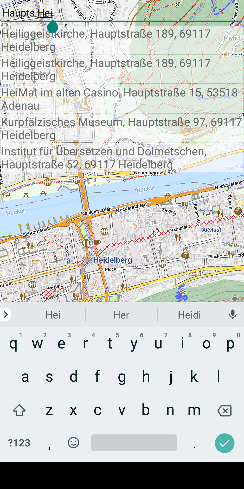
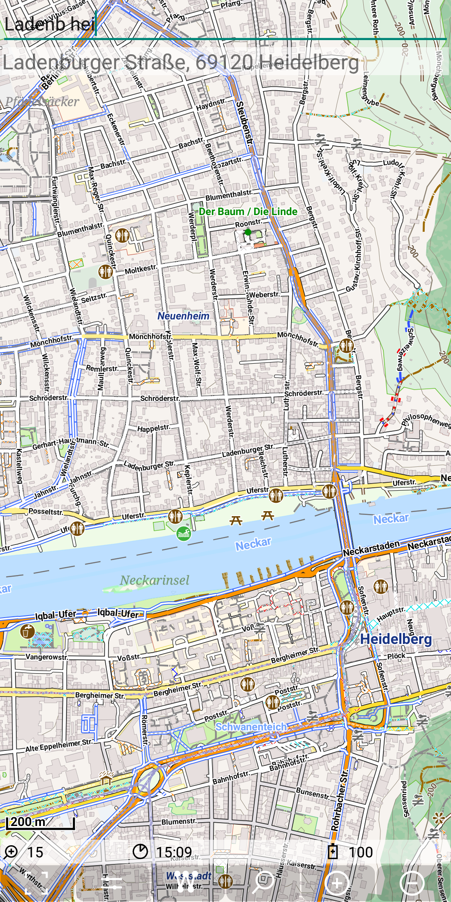
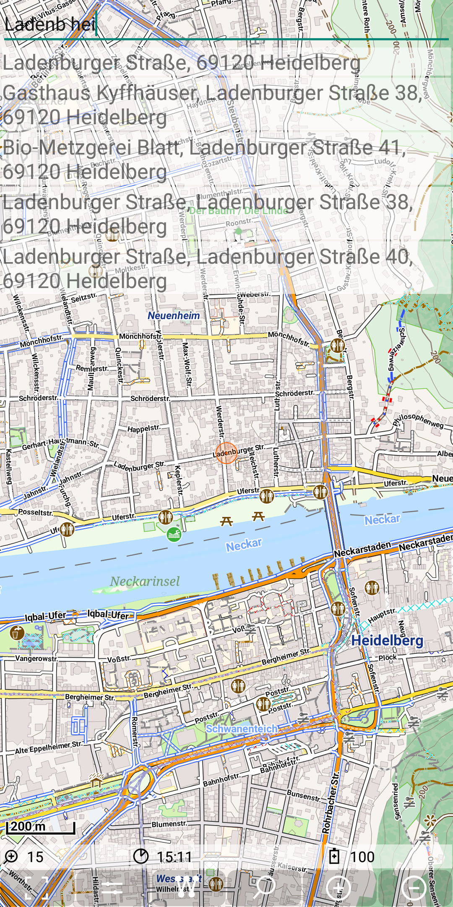

<small><small>[Back to Index](../../../index.md)</small></small>

## Further Features: geocode provider - Graphhopper

The [graphhopper](https://www.graphhopper.com/) service provides multiple services. Geocode service is
just one of them.

This service requires an API_KEY. So if you want to use it, you have to register on
[https://graphhopper.com/dashboard/#/login](https://graphhopper.com/dashboard/#/login).
You can get a token with an API_KEY for free, which allows at least several hundred Geocode requests a day.
You have to put one line in your "Graphhopper.cfg" configuration file:
```
API_KEY=<your_registered_API_KEY>
```

#### Forward search

The implementation for the Graphhopper search engine doesn't provide the option to restrict the search results to 
a given bounding box or circle. The number of result is limited to 5. The big advantage of graphhopper is that it
provides the ability for autocompletion. It even allows to autocompletion for multiple terms. 

This implementation is using the geocode API
[ https://graphhopper.com/api/1/geocode](https://docs.graphhopper.com/#tag/Geocoding-API)
As soon as the search text length exceeds 5 character, the search will be started.


So after "Ladenb" is the result

&nbsp; 

But after "Ladenb hei" the "Ladenburger" street is found.

&nbsp; 


#### Reverse Search 

Graphhopper supports also reverse geocoding. It's the same API as above, just with an additional parameter: reverse=true.
A long press on the result of the first search provides the following result:

&nbsp; 

#### Summary

The search results, forward and reverse are both with quite good quality. The autocompletion is the best I have seen up to now.

<small><small>[Back to Index](../../../index.md)</small></small>