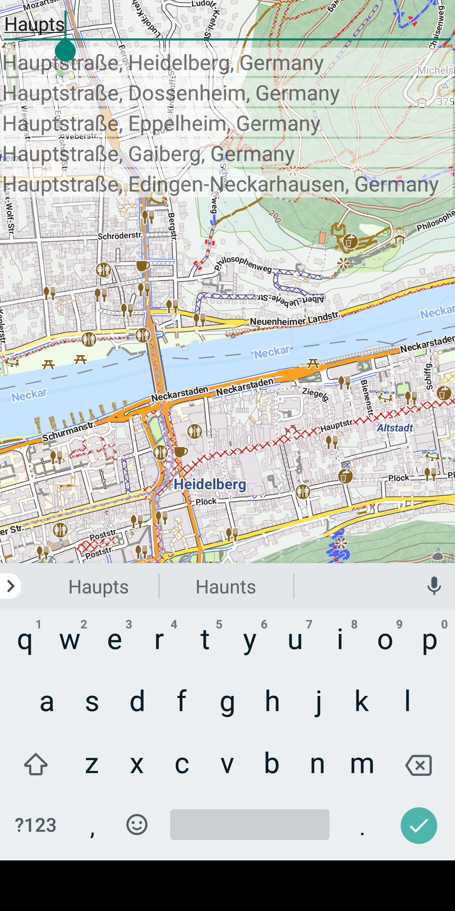
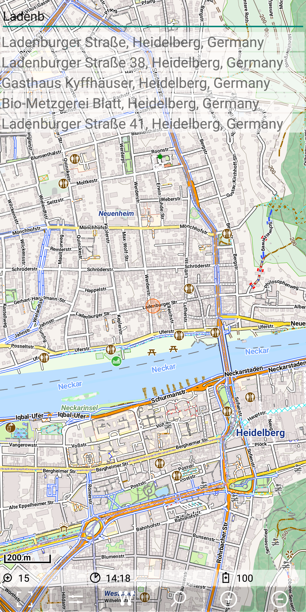

<small><small>[Back to Index](../../../index.md)</small></small>

## Further Features: geocode provider - Pelias

The routing engine [OpenRouteService](https://openrouteservice.org/) provides the geocode service [Pelias](https://github.com/pelias/pelias).

This service requires an API_KEY. So if you want to use it, you have to register on
[https://openrouteservice.org/dev/#/home](https://openrouteservice.org/dev/#/home).
You can get a token with an API_KEY for free, which allows up to 1000 Geocode requests a day.
You have to put one line in your "Pelias.cfg" configuration file:
```
API_KEY=<your_registered_API_KEY>
```

#### Forward search

The implementation for the Pelias search engine defines a circle of 50km around the current
center position of the map. Starting with zoom level 9, this size doubles with each lower
zoom level. The number of result is limited to 5.
This implementation is using the autocomplete API
[https://api.openrouteservice.org/geocode/autocomplete](https://github.com/pelias/documentation/blob/master/autocomplete.md)
As soon as the search text length exceeds 5 character, the search will be started.

If we search for the "Hauptstraße street, we don't have to type the full name.
Already the search string "Haupts" contains as the first result already the "Hauptstraße" street in Heidelberg.

&nbsp; 

Nevertheless, if you try to combine incomplete terms, e.g. "Haupts Hei" - then the search doesn't give you any result!

#### Reverse Search 

Pelias also supports the reverse geocoding search via 
[https://api.openrouteservice.org/geocode/reverse](https://github.com/pelias/documentation/blob/master/reverse.md#reverse-geocoding)

A long press on the "Haupstraße 20, Heidelberg" provides the following result:

&nbsp; 

#### Summary

The search results, forward and reverse are both with quite good quality. 

<small><small>[Back to Index](../../../index.md)</small></small>