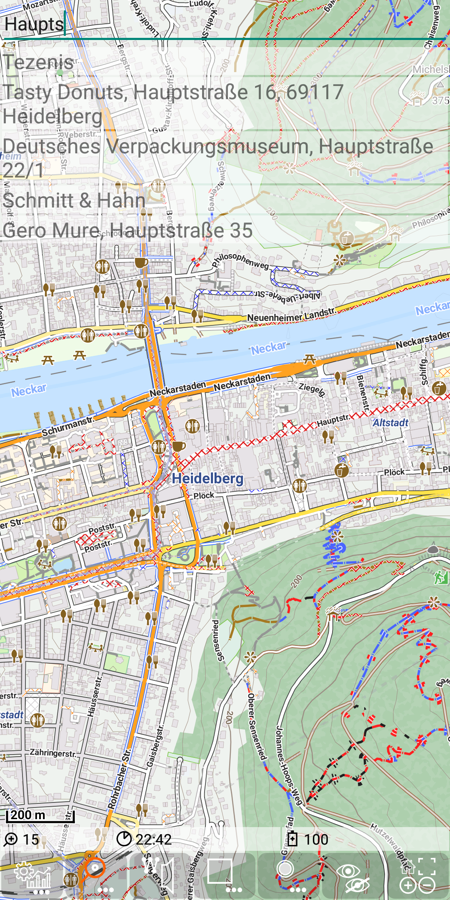
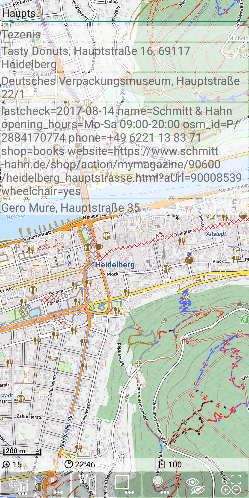
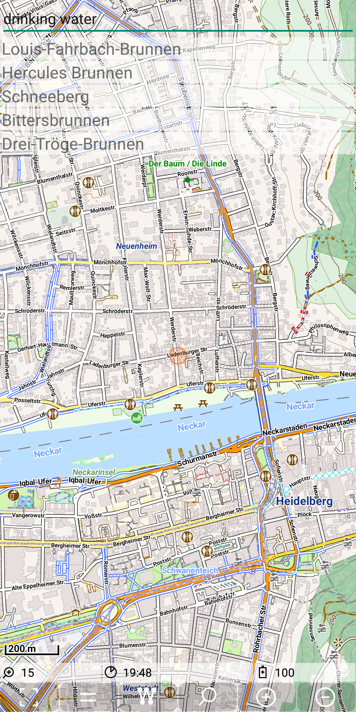
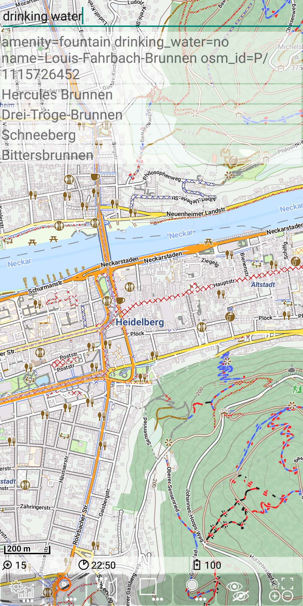
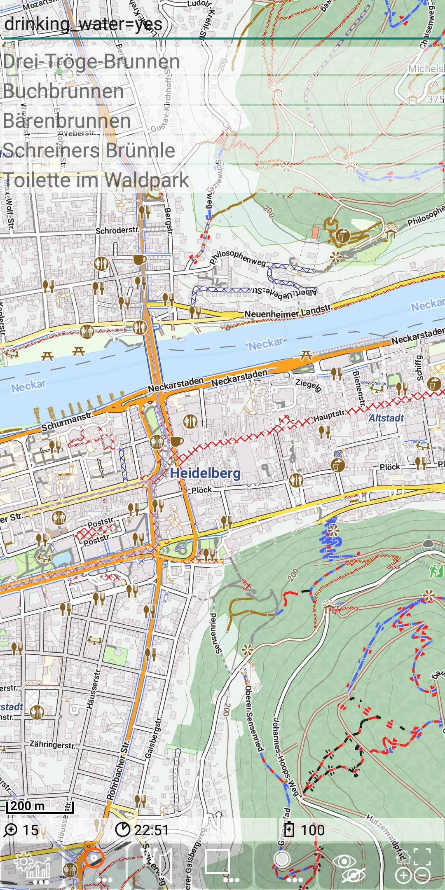
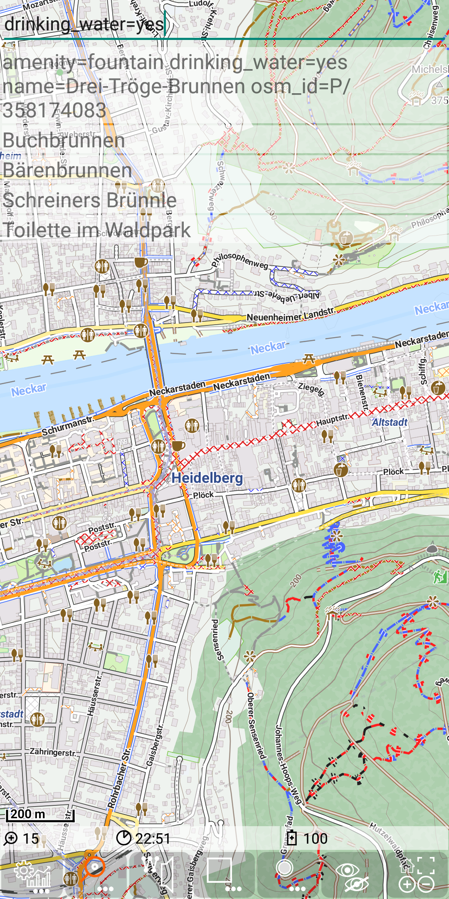
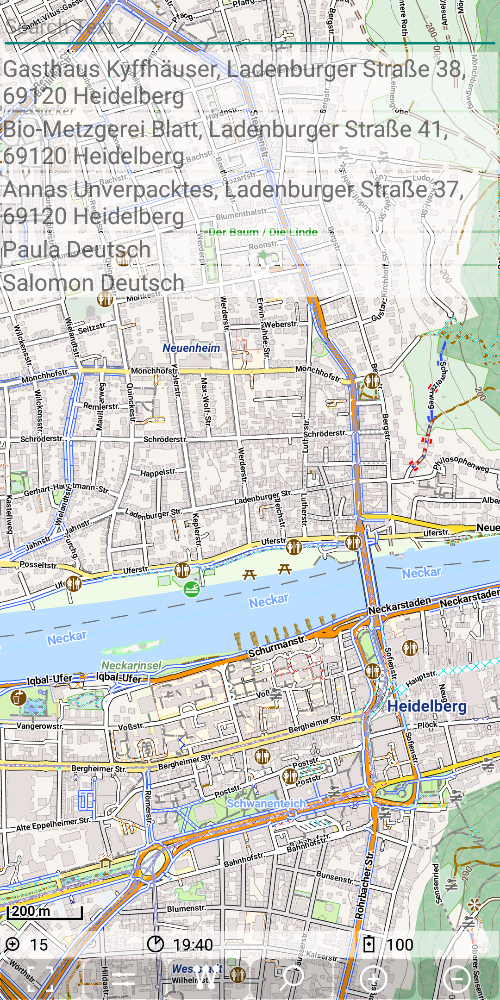

<small><small>[Back to Index](../../../index.md)</small></small>

## Further Features: geocode provider - POI

This geocode implementation is based on the POI (point of interests) files. These POI files can be downloaded together with the corresponding map files 
at [openandromaps](https://www.openandromaps.org/). Place the ".poi" in the same directory as the "mapsforge ".map" file, which is 
"./MGMapViewer/maps/mapsforge/".
Be careful to name the ".poi" file exactly as the ".map", since it will not be found otherwise.

Of cause the access to this POI file does neither need internet nor an API-KEY.
It is basically an SQLite database search. 

#### Forward search

The implementation for the POI search engine defines a square of 10km around the current
center position of the map. Starting with zoom level 11, this size doubles with each lower
zoom level. 

The POI database contains typically no entries for streets. But there are entries for a lot of shops, 
restaurants, public amenities in the POI database. The database itself contains a large data field per POI,
which contains a couple of subfields - but they are only accessible via the database by slow text-search
processing. Therefore the implementation does not realize an incremental search.

Nevertheless searching with just the starting string "Haupts" is again successful.
The result are POIs in this street. 
 
&nbsp; 

But there is another special aspect - since the database entry contains more information
then the typical result visualize. So you might wonder, why the entry "Schmitt & Hahn" match the search criteria.
By double tap on an entry this entry will be switched
to a detailed mode - which presents all data of this entry. With this information it's mostly possible to answer the 
above questions. 
 
&nbsp; 

With another double tap on this entry it will be switched back to the short version. 

An example of the story above is the case, if you are looking for drinking water.
It returns multiple "Brunnen", which are close. The double tap shows the details and
you can see the Tag "drinking_water=no".

&nbsp; 
&nbsp; 

With this knowledge you can refine the search "drinking_water=yes" and you get the results

&nbsp; 
&nbsp; 

#### Reverse Search 

The POI geocode search provider realize also a reverse search. The reverse search
defines a square of 100m around the current center position of the map.
All returned POIs in that square are sorted by their distance to the search position.
Finally the closest five entries are shown as the result.

Reverse search on the position of "Haupstr 20, Heidelberg" provides following consistent result:

&nbsp; 

#### Summary

Although especially for address search this engine is not comparable to Graphhopper or Pelias
it might be useful if there is no internet and also for some very special search
requests.

<small><small>[Back to Index](../../../index.md)</small></small>