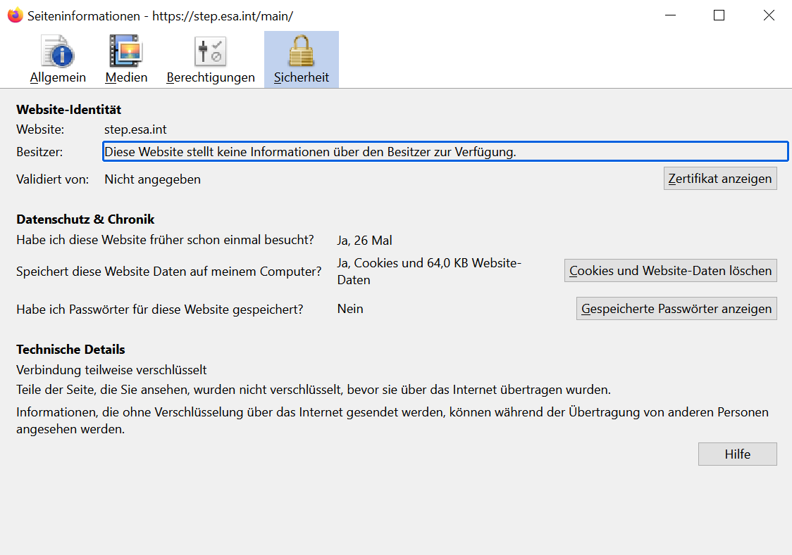
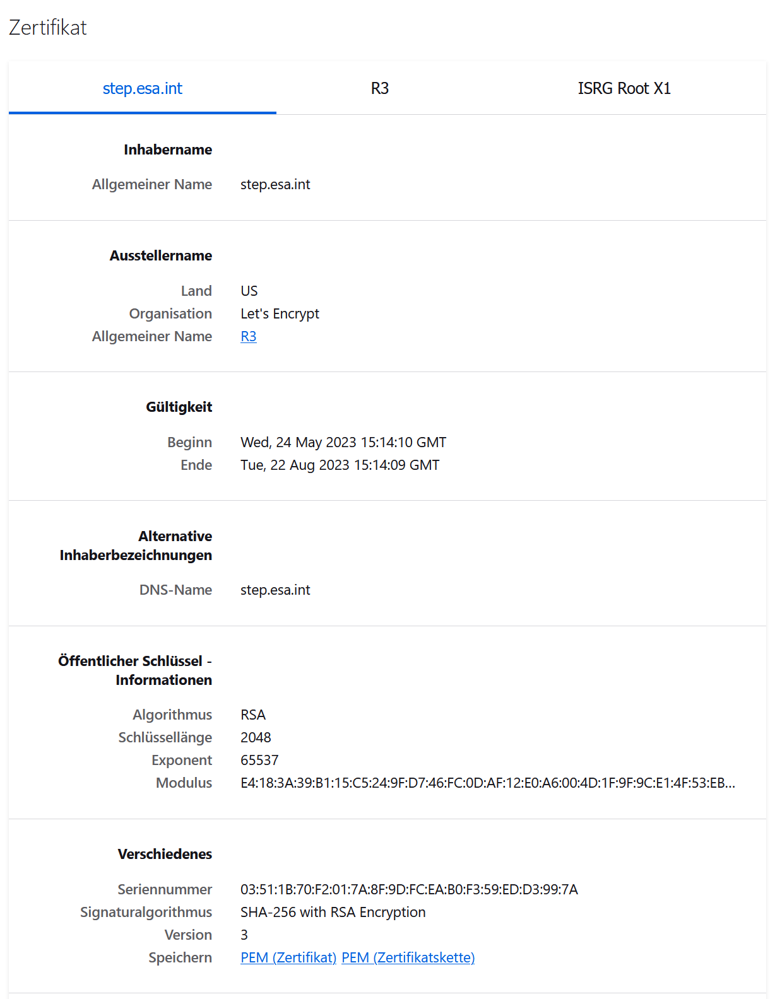

## Dwonload from step.esa.int

Here are some developer information about downloading of height data from the server "step.esa.int".
The current implementation tries first a https access and if this fails, it executes a retry with a http access.

In principle this server allows both "http" and "https" access. Unfortunately both has caused some trouble in the past. 

1. HTTP access  
  This requires in the resource file network_security_config.xml a section: 
 ```
     <domain-config cleartextTrafficPermitted="true">
        <domain includeSubdomains="true">step.esa.int</domain>
    </domain-config>
 ```

&nbsp;&nbsp;&nbsp;&nbsp;&nbsp;&nbsp;&nbsp;&nbsp;Still it was observed, that the HTTP request delivers a 404 - File not found answer.

2. HTTPS access  
  Unfortunately I got en error "javax.net.ssl.SSLHandshakeException: java.security.cert.CertPathValidatorException: Trust anchor for certification path not found." 
  The workaround for this is to add the intermediate and root certificate to the app. In detail this works as followed:  
  Open in Firefox the page "https://step.int.esa/" - open the lock symbol in front of the url, and then goto further information.  
    
  Click on "Zertifikat anzeigen" - then you get a page like this:  
     
   Here you can save the server certificate (step.esa.int), the intermediate cetificate (R3) and the root certificate (ISRG Root X1). Save the 2nd (to res/raw/r3.pem) and 3rd (to res/raw/isrgroot.pem) 
to the res/raw folder and add in you network_security_config.xml a section:
```
    <domain-config cleartextTrafficPermitted="true">
        <domain includeSubdomains="true">step.esa.int</domain>
            <trust-anchors>
                <certificates src="@raw/r3"/>
                <certificates src="@raw/isrgrootx1"/>
                <certificates src="system"/>
            </trust-anchors>
    </domain-config>
 ```

