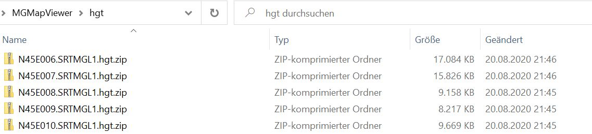

<small><small>[Back to Index](../../../index.md)</small></small>

## Further Features: height data

This app is able to handle offline height data from ".hgt" files in various situations. These height data will be added to all points. 
Especially they are useful in case of route planning, since you get immediately in idea about the accumulated  height gain of the route and as well they are the 
basis for the visualisation of the [height profile](../HeightProfile/hprof.md) of a route.

Since gain/loss calculation based on GPS data is very faulty, this calculation prefers meanwhile hgt data over gps data (relevant, if device has no barometer). 

## Height data sources

### Sonny

This private project provides data, mostly based on lidar technology. For details see the [page of the Sonny](https://sonny.4lima.de/).
This app currently using the Europe v22 data from Sonny. To make this data available to the app, there is a copy of it on a [github hgt data](https://github.com/mg4gh/hgtdata) project.

### ESA 

The ESA provides hgt data created by the [SRTM](https://en.wikipedia.org/wiki/Shuttle_Radar_Topography_Mission) (Shuttle Radar Topography Mission) project.
Simply go to http(s)://step.esa.int/auxdata/dem/SRTMGL1/ , all files like "N54E014.SRTMGL1.hgt.zip" are available for HTTP download.

## Download

After you assign a newly downloaded map to a visible layer, you will be asked whether to download corresponding height data.
If you confirm the download, that's all.

Alternatively you may use the [hgt grid layer](../../MainMapFeatures/MapGrid/hgt.md) that provides an easy overview about the local available height data.
The Section [Downloading of missing hgt data](../../MainMapFeatures/MapGrid/hgt.md#download) describes the download of missing hgt data in detail.

The automatic download prefers data from Sonny, and takes ESA data as fallback. If ever you do an manual download of height data,
place these downloaded hgt files as they are in the directory "MGMapViewer/hgt" (do **not** unzip them).

### Developer information

Here is some more information for [developer](./developer.md).

<small><small>[Back to Index](../../../index.md)</small></small>