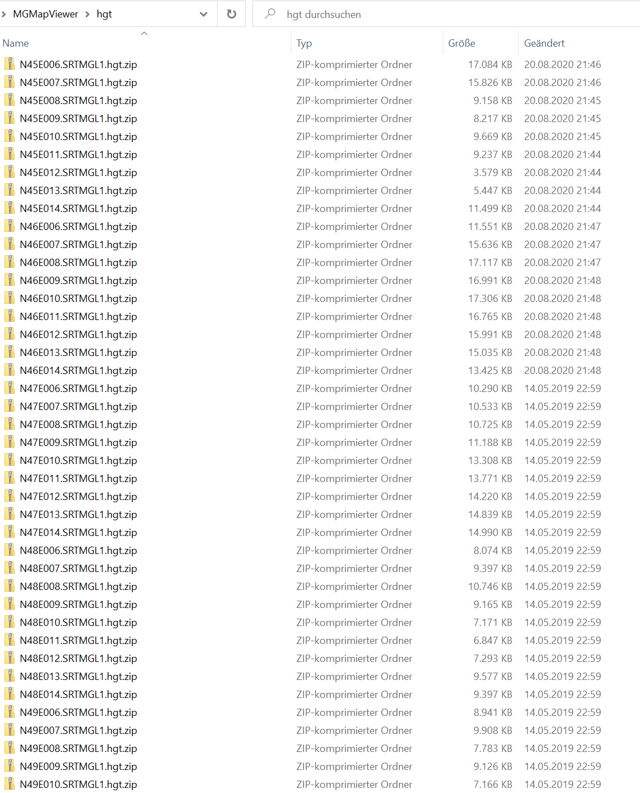
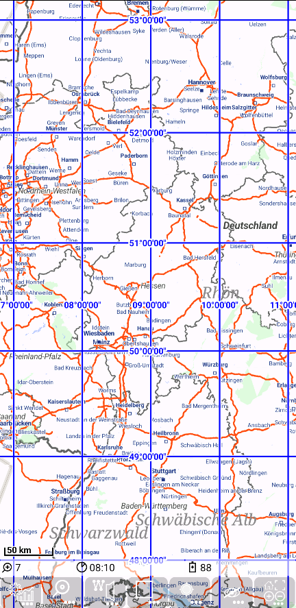

<small><small>[Back to Index](../../../index.md)</small></small>

## Further Features: height data

This app is able to handle offline hight data from ".hgt" files in various situations. These .hgt based height data will be added to all points. 
Especially they are useful in case of route planning, since you get immediately in idea about the height meters of the route and as well they are the 
basis for the visualisation of the [height profile](../HeightProfile/hprof.md) of a route.

These ".hgt" files can be downloaded form the <a href="https://lpdaac.usgs.gov/products/srtmgl1v003/">SRTMGL1</a> project. This project provides height
data with a raster of 1 arc second, which is roughly 30m. For more details see the project page.

If you want to download these ".hgt" data, you need to register via "https://urs.earthdata.nasa.gov/home".
Once you are registered and logged in, you can select in your profile the menu item
<span style="color:gray">*Application/Authorized Apps*</span>. Go to the end of the list and check
<span style="color:gray">*Show applications that can be auto-authorized*</span>. Then select the
 entry <span style="color:gray">LP DAAC Data Pool</span> and click the **Authorize** butten.  

Now you can download e.g. with the link
<span style="color:gray">https://e4ftl01.cr.usgs.gov/MEASURES/SRTMGL1.003/2000.02.11/N54E014.SRTMGL1.hgt.zip</span>
the .hgt file for N54E014. Each file provides data for a rectangle with one degree of latitude and one degree of longitude.
Place these downloaded hgt files as they are in the directory "./MGMapViewer/hgt" (do **not** unzip them).

So this folder might look like this:  


But which (latitude and longitude) hgt files do you need for you personal use? You can easily use a [grid layer](../../MainMapFeatures/MapGrid/mapgrid.md) to find out, which 
hgt files do you need.
Use a properties file (named e.g. `hgt.properties` ) like this:

```
zoomLevel5=1.0
zoomLevel6=1.0
zoomLevel7=1.0
zoomLevel8=1.0
zoomLevel9=1.0
zoomLevel10=1.0
zoomLevel11=1.0
```

and place it to ./MGMapViewer/maps/mapgrid. Select this layer on top of a mapsforge layer - then you can see, which hgt file you need for which area:




<small><small>[Back to Index](../../../index.md)</small></small>