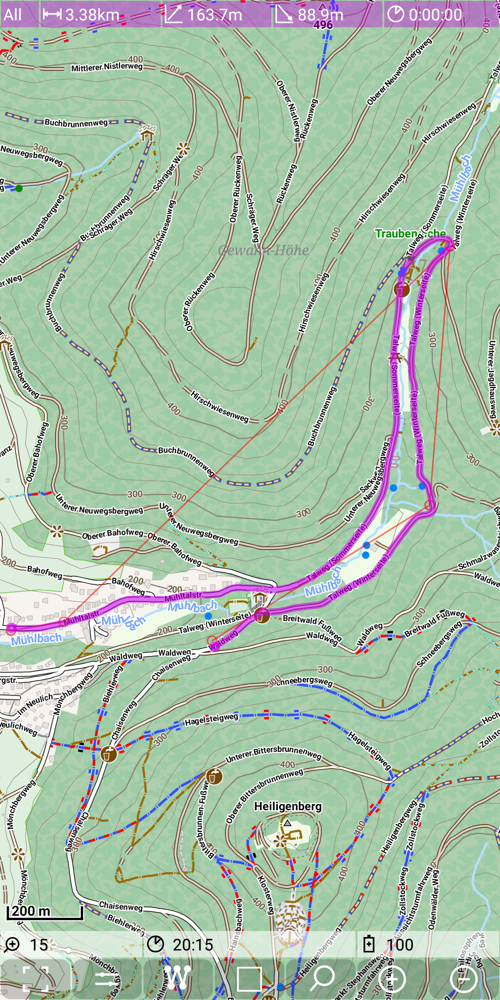
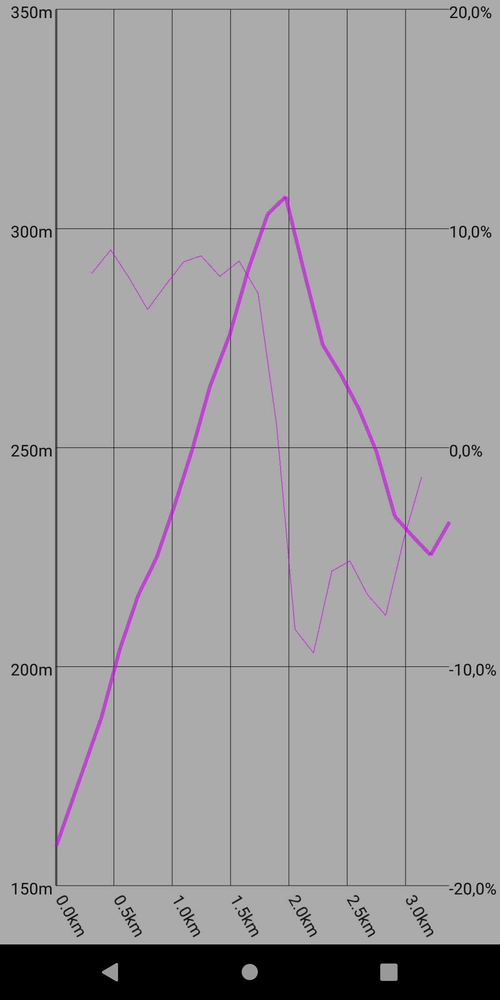

## Further Features: height profile

To enter the statistic view use *Menu | Height Profile*.

&nbsp;

The following figure shows an example of the height profile view:

&nbsp;

As it is visible in the example, the height profile can visualize multiple tracks at the same time.
For coloring please check the [track definitions](../../track.md). 

There is one more option: you can toggle on an ascent profile as an addition to the height profile.
To do this toggle the setting *Menu | Settings and more | Further Settings | Ascent height profile*.

&nbsp;
&nbsp;
&nbsp;

With this setting switched on the route as seen on the first picture provides a height graph
(thick purple line) and an ascent graph (thin purple line)

&nbsp;
&nbsp;

Be aware of the second scale on the right side, which is valid for the ascent graph.