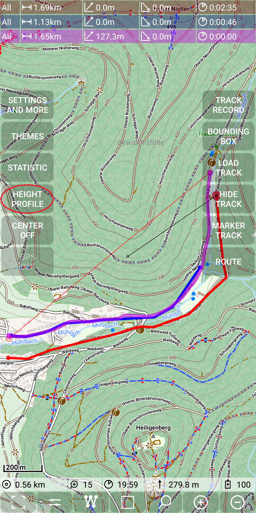
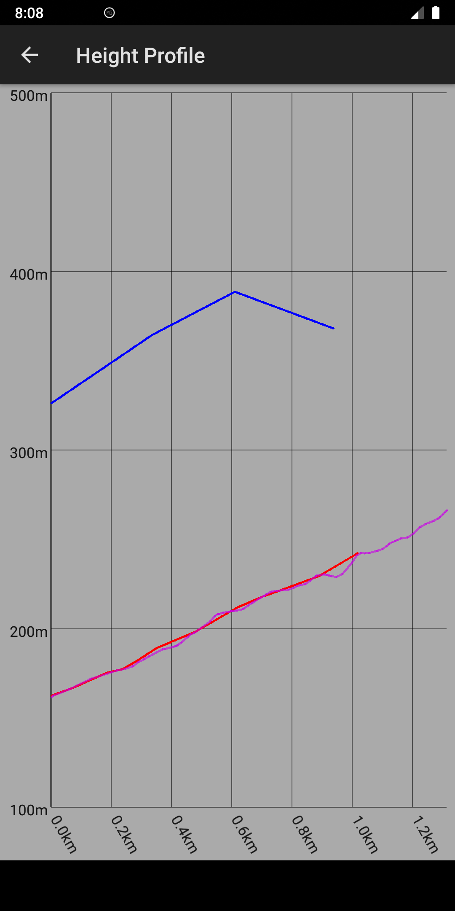
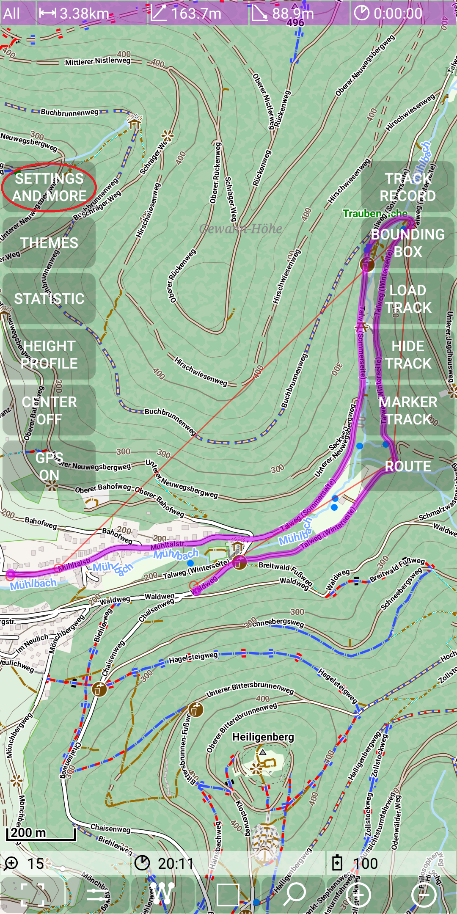
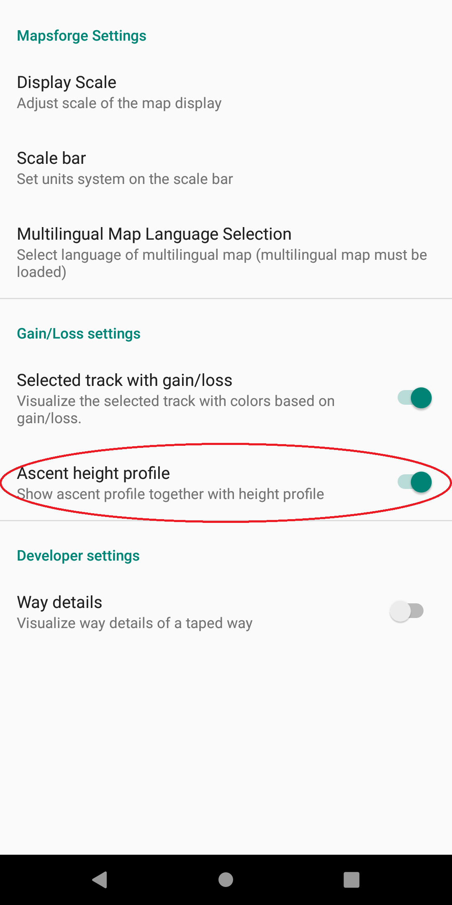
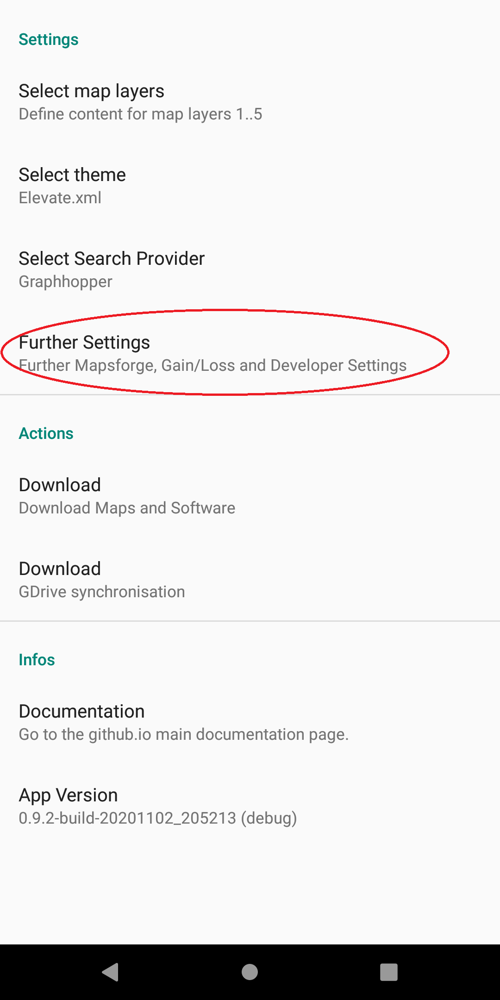

<small><small>[Back to Index](../../../index.md)</small></small>

## Further Features: height profile

#### Height profile

For illustration purposes we have here a recording track, a route track and a selected track:

&nbsp;

To enter now the height profile activity use
 + .

As the result we see the height profiles of all three tracks. For coloring please check the [track definitions](../../track.md).

&nbsp;

#### Ascent profile

For the next example we take the following start situation: We have a route track with following height profile:

&nbsp;
&nbsp;

Now you can toggle on an ascent profile as an addition to the height profile (
 +  +
 *Ascent height profile*).

Now if we open the height profile activity
 + ), then we see
the same height graph (thick purple line) and additionally an ascent graph (thin purple line)

&nbsp;

Be aware of the second scale on the right side, which is valid for the ascent graph.

<small><small>[Back to Index](../../../index.md)</small></small>