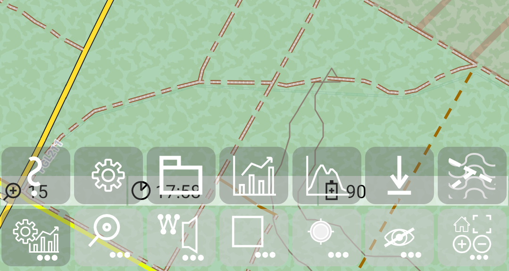
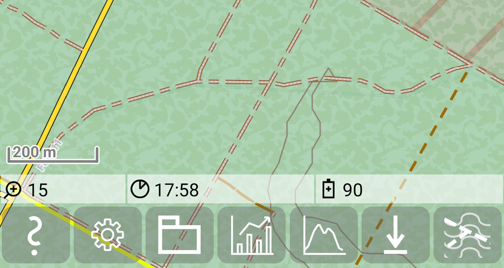

<small><small>[Back to Index](../../../index.md)</small></small>

## Further Features: quick controls of MGMapActivity (main activity)

The MGMapActivity (main activity) provides seven quick control buttons, where each of them represents a menu button.
this looks like:

   &nbsp;

Whenever you tap on one of them (e.g. menu task ), the corresponding 
submenu will be shown, and you will see a set of action buttons. Depending on the display setting "Menu in one line" 
(default false) you get the menu items in the line above or in the same line:

   &nbsp;
   &nbsp;

If you don't use any menu item, the buttons switch back after 3 seconds to the normal menu. If you tap on a menu item,
then the corresponding action is executed and the buttons switch also back to the menu. 
All submenus with menu items provide on the
left side a help button. If you tap on this button, you'll get an explanation for all button and what happens, if
you tap on it. In this case the menu items and the help stay visible until you press further butons.

While the menu buttons represent the current state, the menu item button express what happens, if you tap them.
So e.g. the menu for "recording" actions shows a red circle, if GPS is switched on. If you open this menu, the track
recording menu item provides a white circle, since you switch recording off, if you press this menu item.

#### Main menu quick controls

<table style="font-size: x-small; padding:5px">
<tr>
	<th></th>
    <th style="text-align:center">Menu Task</th>
    <th style="text-align:center">Menu Search</th>
    <th style="text-align:center">Menu Marker</th>
    <th style="text-align:center">Menu Bounding box</th>
    <th style="text-align:center">Menu Record</th>
    <th style="text-align:center">Menu Show/Hide</th>
    <th style="text-align:center">Menu Multi</th>
</tr>
<tr>
<td width="6%" style="padding:5px;vertical-align:top">Menu icon</td>
<td width="12%" style="text-align:center; min-width:90px"></td>
<td width="12%" style="text-align:center; min-width:90px"></td>
<td width="12%" style="text-align:center; min-width:90px"></td>
<td width="12%" style="text-align:center; min-width:90px"></td>
<td width="12%" style="text-align:center; min-width:90px"></td>
<td width="12%" style="text-align:center; min-width:90px"></td>
<td width="12%" style="text-align:center; min-width:90px"></td>
</tr>
<tr>
	<td style="padding:5px;vertical-align:top">Menu functions</td>
    <td style="padding:5px;vertical-align:top"><ul style="padding-left:10px;"><li>settings</li><li>further settings</li><li>statistics</li><li>height profile</li><li>download</li><li>themes</li></ul></td>
    <td style="padding:5px;vertical-align:top"><ul style="padding-left:10px"><li>toggle search mode</li><li>toggle show search result mode</li></ul></td>
    <td style="padding:5px;vertical-align:top"><ul style="padding-left:10px"><li>toggle marker edit mode</li><li>toggle turning instruction mode</li><li>map matching action</li></ul></td>
    <td style="padding:5px;vertical-align:top"><ul style="padding-left:10px"><li>load from bbox</li><li>toggle bbox mode</li><li>load all tiles for tilestore</li><li>load missing tiles for tilestore</li><li>delete all tiles from tilestore</li></ul></td>
    <td style="padding:5px;vertical-align:top"><ul style="padding-left:10px"><li>toggle center mode</li><li>toggle GPS mode</li><li>toggle record track mode</li><li>toggle record track segment mode</li></ul></td>
    <td style="padding:5px;vertical-align:top"><ul style="padding-left:10px"><li>toggle layer transparency controls</li><li>toggle track transparency controls</li><li>hide selected track</li><li>hide not selected tracks</li><li>hide all tracks</li><li>hide marker/route track</li></ul></td>
    <td style="padding:5px;vertical-align:top"><ul style="padding-left:10px"><li>leave the app</li><li>toggle fullscreen mode</li><li>zoom in</li><li>zoom out</li><li>lunch Android homescreen</li></ul></td>
</tr>
<tr>
<td  style="padding:5px;vertical-align:top">Menu states</td>
<td></td>
<td style="padding:5px;vertical-align:top"><ul style="padding-left:10px">
	<li>search mode &nbsp;</li>
	<li>show search result mode &nbsp;</li>
	<li>Location based search mode is visible as icon in front of the search text 
	        &nbsp;</li>
</ul></td>
<td style="padding:5px;vertical-align:top"><ul style="padding-left:10px">
	<li>marker edit mode &nbsp;</li>
	<li>turning instruction mode &nbsp;</li>
</ul></td>
<td style="padding:5px;vertical-align:top"><ul style="padding-left:10px">
	<li>bbox mode &nbsp;</li>
</ul></td>
<td style="padding:5px;vertical-align:top"><ul style="padding-left:10px">
	<li>GPS mode (GPS or track recording or track segment recording) &nbsp;</li>
</ul></td>
<td></td>
<td></td>
</tr>
 </table>

#### Menu Task

<table style="font-size: x-small; padding:5px">
<tr>
	<th></th>
    <th style="text-align:center">Help</th>
    <th style="text-align:center">Settings</th>
    <th style="text-align:center">File manager</th>
    <th style="text-align:center">Statistic</th>
    <th style="text-align:center">Height profile</th>
    <th style="text-align:center">Download</th>
    <th style="text-align:center">Themes</th>
</tr>
<tr>
<td width="6%" style="padding:5px;vertical-align:top">Menu item icon</td>
<td width="12%" style="text-align:center; min-width:90px"></td>
<td width="12%" style="text-align:center; min-width:90px"></td>
<td width="12%" style="text-align:center; min-width:90px"></td>
<td width="12%" style="text-align:center; min-width:90px"></td>
<td width="12%" style="text-align:center; min-width:90px"></td>
<td width="12%" style="text-align:center; min-width:90px"></td>
<td width="12%" style="text-align:center; min-width:90px"></td>
</tr>
<tr>
	<td style="padding:5px;vertical-align:top">Menu item functions</td>
    <td style="padding:5px;vertical-align:top">Provide help</td>
    <td style="padding:5px;vertical-align:top">Start settings activity with main preference screen</td>
    <td style="padding:5px;vertical-align:top">Start file manager activity</td>
    <td style="padding:5px;vertical-align:top">Start statistic activity</td>
    <td style="padding:5px;vertical-align:top">Start height profile activity</td>
    <td style="padding:5px;vertical-align:top">Start settings activity with download preference screen</td>
    <td style="padding:5px;vertical-align:top">Start theme settings activity</td>
</tr>
</table>

#### Menu Search

<table style="font-size: x-small">
<tr>
	<th></th>
    <th style="text-align:center">Help</th>
    <th style="text-align:center">Search mode</th>
    <th style="text-align:center">Show search result mode</th>
    <th style="text-align:center">Location based search</th>
    <th style="text-align:center"></th>
    <th style="text-align:center"></th>
    <th style="text-align:center"></th>
</tr>
<tr>
<td width="6%"  style="padding:5px;vertical-align:top">Menu item icon</td>
<td width="12%" style="text-align:center; min-width:90px"></td>
<td width="12%" style="text-align:center; min-width:90px"></td>
<td width="12%" style="text-align:center; min-width:90px"></td>
<td width="12%" style="text-align:center; min-width:90px"></td>
<td width="12%" style="text-align:center; min-width:90px"> </td>
<td width="12%" style="text-align:center; min-width:90px"> </td>
<td width="12%" style="text-align:center; min-width:90px"> </td>
</tr>
<tr>
	<td style="padding:5px;vertical-align:top">Menu item functions</td>
    <td style="padding:5px;vertical-align:top">Provide help</td>
    <td style="padding:5px;vertical-align:top">
		<table style="padding:0px;border:none">
			<tr><td width="30%" style="padding:5px;vertical-align:top;border:none"></td><td width="70%" style="padding:5px;vertical-align:top;border:none">Switch on</td></tr>
			<tr><td width="30%" style="padding:5px;vertical-align:top;border:none"></td><td width="70%" style="padding:5px;vertical-align:top;border:none">Switch off</td></tr>
		</table>
	</td>
    <td style="padding:5px;vertical-align:top">
		<table style="padding:0px;border:none">
			<tr><td width="30%" style="padding:5px;vertical-align:top;border:none"></td><td width="70%" style="padding:5px;vertical-align:top;border:none">Switch on</td></tr>
			<tr><td width="30%" style="padding:5px;vertical-align:top;border:none"></td><td width="70%" style="padding:5px;vertical-align:top;border:none">Switch off</td></tr>
			<tr><td width="30%" style="padding:5px;vertical-align:top;border:none"></td><td width="70%" style="padding:5px;vertical-align:top;border:none">Disabled</td></tr>
		</table>
	</td>
    <td style="padding:5px;vertical-align:top">
		<table style="padding:0px;border:none">
			<tr><td width="30%" style="padding:5px;vertical-align:top;border:none"></td><td width="70%" style="padding:5px;vertical-align:top;border:none">Switch on</td></tr>
			<tr><td width="30%" style="padding:5px;vertical-align:top;border:none"></td><td width="70%" style="padding:5px;vertical-align:top;border:none">Switch off</td></tr>
		</table>
	</td>
    <td></td>
    <td></td>
    <td></td>
</tr>
</table>

#### Menu Marker

<table style="font-size: x-small">
<tr>
	<th></th>
    <th style="text-align:center">Help</th>
    <th style="text-align:center"> </th>
    <th style="text-align:center">Marker edit mode</th>
    <th style="text-align:center">Routing Hint mode</th>
    <th style="text-align:center"></th>
    <th style="text-align:center">Map matching</th>
    <th style="text-align:center"></th>
</tr>
<tr>
<td width="6%"  style="padding:5px;vertical-align:top">Action icon</td>
<td width="12%" style="text-align:center; min-width:90px"></td>
<td width="12%" style="text-align:center; min-width:90px"> </td>
<td width="12%" style="text-align:center; min-width:90px"></td>
<td width="12%" style="text-align:center; min-width:90px"></td>
<td width="12%" style="text-align:center; min-width:90px"> </td>
<td width="12%" style="text-align:center; min-width:90px"></td>
<td width="12%" style="text-align:center; min-width:90px"> </td>
</tr>
<tr>
	<td style="padding:5px;vertical-align:top">Action functions</td>
    <td style="padding:5px;vertical-align:top">Provide help</td>
    <td></td>
    <td style="padding:5px;vertical-align:top">
		<table style="padding:0px;border:none">
			<tr><td width="30%" style="padding:5px;vertical-align:top;border:none"></td><td width="70%" style="padding:5px;vertical-align:top;border:none">Switch on</td></tr>
			<tr><td width="30%" style="padding:5px;vertical-align:top;border:none"></td><td width="70%" style="padding:5px;vertical-align:top;border:none">Switch off</td></tr>
		</table>
	</td>
	<td style="padding:5px;vertical-align:top">
		<table style="padding:0px;border:none">
			<tr><td width="30%" style="padding:5px;vertical-align:top;border:none"></td><td width="70%" style="padding:5px;vertical-align:top;border:none">Switch on</td></tr>
			<tr><td width="30%" style="padding:5px;vertical-align:top;border:none"></td><td width="70%" style="padding:5px;vertical-align:top;border:none">Switch off</td></tr>
			<tr><td width="30%" style="padding:5px;vertical-align:top;border:none"></td><td width="70%" style="padding:5px;vertical-align:top;border:none">Disabled</td></tr>
		</table>
	</td>
    <td></td>
    <td style="padding:5px;vertical-align:top">
		<table style="padding:0px;border:none">
			<tr><td width="30%" style="padding:5px;vertical-align:top;border:none"></td><td width="70%" style="padding:5px;vertical-align:top;border:none">Trigger "map matching"</td></tr>
			<tr><td width="30%" style="padding:5px;vertical-align:top;border:none"></td><td width="70%" style="padding:5px;vertical-align:top;border:none">Disabled</td></tr>
		</table>
	</td>
    <td></td>
</tr>
</table>

#### Menu Bounding box (bbox)

<table style="font-size: x-small">
<tr>
	<th></th>
    <th style="text-align:center">Help</th>
    <th style="text-align:center"> </th>
    <th style="text-align:center">Load from bbox</th>
    <th style="text-align:center">bbox edit mode</th>
    <th style="text-align:center">Load missing tiles to tilestore</th>
    <th style="text-align:center">Load all tiles to tilestore</th>
    <th style="text-align:center">Delete all tiles from tilestore</th>
</tr>
<tr>
<td width="6%" style="padding:5px;vertical-align:top">Action icon</td>
<td width="12%" style="text-align:center; min-width:90px"></td>
<td width="12%" style="text-align:center; min-width:90px"> </td>
<td width="12%" style="text-align:center; min-width:90px"></td>
<td width="12%" style="text-align:center; min-width:90px"></td>
<td width="12%" style="text-align:center; min-width:90px"></td>
<td width="12%" style="text-align:center; min-width:90px"></td>
<td width="12%" style="text-align:center; min-width:90"></td>
</tr>
<tr>
	<td style="padding:5px;vertical-align:top">Action functions</td>
    <td style="padding:5px;vertical-align:top">Provide help</td>
    <td></td>
    <td style="padding:5px;vertical-align:top">
		<table style="padding:0px;border:none">
			<tr><td width="30%" style="padding:5px;vertical-align:top;border:none"></td><td width="70%" style="padding:5px;vertical-align:top;border:none">Load tracks by bbox</td></tr>
			<tr><td width="30%" style="padding:5px;vertical-align:top;border:none"></td><td width="70%" style="padding:5px;vertical-align:top;border:none">Disabled</td></tr>
		</table>
	</td>
    <td style="padding:5px;vertical-align:top">
		<table style="padding:0px;border:none">
			<tr><td width="30%" style="padding:5px;vertical-align:top;border:none"></td><td width="70%" style="padding:5px;vertical-align:top;border:none">Switch on</td></tr>
			<tr><td width="30%" style="padding:5px;vertical-align:top;border:none"></td><td width="70%" style="padding:5px;vertical-align:top;border:none">Switch off</td></tr>
		</table>
	</td>
    <td style="padding:5px;vertical-align:top">
		<table style="padding:0px;border:none">
			<tr><td width="30%" style="padding:5px;vertical-align:top;border:none"></td><td width="70%" style="padding:5px;vertical-align:top;border:none">Load missing tiles by bbox</td></tr>
			<tr><td width="30%" style="padding:5px;vertical-align:top;border:none"></td><td width="70%" style="padding:5px;vertical-align:top;border:none">Disabled</td></tr>
		</table>
	</td>
    <td style="padding:5px;vertical-align:top">
		<table style="padding:0px;border:none">
			<tr><td width="30%" style="padding:5px;vertical-align:top;border:none"></td><td width="70%" style="padding:5px;vertical-align:top;border:none">Load all tiles by bbox</td></tr>
			<tr><td width="30%" style="padding:5px;vertical-align:top;border:none"></td><td width="70%" style="padding:5px;vertical-align:top;border:none">Disabled</td></tr>
		</table>
	</td>
    <td style="padding:5px;vertical-align:top">
		<table style="padding:0px;border:none">
			<tr><td width="30%" style="padding:5px;vertical-align:top;border:none"></td><td width="70%" style="padding:5px;vertical-align:top;border:none">Delete all tiles by bbox</td></tr>
			<tr><td width="30%" style="padding:5px;vertical-align:top;border:none"></td><td width="70%" style="padding:5px;vertical-align:top;border:none">Disabled</td></tr>
		</table>
	</td>
</tr>
</table>

#### Menu Record

<table style="font-size: x-small">
<tr>
	<th></th>
    <th style="text-align:center">Help</th>
    <th style="text-align:center"> </th>
    <th style="text-align:center">Center mode</th>
    <th style="text-align:center">GPS mode</th>
    <th style="text-align:center">Record track mode</th>
    <th style="text-align:center">Record track segment mode</th>
    <th style="text-align:center"></th>
</tr>
<tr>
<td width="6%" style="padding:5px;vertical-align:top">Action icon</td>
<td width="12%" style="text-align:center; min-width:90px"></td>
<td width="12%" style="text-align:center; min-width:90px"> </td>
<td width="12%" style="text-align:center; min-width:90px"></td>
<td width="12%" style="text-align:center; min-width:90px"></td>
<td width="12%" style="text-align:center; min-width:90px"></td>
<td width="12%" style="text-align:center; min-width:90px"></td>
<td width="12%" style="text-align:center; min-width:90px"> </td>
</tr>
<tr>
	<td style="padding:5px;vertical-align:top">Action functions</td>
    <td style="padding:5px;vertical-align:top">Provide help</td>
    <td></td>
	<td style="padding:5px;vertical-align:top">
		<table style="padding:0px;border:none">
			<tr><td width="30%" style="padding:5px;vertical-align:top;border:none"></td><td width="70%" style="padding:5px;vertical-align:top;border:none">Switch on</td></tr>
			<tr><td width="30%" style="padding:5px;vertical-align:top;border:none"></td><td width="70%" style="padding:5px;vertical-align:top;border:none">Switch off</td></tr>
			<tr><td width="30%" style="padding:5px;vertical-align:top;border:none"></td><td width="70%" style="padding:5px;vertical-align:top;border:none">Disabled</td></tr>
		</table>
	</td>
	<td style="padding:5px;vertical-align:top">
		<table style="padding:0px;border:none">
			<tr><td width="30%" style="padding:5px;vertical-align:top;border:none"></td><td width="70%" style="padding:5px;vertical-align:top;border:none">Switch on</td></tr>
			<tr><td width="30%" style="padding:5px;vertical-align:top;border:none"></td><td width="70%" style="padding:5px;vertical-align:top;border:none">Switch off</td></tr>
			<tr><td width="30%" style="padding:5px;vertical-align:top;border:none"></td><td width="70%" style="padding:5px;vertical-align:top;border:none">Disabled</td></tr>
		</table>
	</td>
	<td style="padding:5px;vertical-align:top">
		<table style="padding:0px;border:none">
			<tr><td width="30%" style="padding:5px;vertical-align:top;border:none"></td><td width="70%" style="padding:5px;vertical-align:top;border:none">Switch on</td></tr>
			<tr><td width="30%" style="padding:5px;vertical-align:top;border:none"></td><td width="70%" style="padding:5px;vertical-align:top;border:none">Switch off</td></tr>
		</table>
	</td>
	<td style="padding:5px;vertical-align:top">
		<table style="padding:0px;border:none">
			<tr><td width="30%" style="padding:5px;vertical-align:top;border:none"></td><td width="70%" style="padding:5px;vertical-align:top;border:none">Switch on</td></tr>
			<tr><td width="30%" style="padding:5px;vertical-align:top;border:none"></td><td width="70%" style="padding:5px;vertical-align:top;border:none">Switch off</td></tr>
			<tr><td width="30%" style="padding:5px;vertical-align:top;border:none"></td><td width="70%" style="padding:5px;vertical-align:top;border:none">Disabled</td></tr>
		</table>
	</td>
    <td></td>
</tr>
</table>

#### Menu Show/Hide

<table style="font-size: x-small">
<tr>
	<th></th>
    <th style="text-align:center">Help</th>
    <th style="text-align:center">Layer transparency controls</th>
    <th style="text-align:center">Track transparency controls</th>
    <th style="text-align:center">Hide selected track</th>
    <th style="text-align:center">Hide not selected tracks</th>
    <th style="text-align:center">Hide all tracks</th>
    <th style="text-align:center">Hide marker/route track</th>
</tr>

<tr>
<td width="6%" style="padding:5px;vertical-align:top">Action icon</td>
<td width="12%" style="text-align:center; min-width:90px"></td>
<td width="12%" style="text-align:center; min-width:90px"></td>
<td width="12%" style="text-align:center; min-width:90px"></td>
<td width="12%" style="text-align:center; min-width:90px"></td>
<td width="12%" style="text-align:center; min-width:90"></td>
<td width="12%" style="text-align:center; min-width:90px"></td>
<td width="12%" style="text-align:center; min-width:90px"></td>
</tr>
<tr>
	<td style="padding:5px;vertical-align:top">Action functions</td>
    <td style="padding:5px;vertical-align:top">Provide help</td>
	<td style="padding:5px;vertical-align:top">
		<table style="padding:0px;border:none">
			<tr><td width="30%" style="padding:5px;vertical-align:top;border:none"></td><td width="70%" style="padding:5px;vertical-align:top;border:none">Switch on</td></tr>
			<tr><td width="30%" style="padding:5px;vertical-align:top;border:none"></td><td width="70%" style="padding:5px;vertical-align:top;border:none">Switch off</td></tr>
		</table>
	</td>
	<td style="padding:5px;vertical-align:top">
		<table style="padding:0px;border:none">
			<tr><td width="30%" style="padding:5px;vertical-align:top;border:none"></td><td width="70%" style="padding:5px;vertical-align:top;border:none">Switch on</td></tr>
			<tr><td width="30%" style="padding:5px;vertical-align:top;border:none"></td><td width="70%" style="padding:5px;vertical-align:top;border:none">Switch off</td></tr>
			<tr><td width="30%" style="padding:5px;vertical-align:top;border:none"></td><td width="70%" style="padding:5px;vertical-align:top;border:none">Disabled</td></tr>
		</table>
	</td>
	<td style="padding:5px;vertical-align:top">
		<table style="padding:0px;border:none">
			<tr><td width="30%" style="padding:5px;vertical-align:top;border:none"></td><td width="70%" style="padding:5px;vertical-align:top;border:none">Hide selected track</td></tr>
			<tr><td width="30%" style="padding:5px;vertical-align:top;border:none"></td><td width="70%" style="padding:5px;vertical-align:top;border:none">Disabled</td></tr>
		</table>
	</td>
	<td style="padding:5px;vertical-align:top">
		<table style="padding:0px;border:none">
			<tr><td width="30%" style="padding:5px;vertical-align:top;border:none"></td><td width="70%" style="padding:5px;vertical-align:top;border:none">Hide not selected track</td></tr>
			<tr><td width="30%" style="padding:5px;vertical-align:top;border:none"></td><td width="70%" style="padding:5px;vertical-align:top;border:none">Disabled</td></tr>
		</table>
	</td>
	<td style="padding:5px;vertical-align:top">
		<table style="padding:0px;border:none">
			<tr><td width="30%" style="padding:5px;vertical-align:top;border:none"></td><td width="70%" style="padding:5px;vertical-align:top;border:none">Hide all tracks</td></tr>
			<tr><td width="30%" style="padding:5px;vertical-align:top;border:none"></td><td width="70%" style="padding:5px;vertical-align:top;border:none">Disabled</td></tr>
		</table>
	</td>
	<td style="padding:5px;vertical-align:top">
		<table style="padding:0px;border:none">
			<tr><td width="30%" style="padding:5px;vertical-align:top;border:none"></td><td width="70%" style="padding:5px;vertical-align:top;border:none">Hide marker/route track</td></tr>
			<tr><td width="30%" style="padding:5px;vertical-align:top;border:none"></td><td width="70%" style="padding:5px;vertical-align:top;border:none">Disabled</td></tr>
		</table>
	</td>
</tr>
</table>

#### Menu Multi

<table style="font-size: x-small">
<tr>
	<th></th>
    <th style="text-align:center">Help</th>
    <th style="text-align:center">Exit</th>
    <th style="text-align:center"> </th>
    <th style="text-align:center">Fullscreen mode</th>
    <th style="text-align:center">Zoom in</th>
    <th style="text-align:center">Zoom out</th>
    <th style="text-align:center">Home</th>
</tr>
<tr>
<td width="6%" style="padding:5px;vertical-align:top">Action icon</td>
<td width="12%" style="text-align:center; min-width:90px"></td>
<td width="12%" style="text-align:center; min-width:90px"></td>
<td width="12%" style="text-align:center; min-width:90px"> </td>
<td width="12%" style="text-align:center; min-width:90px"></td>
<td width="12%" style="text-align:center; min-width:90px"></td>
<td width="12%" style="text-align:center; min-width:90px"></td>
<td width="12%" style="text-align:center; min-width:90px"></td>
</tr>
<tr>
	<td style="padding:5px;vertical-align:top">Action functions</td>
    <td style="padding:5px;vertical-align:top">Provide help</td>
    <td style="padding:5px;vertical-align:top">Exit: Leave the app</td>
    <td style="padding:5px;vertical-align:top"> </td>
    <td style="padding:5px;vertical-align:top">Toggle fullscreen mode</td>
    <td style="padding:5px;vertical-align:top">Zoom in</td>
    <td style="padding:5px;vertical-align:top">Zoom out</td>
    <td style="padding:5px;vertical-align:top">Lunch Android homescreen</td>
</tr>
</table>

 <small><small>[Back to Index](../../../index.md)</small></small>

