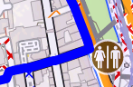

<small><small>[Back to Index](../../../index.md)</small></small>

## Further Features: quick controls for tracks

####  Track controls
<table style="font-size: small">
<th width="12%" style="text-align:center; min-width:60px; max-width:60px"> </th>
<th width="17%" style="text-align:center; min-width:100px"></th>
<th width="17%" style="text-align:center; min-width:100px"> and </th>
<th width="17%" style="text-align:center; min-width:100px"> and </th>
<th width="17%" style="text-align:center; min-width:100px"></th>
<th width="17%" style="text-align:center; min-width:100px"></th>

<tr>
    <td>short tap</td>
    <td> </td>
    <td> </td>
    <td>on point: delete point on line: insert new point </td>
    <td> </td>
    <td>make this track to the selected</td>
</tr>
<tr>
    <td>long tap</td>
    <td>toggle gain/loss mode</td>
    <td>toggle gain/loss mode </td>
    <td>on point: toggle gain/loss mode on line: toggle direct route </td>
    <td>toggle gain/loss mode</td>
    <td> </td>
</tr>
</table>

 <small><small>[Back to Index](../../../index.md)</small></small>

