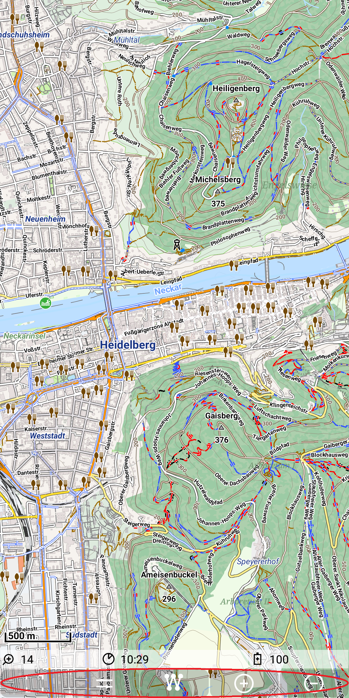

<small><small>[Back to Index](../../../index.md)</small></small>

## Further Features: quick controls

At the very bottom of the screen there is a row with quick controls:

&nbsp;

There are seven quick controls:
- Full Screen: toggle full screen mode (ON/OFF)
- Transparency Control: toggle the visibility of the sliders for transparency control (see 
[Overlay multiple map layers](../../MainMapFeatures/MapMulti/multimap.md) and control transparency per layer)
- Marker Track Control: toggle Marker Track mode (see [Marker Track](../../MainTrackFeatures/MarkerTrack/markertrack.md))
- BoundingBox Control: toggle bounding box control layer (see [Bounding Box](../../MainTrackFeatures/BoundingBox/boundingbox.md))
- Geocode: Toggle visibility of search control (see [Geocode](../../FurtherFeatures/Geocode/geocode.md) feature)  
- Zoom In
- Zoom Out

 <small><small>[Back to Index](../../../index.md)</small></small>

