<small><small>[Back to Index](../../../index.md)</small></small>

## Further Features: quick controls

### MGMapActivity (main activity)

#### Standard quick controls

<table style="font-size: small">
<th width="12%" style="text-align:center; min-width:60px; max-width:60px"> </th>
<th width="12%" style="text-align:center; min-width:100px">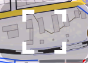</th>
<th width="12%" style="text-align:center; min-width:100px">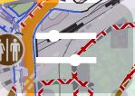</th>
<th width="12%" style="text-align:center; min-width:100px"></th>
<th width="12%" style="text-align:center; min-width:100px">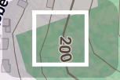</th>
<th width="12%" style="text-align:center; min-width:100px">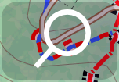</th>
<th width="12%" style="text-align:center; min-width:100px"></th>
<th width="12%" style="text-align:center; min-width:100px">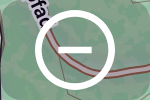</th>
<tr>
    <td>short tap</td>
    <td>toggle fullscreen</td>
    <td>toggle slider for layer transparency</td>
    <td>toggle edit marker track</td>
    <td>toggle bounding box mode</td>
    <td>toggle search mode</td>
    <td>zoom in</td>
    <td>zoom out</td>
</tr>
<tr>
    <td>long tap</td>
    <td>go to homescreen</td>
    <td>toggle slider for track transparency</td>
    <td>toggle routing hints</td>
    <td>toggle bounding box mode on and mark central window</td>
    <td> </td>
    <td> </td>
    <td> </td>
</tr>
<tr>
    <td>double tap</td>
    <td>more quick controls</td>
    <td> </td>
    <td>hide marker track/route</td>
    <td> </td>
    <td> </td>
    <td> </td>
    <td> </td>
</tr>
</table>

#### Extra quick controls (after double tap on fullscreen)
<table style="font-size: small">
<th width="12%" style="text-align:center; min-width:60px; max-width:60px"> </th>
<th width="12%" style="text-align:center; min-width:100px">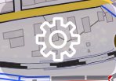</th>
<th width="12%" style="text-align:center; min-width:100px">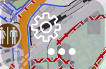</th>
<th width="12%" style="text-align:center; min-width:100px">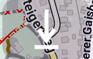</th>
<th width="12%" style="text-align:center; min-width:100px">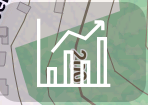</th>
<th width="12%" style="text-align:center; min-width:100px">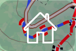</th>
<th width="12%" style="text-align:center; min-width:100px">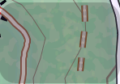</th>
<th width="12%" style="text-align:center; min-width:100px">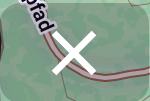</th>

<tr>
    <td>short tap</td>
    <td>settings preference screen</td>
    <td>further settings preference screen</td>
    <td>download preference screen</td>
    <td>open statistic activity</td>
    <td>go to homescreen</td>
    <td> </td>
    <td>close this app</td>
</tr>
</table>

####  Track controls
<table style="font-size: small">
<th width="12%" style="text-align:center; min-width:60px; max-width:60px"> </th>
<th width="17%" style="text-align:center; min-width:100px"></th>
<th width="17%" style="text-align:center; min-width:100px"> and </th>
<th width="17%" style="text-align:center; min-width:100px"> and </th>
<th width="17%" style="text-align:center; min-width:100px"></th>
<th width="17%" style="text-align:center; min-width:100px"></th>

<tr>
    <td>short tap</td>
    <td> </td>
    <td> </td>
    <td>on point: delete point on line: insert new point </td>
    <td> </td>
    <td>make this track to the selected</td>
</tr>
<tr>
    <td>long tap</td>
    <td>toggle gain/loss mode</td>
    <td>toggle gain/loss mode </td>
    <td>on point: toggle gain/loss mode on line: toggle direct route </td>
    <td>toggle gain/loss mode</td>
    <td> </td>
</tr>
</table>

### Track statistic activity

#### Standard quick controls 
<table style="font-size: small">
<th width="12%" style="text-align:center; min-width:60px; max-width:60px"> </th>
<th width="12%" style="text-align:center; min-width:75px"></th>
<th width="12%" style="text-align:center; min-width:75px"></th>
<th width="12%" style="text-align:center; min-width:75px"></th>
<th width="12%" style="text-align:center; min-width:75px"></th>
<th width="12%" style="text-align:center; min-width:75px"></th>
<th width="12%" style="text-align:center; min-width:75px"></th>
<th width="12%" style="text-align:center; min-width:75px"></th>
<th width="12%" style="text-align:center; min-width:75px"></th>
<th width="12%" style="text-align:center; min-width:75px"></th>

<tr>
    <td>short tap</td>
    <td>toggle fullscreen mode</td>
    <td>select all entries</td>
    <td>deselect all entries</td>
    <td>view selected tracks</td>
    <td>open as marker track</td>
    <td>share tracks</td>
    <td>save tracks</td>
    <td>delete tracks</td>
    <td>back to manin activity</td>
</tr>
</table>

 <small><small>[Back to Index](../../../index.md)</small></small>

