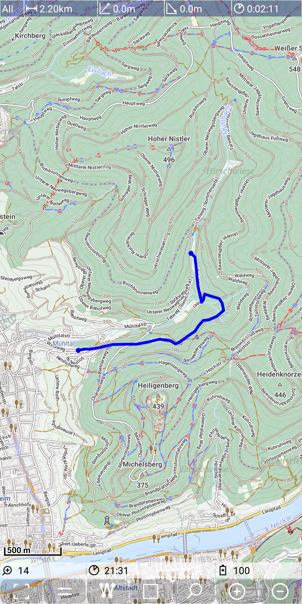
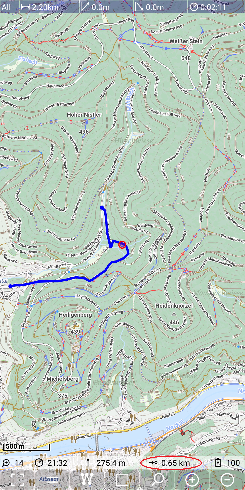
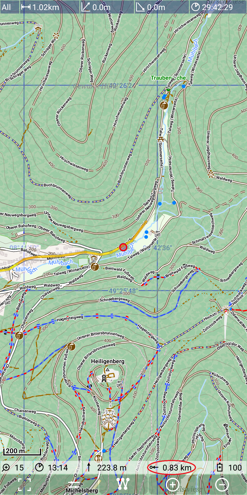
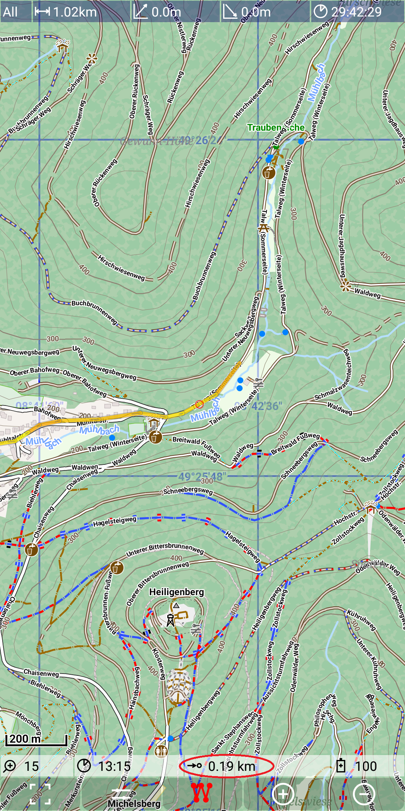
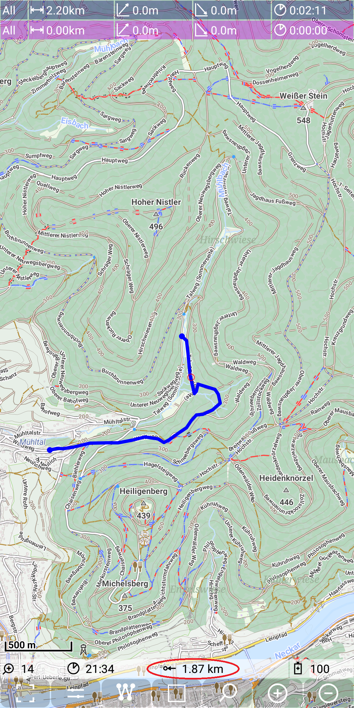
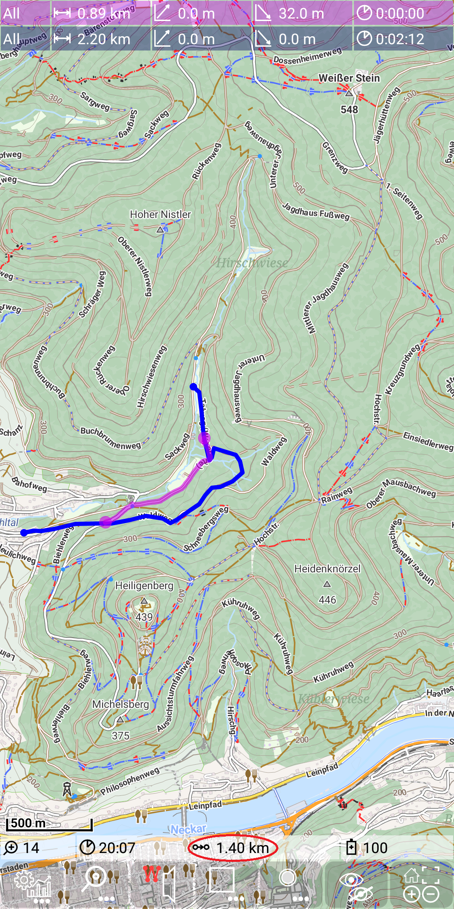
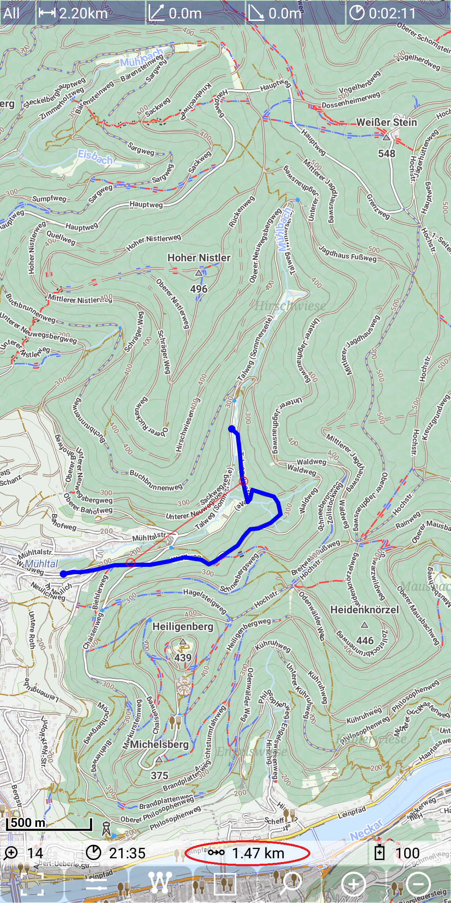

<small><small>[Back to Index](../../../index.md)</small></small>

## Further Features: remaining distance - show distance along the selected track

This feature provides the following detailed options:
- remaining distance to the end of the selected track based on current position
- remaining distance to the start of the selected track based on current position
- remaining distance to the end of the selected track based on a given point
- remaining distance to the start of the selected track based on a given point
- distance along the selected track based on two given points

Let's take the following track as the basis to explain this feature

&nbsp;

This selected track has a total length of 2.20km.
If you move along this path with a switched on GPS, then the following pictures might occurs.
The red circle show the current position, not far from the end of the track.
Then there is a field in the status, which shows the remaining distance of 0.62km.
Please notice also the icon with an arrow to the target ().
It means distance to the end of the track.

With a long press on this field in the status line you can change the remaining direction, means you 
get the distance to the start of the track and also the icon has changed to indicate 
the semantic of this value ().

&nbsp;
&nbsp;

But how to determine the remaining distance from a given point (without being at this point)?
Use a MarkerPoint (see [MarkerTrack feature](../../MainTrackFeatures/MarkerTrack/markertrack.md)) to get the 
remaining distance from this point. Again with a long tap on this status line field we can change the direction.

 
&nbsp;
&nbsp;

If you want to determine the distance between two given points along the track, then this is also possible.
Just use a second MarkerPoint. While the direct route has a length of only 0.89km (along the purple line),
the length along the given selected track is 1.40km (along the blue line).

&nbsp;

In this situation the automatic routing might be confusing. So you can use
 + 
and to set marker track visible and route track to invisible:

&nbsp;

In the result the MarkerTrack with its two points is better visible. The distance is again shown in the 
status line. Please notice that the icon in this field indicates the measurement between two pints ().

<small><small>[Back to Index](../../../index.md)</small></small>