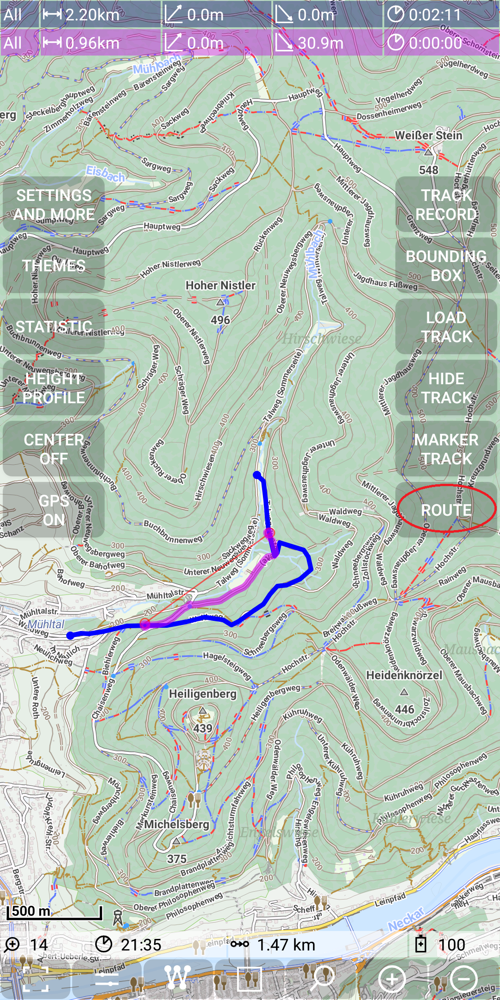
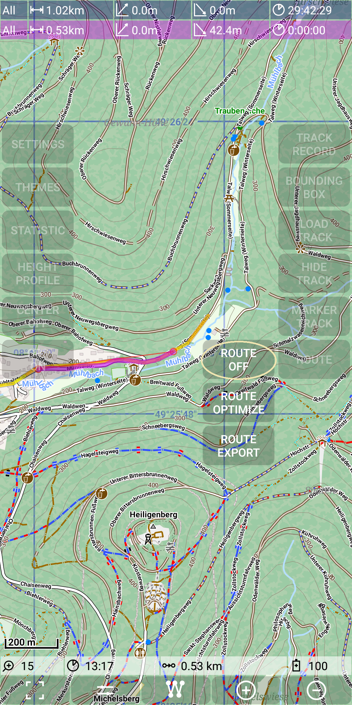

## Further Features: remaining distance - show distance along the selected track 

This feature subsume the following detailed options:
- remaining distance based on current position
- remaining distance based on current position to the start of the selected track
- remaining distance based on a given point
- remaining distance to the reverse end of the selected track
- distance along the track based on two given points

Let's take the following track as the basis to explain this feature

&nbsp;

This selected track has a total length of 1.02km.
If you move along this path with a switched on GPS, then the following picture occurs.
The red circle show the current position, not far from the end of the track.
Then there is a field in the status, which shows the remaining distance of 0.19km.
Please notice also the icon with an arrow to the target. It means distance to the end of the track.

With a long press on this field in the status line you can change the remaining direction, means you 
get the distance to the start of the track and also the icon has changed to indicate 
the semantic of this value. 

&nbsp;
&nbsp;

But how to determine the remaining distance from a given point (without being at this point)?
Use a MarkerPoint (see [MarkerTrack feature](../../MainTrackFeatures/MarkerTrack/markertrack.md)) to get the 
remaining distance from this point. Again with a long tap on this status line field we can change the direction.

 
&nbsp;
&nbsp;

If you want to determine the distance between two given points along the track, then this is also possible.
Just use a second MarkerPoint.

&nbsp;

In this situation the automatic routing might be confusing. Therefore thre is the option to switch it off with
*Menu | Route | Route Off*.

&nbsp;
&nbsp;

In the result the MarkerTrack with its two points is better visible. The distance is again shown in the 
status line. Now the icon in this filed indicates the measurement between two pints.

&nbsp;
