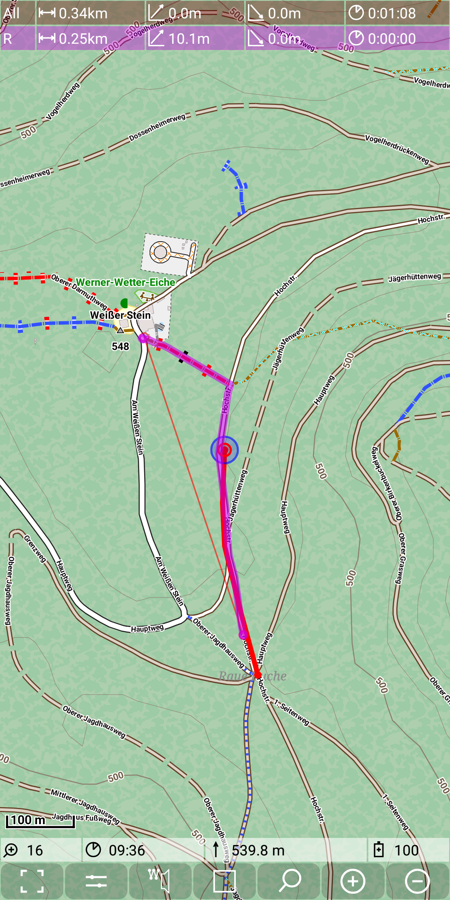

<small><small>[Back to Index](../../../index.md)</small></small>

## Main Track Feature: routing hints

This feature is an addon to the basic [routing feature](../../MainTrackFeatures/Routing/routing.md).

You can toggle this feature on and off with a long press on the marker track quick control. As a result of activating this
feature the quick control icon changes in a way, that the original icon will be smaller and beside it there is a small icon of a
loudspeaker. This toggle action works with marker track edit mode switched on and off.

Currently this feature works only in german language.
All direction information will be given with values based on a clock design.
So "12Uhr" means straight ahead, "3Uhr" means turn right  and "9Uhr" means turn left.

The following example illustrates this behaviour: Imagine, you are moving with track recording switched on (red line)
along a given route (purple line). Now switch on the routing hints:

&nbsp;
&nbsp;

Go on moving. Then you get the voice message "In 97 Meter 9Uhr"

&nbsp;

If you come closer to the crossroad, you'll get the message "Gleich 9Uhr  Kurs 11 Uhr"

&nbsp;

After this example I'll try to give some general rules for these voice messages:
- Routing hints will be given based on a new location information (new GPS point).
- A first routing hint will be given, sa soon as the remaining distance to the routing point gets less than 100m. It starts with "In \<nn> Metern ..."
- A second routing hint will be given as soon as the distance to the routing point becomes less than 40m. This advise is started with
 "Gleich ..." or "Danach ...".
- A routing hint may give additional information "Kurs \<nn>Uhr", which means: calculate a point along the route that is 100m ahead the last measured point.
 calculate the direction to this 100m away point and based on this the clock direction. The idea behind this is to give a rough information, in
 which direction you'll have to move.
- A hint will only be given for points in the graph with more than two neighbours. (There is some routing hint preparation as part of the
 route calculation process).
- There will be no routing hint, if the route is straight ahead and other options are not too close to this.
- If there are other options, which are rather close to the planed route, then the hint may be extended by the advise
 "Nicht links \<nn>Uhr" or "Nicht rechts \<nn>Uhr".
- If there is a second routing point within the next 100m, then the advise information for next two routing points is given.

Additional rules
- If the measured distance to the route is above the THRESHOLD_FAR (200m), then you get once the message
 "Großer Abstand mehr als <THRESHOLD_FAR> Meter". New hints will only be given, if you have a new location with less than
 THRESHOLD_MEDIUM (40m) distance to the route.
- If the measured distance to the route is above the THRESHOLD_MEDIUM (40m), then you get up to three messages:
  - "Achtung Abstand \<nn> Meter"
  - "Achtung Achtung Abstand \<nn> Meter"
  - "Achtung Achtung Achtung Abstand \<nn> Meter"  
  If there are further gps points with a distance more the THRESHOLD_MEDIUM, you don't get any further hint

<small><small>[Back to Index](../../../index.md)</small></small>