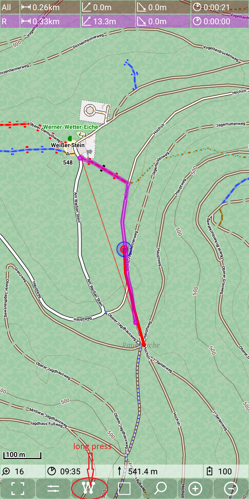
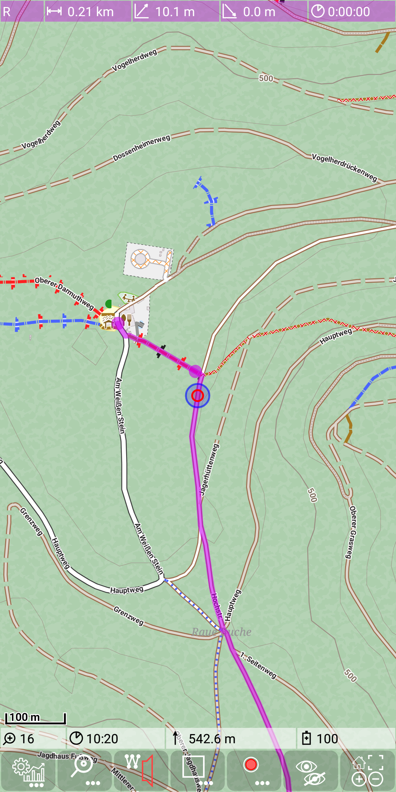

<small><small>[Back to Index](../../../index.md)</small></small>

## Main Track Feature: turning instructions

This feature provides the option to get basic turning instructions via the text-to-speech engine of Android.

Technically this feature is an addon to the basic [routing feature](../../MainTrackFeatures/Routing/routing.md).

You can toggle this feature on with  + .
As a result the icon of the marker quick control changes from  to .
Analogous you can switch it off with  + .

Currently this feature works only in german language.
All direction information will be given with values based on a clock design.
So "12Uhr" means straight ahead, "3Uhr" means turn right  and "9Uhr" means turn left.

The following example illustrates this behaviour: Imagine, you are moving along a given route (purple line) in north direction
and you have switched on the turning instructions:

&nbsp;

Go on moving. Then you might get the voice message "In 97 Meter 9Uhr"

If you come closer to the crossroad, you'll get the message "Gleich 9Uhr  Kurs 11 Uhr"

&nbsp;

After this example I'll try to give some general rules for these voice messages:
- Turning instructions will be given based on a new location information (new GPS point).
- A first instruction will be given, as soon as the remaining distance to the turning point gets less than 100m. It starts with "In \<nn> Metern ..."
- A second turning instruction will be given as soon as the distance to the turning point becomes less than 40m. This advise is started with
 "Gleich ..." or "Danach ...".
- A turning instruction may give additional information "Kurs \<nn>Uhr", which means: calculate a point along the route that is 100m ahead the last measured point.
 Calculate the direction to this 100m away point and based on this the clock direction. The idea behind this is to give a rough information, in
 which direction you'll have to move.
- An instruction will only be given for points in the graph with more than two neighbours - so if there is no other option than turning right,
you don't get any instruction, just follow the way.
- There will be no turning instruction, if the route is straight ahead and other options are not too close to this.
- If there are other options, which are rather close to the planed route, then the instruction may be extended by the advise
 "Nicht links \<nn>Uhr" or "Nicht rechts \<nn>Uhr".
- If there is a second turning point within the next 100m, then the instruction information for next two turning points is given.

Additional rules
- If the measured distance to the route is above the THRESHOLD_FAR (200m), then you get once the message
 "Großer Abstand mehr als <THRESHOLD_FAR> Meter". New instructions will only be given, if you have a new location with less than
 THRESHOLD_MEDIUM (40m) distance to the route.
- If the measured distance to the route is above the THRESHOLD_MEDIUM (40m), then you get up to three messages:
  - "Achtung Abstand \<nn> Meter"
  - "Achtung Achtung Abstand \<nn> Meter"
  - "Track verlassen"
  If there are further gps points with a distance more the THRESHOLD_MEDIUM, you don't get any further information.
- A gps point with distance < THRESHOLD_MEDIUM after a gps point with distance > THRESHOLD_MEDIUM results in a "on track" message.
- A gps point goves also an "on track" message, if last given instruction is more than 500m back on the route.
- A gps point with distance < THRESHOLD_MEDIUM to the final point of the route give the message "Ziel erreicht"

#### Minimal turning instruction

Via the routing settings the "minimal turning instructions" can be switched on. In this mode only the "on track" message and the distance warnings are
given. 

<small><small>[Back to Index](../../../index.md)</small></small>