<small><small>[Back to Index](../../../index.md)</small></small>

## Further Feature: Share Location

This feature provides the option to to share your location with another user of this app. There are mainly two use cases considered:
- Share position usage  
You want to meet somebody and it's easy, if you see other persons position on your map.
In this case one user is sending its position and the second user is listening to it immediately.
- Emergency usage  
In case of an emergency, e.g. if after an accident, it may happen that you are not able to help yourself.
In this scenario the second person is usually not checking the position of the first person all the time. Rather some time later the second person
wants to check the last position of the first person.

### Activate/Deactivate feature

Press  and  to open the settings preference screen.
Scroll down to the the GNSS settings section where you can activate/deactivate this feature. To use this feature you need to accept the share location conditions.
After activation use the Android back button to go back to the map activity.

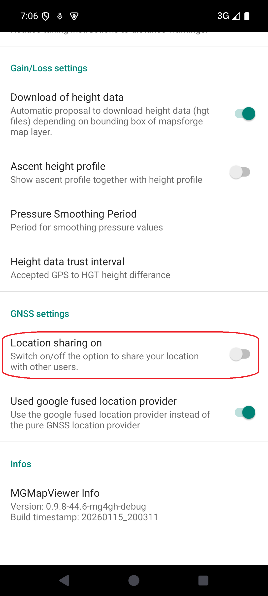&nbsp;
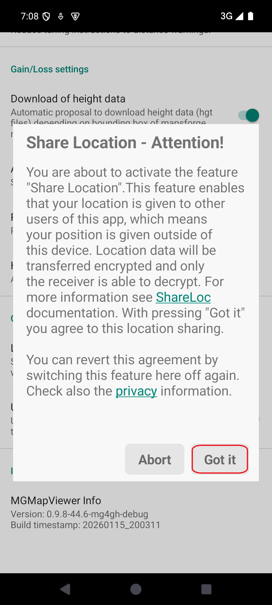&nbsp;
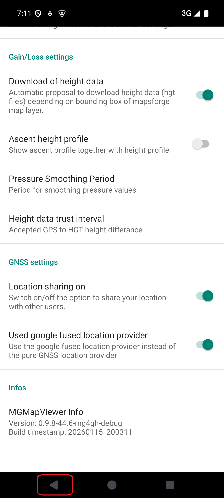&nbsp;

### Share Location Settings

After activating this feature you can open the "Share Location Settings" dialog with  + .

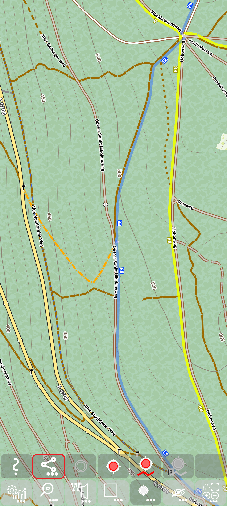&nbsp;

#### Registration

In the top section you find information about yourself. Here you can also register/unregister for the usage.
This is necessary to share location data with somebody specific.
The key for the registration is an email address. This email address represents your identity. 

To start registration press "Register" and enter your email address. 

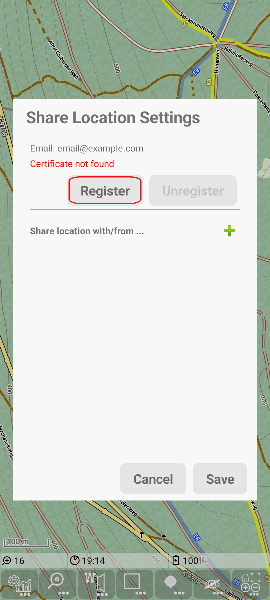&nbsp;
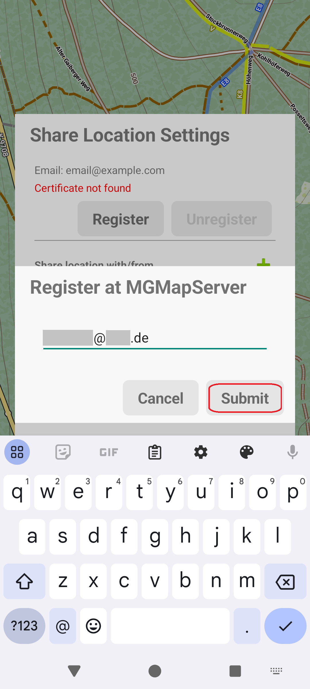&nbsp;

After entering the email address you receive a mail with a confirmationId, which you need to enter
as a second input to prove your identity.

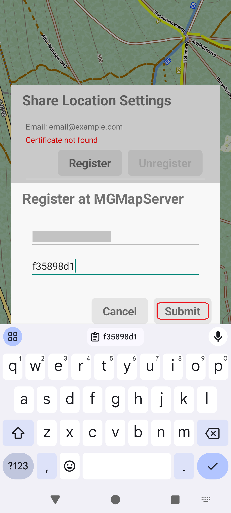&nbsp;
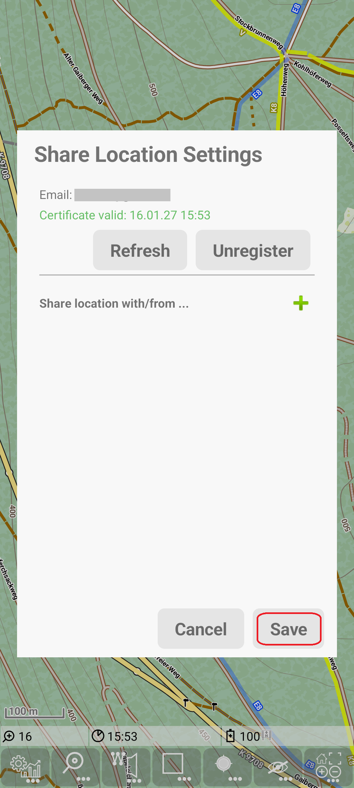&nbsp;

Finally you see in green color that there is a new certificate created and how long this is valid.
With Save you can leave the dialog.

In your device a private/public key pair is generated, and (if this confirmationId is correct) you receive a signed certificate for this
key. The private key is kept only in your device. So nobody will be able to read data that is encrypted for you.

#### Share location with/from ...

In this section you can determine with whom you want to share your location or from whom you want to get the location. 
In both cases you need to create an entry for the other person (press the green "+").
Edit the email address of this entry to match the desired person.
Verify that the certificate of others person is valid (updated automatically) - otherwise 
location sharing will not work.

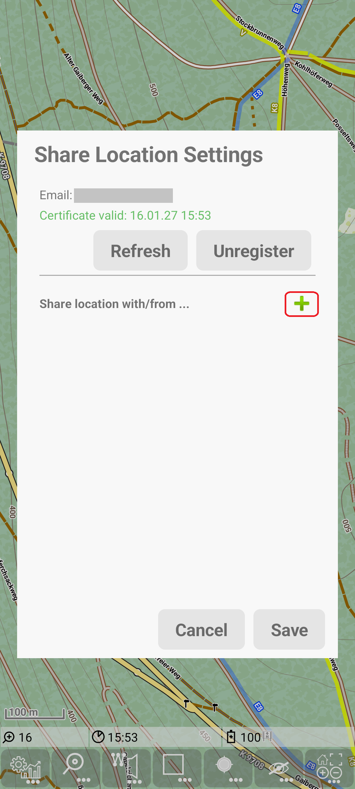&nbsp;
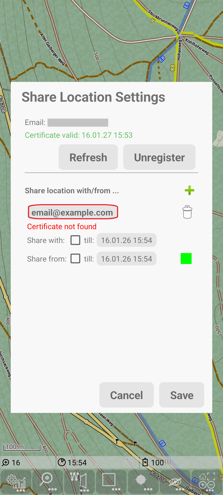&nbsp;

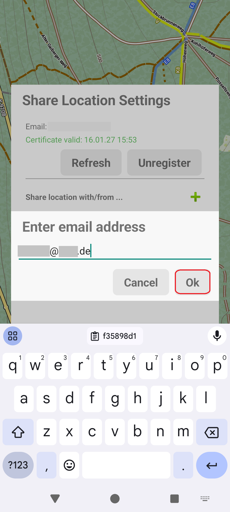&nbsp;
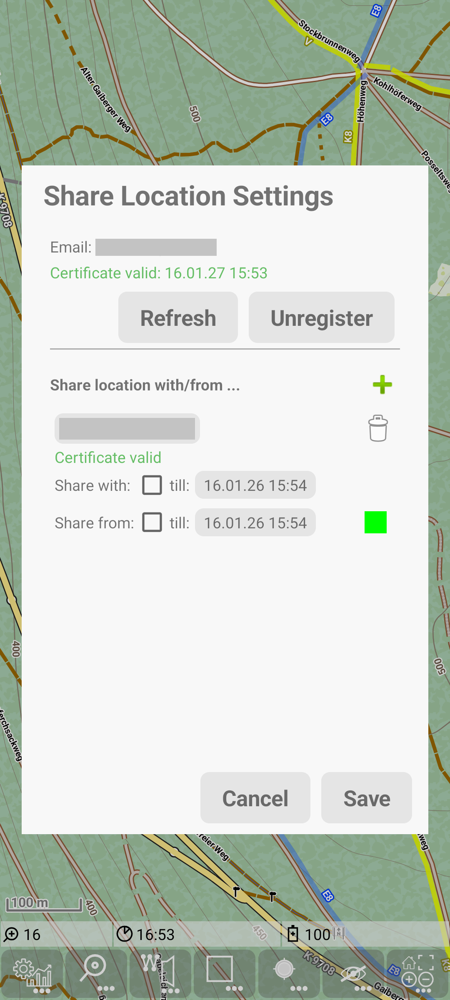&nbsp;

**Share location with ...**

Now you need to decide whether you want to share your location with the other person.

To share your location tap on the date in the "Share with" line. 
In the simplest case take the suggested time (it's 1h ahead) and just press ok. 
Then this selected time will be shown and also the checkbox for "share with" will be activated.

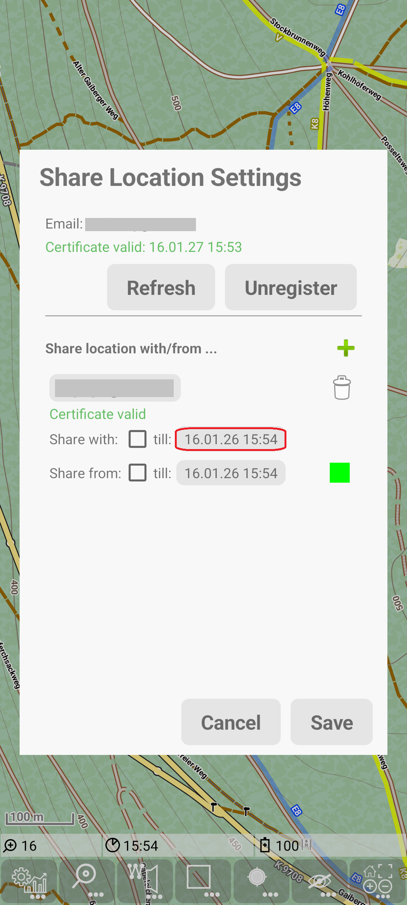&nbsp;
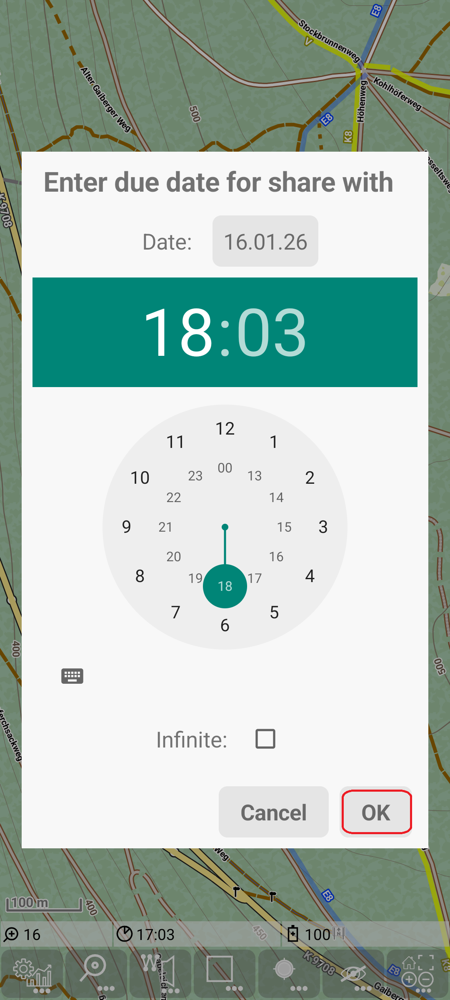&nbsp;
&nbsp;

Alternatively you may select any other timespan or you may even set "infinite".

**Share location from ...**

For the "share from" you can first select a color to visualize other persons location. For this 
tap on the colored field, select desired base color, then select transparency and press "select".

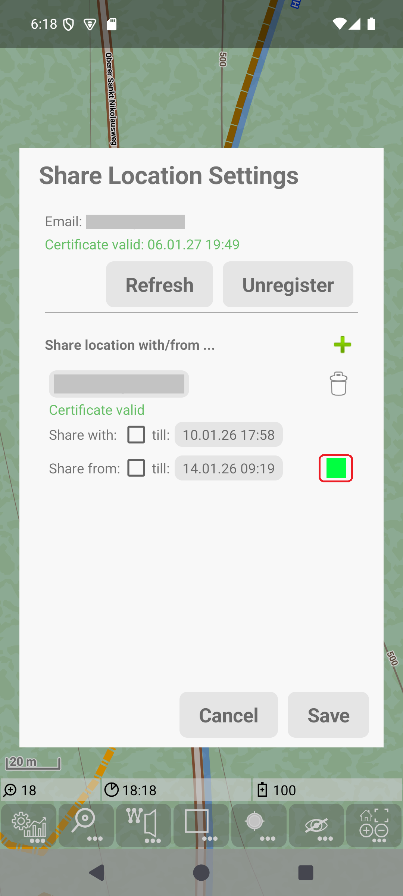&nbsp;
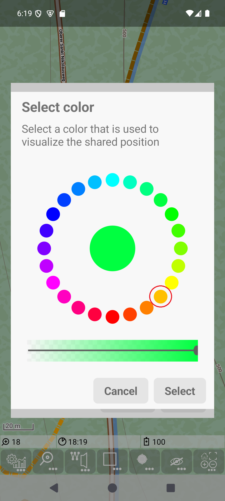&nbsp;

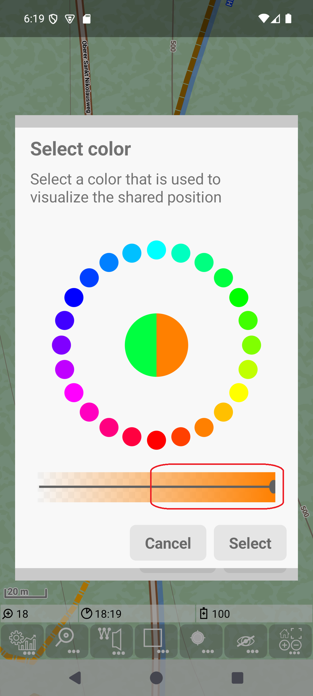&nbsp;
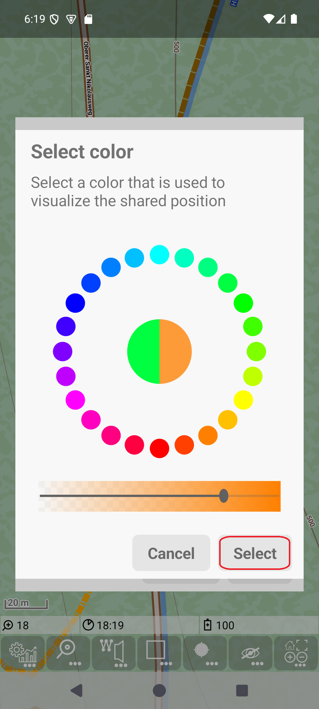&nbsp;

Now you should also select the desired timespan (like in the "share with"). To start this press on the time field in the "share from" row.
After selecting a date/time until the visualisation shall happen, this should look like the last screenshot (make sure that the checkbox is really checked).

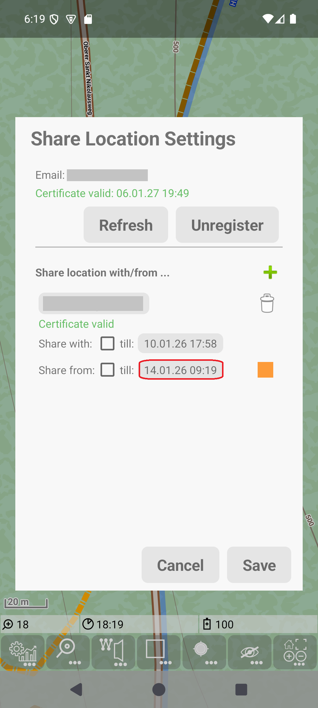&nbsp;
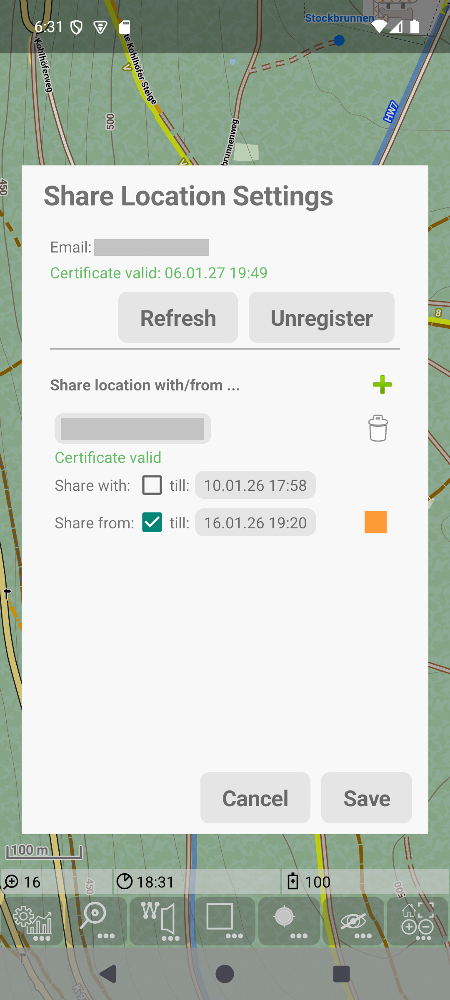&nbsp;

Finally leave the dialog with "Save" to make sure that settings on other persons are stored and activated.

#### Share location in action

After a long description of setup, here is how it looks like.

First screenshot shows the "share with". Here only GPS is activated, not track recording. But in terms of location sharing there is no difference between these two cases.
Note the icon of the recording indicates that also the sharing is active .

Second screenshot shows the "share from". Here only the latest and the second latest position are visible. This enables to determine the direction of movement, 
but it should not give the whole track (it's not supervision). 

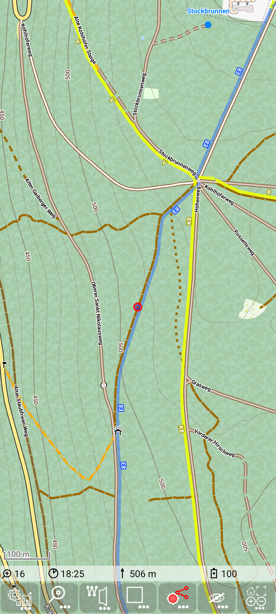&nbsp;
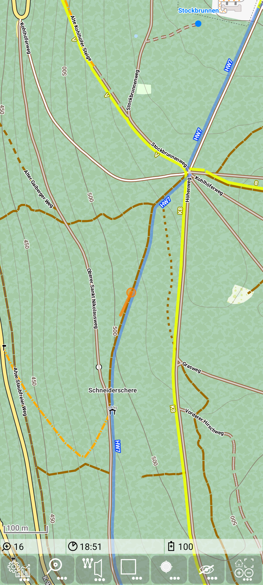&nbsp;

If you use "share from", then the map will be centered automatically to other persons position, if
- edit mode for routing is off and 
- gps is off or
- gps is on, but the function center gps position is off.

### Data Privacy

This feature is realized privacy friendly. It works with a minimum of data. 
See also [privacy](../../../privacy.md#share-location) description for this feature.

<small><small>[Back to Index](../../../index.md)</small></small>