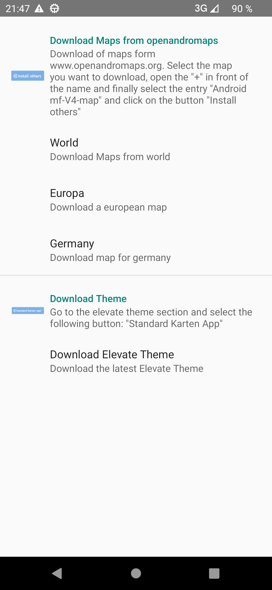
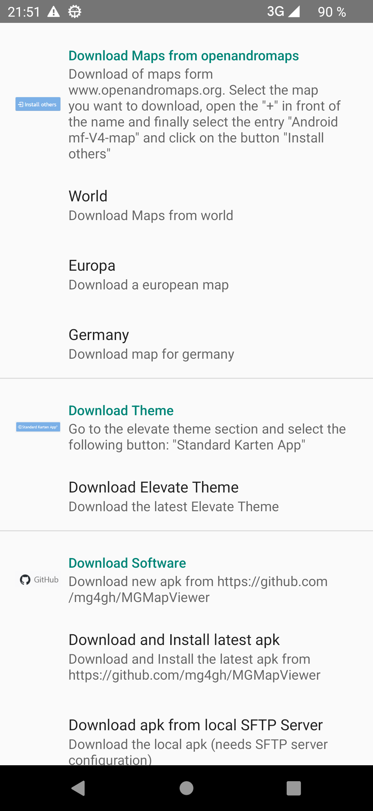
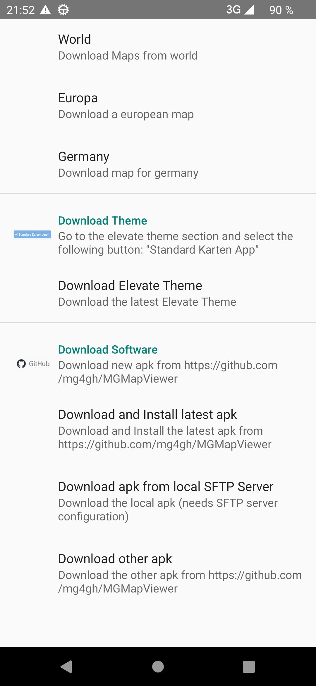

<small><small>[Back to Index](../../../index.md)</small></small>

## Software Update

If you use the official play store version, the software update is handled via the play store. 
Press  and  to see the download preference screen. It has no "Download Software" section:

&nbsp;

But if you have installed the app manually, then you'll need to take care also
about the updates manually. Open  and  to see the download preference screen, scroll down to the end:

&nbsp;
&nbsp;

There are multiple options, usually the first one is sufficient for you:
- Download and install latest apk (from github)<br>
The download of the apk is based on the [apk directory](https://github.com/mg4gh/MGMapViewer/tree/master/apk) of the github project page. If you use this option for the first time, you 
will be asked to give this app the permission to install apps. This is necessary to trigger the installation after download automatically. 
If you don't want to give this permission to the app, then use the option "Download other apk".
- Download apk from local SFTP server<br>
This option is for developer to speed up the test - it allows to generate and install a new app version in a few seconds - but it requires some additional effort 
on the developer site. You need to generate and export the desired apk to an SFTP server - this can be e.g. a raspberry pi with a special user for sync purposes. 
To get this option visible you need to provide a config file named *apk_sysnc.properties* in the *MGMapViewer/config* path. It is expected that the client finds 
an .apk file and a corresponding .sha256 file in the subdirectory <targetPrefix> of the users home directory.<br/>
  The apk will be downloaded and the download will be verified with the .sha256 hash code.
After successful download the apk will be installed. Again the permission for this has to be granted.  


  ```
  hostname=<IP of SFTP server>
  port=<port>
  username=<username>
  pkFile=tokens/id_rsa
  passphrase=
  targetPrefix=<subdirOfUsersHome>
  wifi="<SSID>"
  ```
  

- Download other apk
This option opens just a browser window with the path *https://github.com/mg4gh/MGMapViewer/tree/master/apk*. Then you can manually select the desired apk, download and 
install it via any browser and file manager of your choice.


<small><small>[Back to Index](../../../index.md)</small></small>