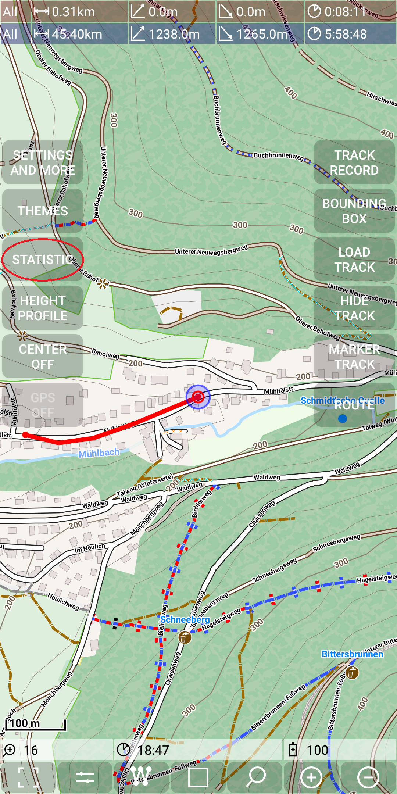
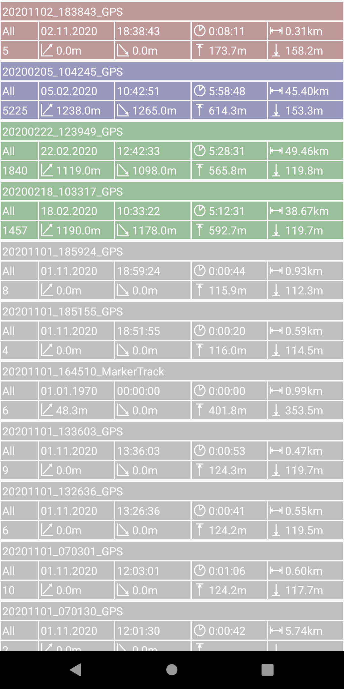
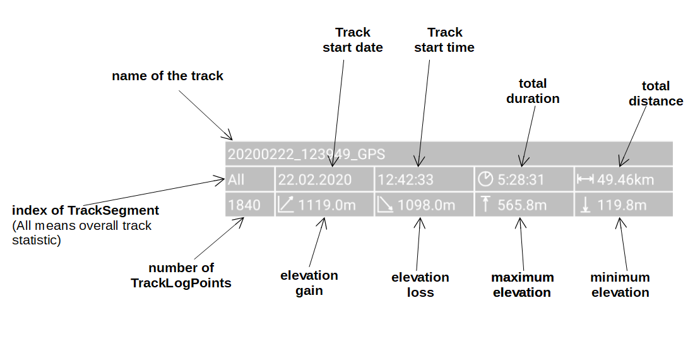
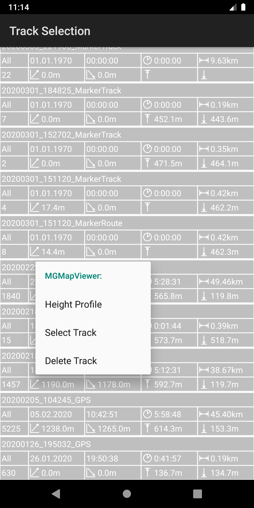
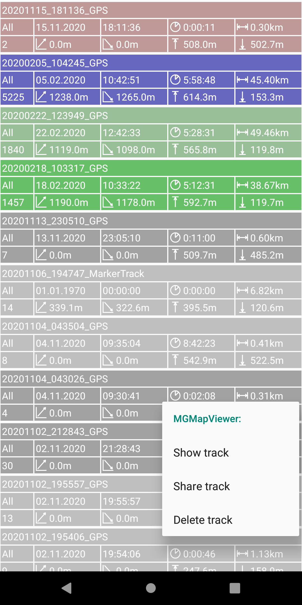

## Further Features: statistic view

There is a statistic view to keep an overview on all existing tracks.

To enter the statistic view use *Menu | Statistic*.

&nbsp;

#### Statistic information

The following figure shows an example of the statistic view - for the coloring see [here](../../track.md).
Inside of a color group the entries are sorted (descending) by name.

&nbsp;

&nbsp;

Each statistic entry consists of three lines - details are explained above.

#### Single entry context menu

With a long press on an statistic entry you get a popup menu (you may notice the color change for the selected entry):

&nbsp;

This menu offers functionality:
- Show Track: open this track as the selected track
- Marker Track: open this track as the marker track
- Height Profile: open the height profile for this track
- Share Track: open a share intent - allows to send the track as gpx file via mail, Whatsapp, etc
- Delete track: delete the track (there is a confirm required - but once you confirm, then it will be deleted, you don't get it back!)

#### Multi entry context menu

You can mark a statistic entry with a simple (short) tap on it. As a visual feedback the color of the entry becomes slightly stronger.
Tapping on a marked entry does unmark it, so the color changes again back.
With a long tap you get again a context menu with those entries, which make sense for multiple entries:

&nbsp;

This context menu offers functionality:
- Show Track: open all marked tracks, the entry with the context menu as the selected one
- Share Track: open a share intent - allows to send the marked tracks as gpx files via mail, Whatsapp, etc
- Delete track: delete the tracks (there is a confirm required - but once you confirm, then they will be deleted, you don't get them back!)

