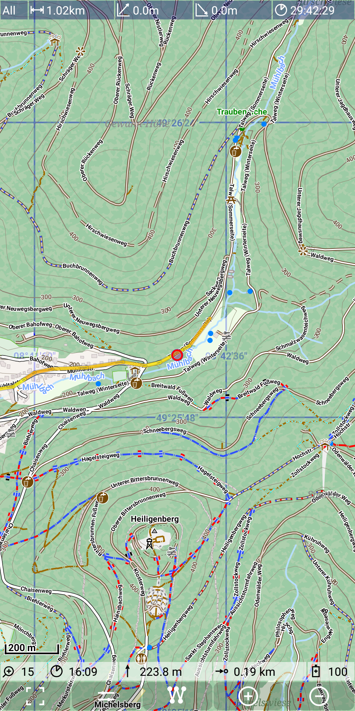
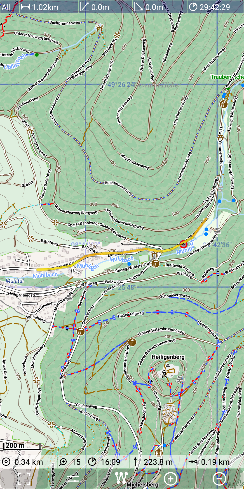

<small><small>[Back to Index](../../../index.md)</small></small>

## Further Features: status line
 
The status line is always visible, but it is kept semi transparent to have an idea about the 
underlying map part. The status line can shows following information:
- [air distance](../AirDistance/airdistance.md) between current position and a point of interest
- zoom level of the current map 
- current time
- current elevation 
- [remaining distance](../Remaining/remaining.md) along the selected track
- battery level

While the zoom level, the time and the battery level information are always available,
the air distance, the current elevation and the remaining distance information are only 
available if a certain context is given. These fields are set visible only, if they can provide 
some meaningful information. On the other hand there is only enough space for five out of this 
six fields. Therefore in the rare case, that for all fields information is available, 
the battery level will be suppressed.

The following figures illustrate this behaviour:

&nbsp;
&nbsp;

<small><small>[Back to Index](../../../index.md)</small></small>