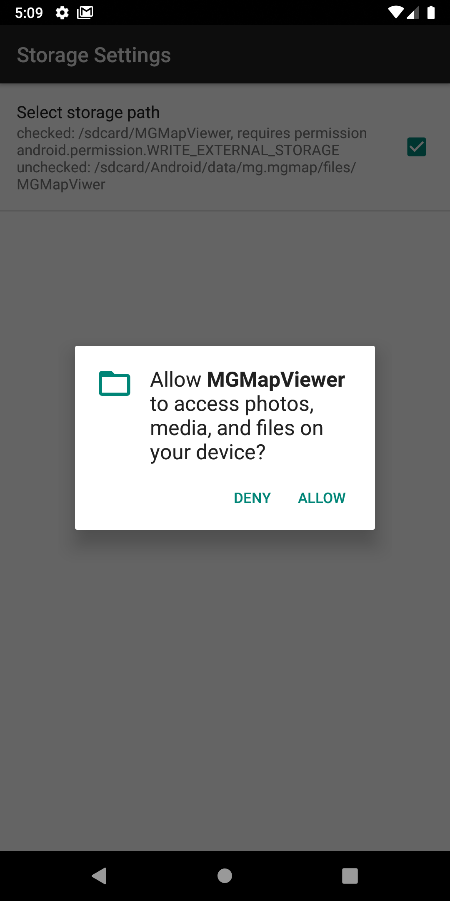

## Further Features: storage location
 
Currently there are two main options, where the data of the MGMapViewer app can be stored:
- /*\<sdcard>*/Andorid/data/mg.mgmap/files/MGMapViewer
- /*\<sdcard>*/MGMapViewer  
 where *\<sdcard>* is not necessarily a real sdcard. It's rather the default external storage location. Often the path is "/storage/emulated/0".
 Sometimes the term "internal storage" is used.

To select the desired storage path use *Menu | Settings | Storage Settings | Select Storage Path*.
 

&nbsp;&nbsp;

The preconfigured option is the first one, because it doesn't need extra permissions. 
If you put your data to this location then keep in mind that the uninstall of the app 
deletes all these data, including the recorded tracks and the maps!  
  
If you use the second option, then your data are independent on the app Software. 
They will be available after deinstallation (you still have your tracks available even 
if you don't use this software anymore). This requires extra
[permissions](./permissions_media.png).  

&nbsp;

If you don't need the data anymore, you have to cleanup the directory manually.

