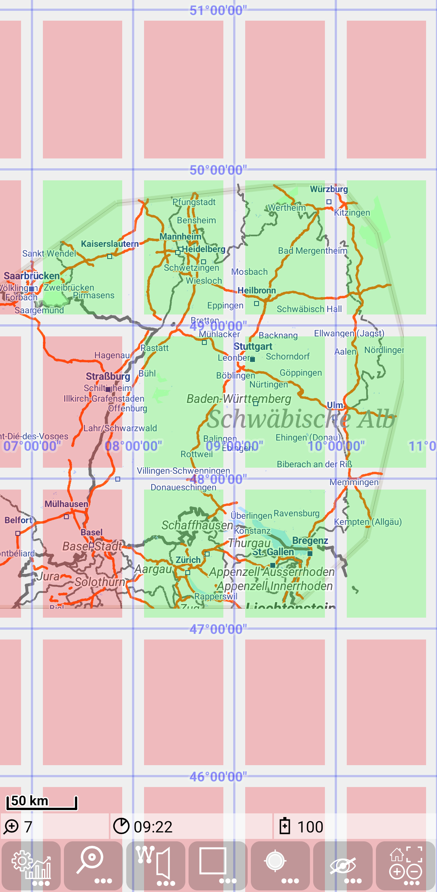
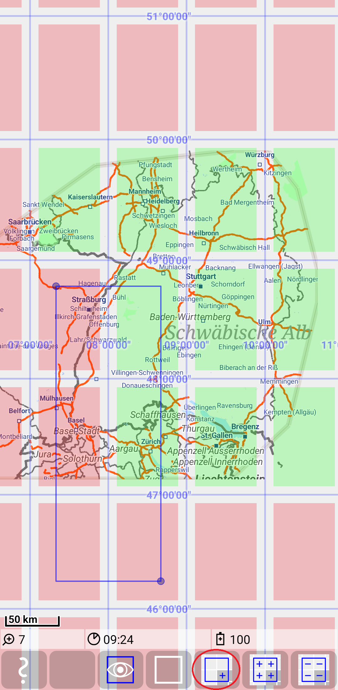
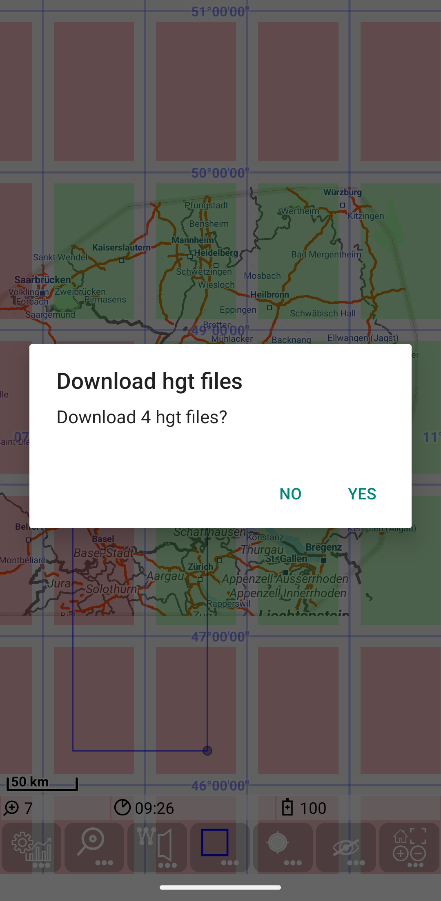
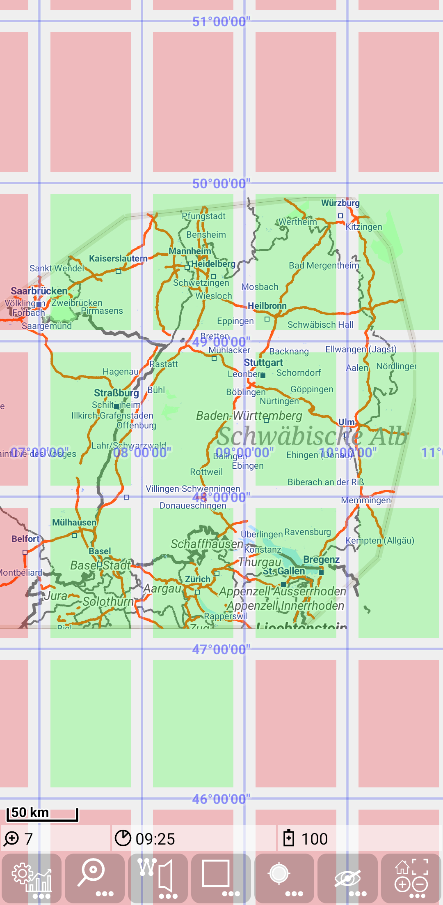

<small><small>[Back to Index](../../../index.md)</small></small>

## Main map Feature: hgt grid layer

The hgt layer is a special grid layer with a constant spacing of 1.0, so it shows the grid of full latitude an longitude degrees.
The special thing about this layer is that it shows the availability of the [height data](../../FurtherFeatures/HeightData/heightdata.md), e.g. like this 

This layer is always available without configuration data. As other layers it allows to control transparency (as shwon in [Overlay multiple map layers](../../MainMapFeatures/MapMulti/multimap.md))

### Downloading of missing hgt data

This feature supports easy download of missing hgt data.
It works similar to the "Tile loading" section of the [Bounding Box](../../MainTrackFeatures/BoundingBox/boundingbox.md#tileloading) feature:

1) Switch on the bounding box mode with  + .
2) Mark relevant area (partly marked grid elements are included in loading)
3) Use  +  to load missing hgt files.
4) Confirm download dialog (for more information about the data source see [height data](../../FurtherFeatures/HeightData/heightdata.md))
5) Downloaded hgt data are visible in hgt layer

Be aware that loading includes all partly marked grid elements, while drop includes only fully included elements.

<small><small>[Back to Index](../../../index.md)</small></small>