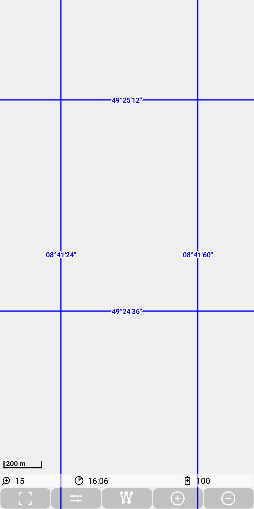

## Main map Feature: mapgrid

A mapgrid layer is controlled be a simple properties file (named e.g.
`grid.properties` ) like this:

```
zoomLevel_6=1.0
zoomLevel_7=1.0
zoomLevel_8=1.0
zoomLevel_9=1.0
zoomLevel_10=0.5
zoomLevel_11=0.25
zoomLevel_12=0.1
zoomLevel_13=0.05
zoomLevel_14=0.025
zoomLevel_15=0.01
zoomLevel_16=0.005
zoomLevel_17=0.0025
zoomLevel_18=0.001
```

The property values describe per zoom level the density of grid lines.

It shows a grid of longitude and latitude values, e.g. like this:



