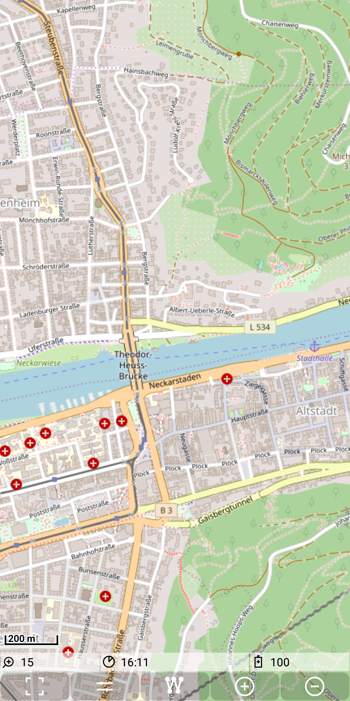

## Main map Feature: maponline

A maponline layer consists of a directory with the name of the layer.
This is a direct subdirectory of ./MGMapViewer/maps/maponline. Inside of
this directory there is a description file with the fix name
`config.xml`. The content of this file looks like:

```
<tilesource>
    <hostnames>
        <hostname>a.tile.openstreetmap.org</hostname>
        <hostname>b.tile.openstreetmap.org</hostname>
        <hostname>c.tile.openstreetmap.org</hostname>
    </hostnames>
    <port>443</port>
    <urlPart>/{z}/{x}/{y}.png</urlPart>
    <parallelRequestsLimit>8</parallelRequestsLimit>
    <protocol>https</protocol>
    <zoomLevelMin>4</zoomLevelMin>
    <zoomLevelMax>20</zoomLevelMax>
    <ttl>8279000</ttl>
</tilesource>
```

The description contains all data to access an online tile server. In the urlPart definition the {z} means zoom level, {x} the x-tile number and {y} the y-tile number.




 