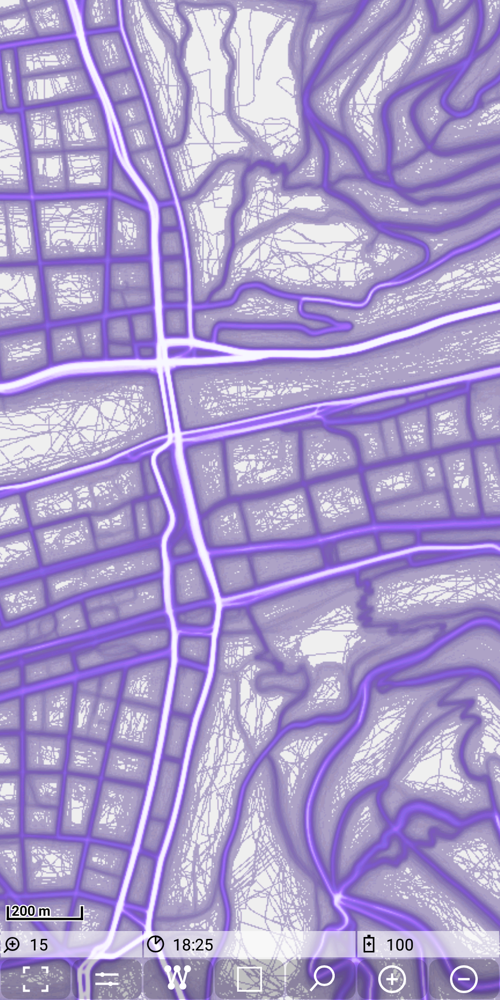

## Main map Feature: mapstore

### Tile store based on files

A mapstore is a directory with the structure \<store_name>/\<zoom_level>/\<x-tile>/\<y-tile>.png. 
This directory will be placed as a subdirectory to "./MGMapViewer/maps/mapstores/".

The following picture shows an example of such a structure:

A mapstore could contain a "normal" map (e.g. downloaded from mapnik), but it could be also something like a heatmap, 
generated from whatever data.

### Tile store based on SQLite database (*.mbtiles)

There is a second option to provide a tile store. In this case all tiles are stored in a single sqlite database file, which has the file extension ".mbtiles".
The format definition is available via [github](https://github.com/mapbox/mbtiles-spec). Place the database file with the tiles in the store directory instead the zoom subdirectories.

You can find examples of such tile stores on openandromaps: The [overview maps](https://www.openandromaps.org/downloads/ubersichts-karten) are in this format.
They are well suited as background maps.

