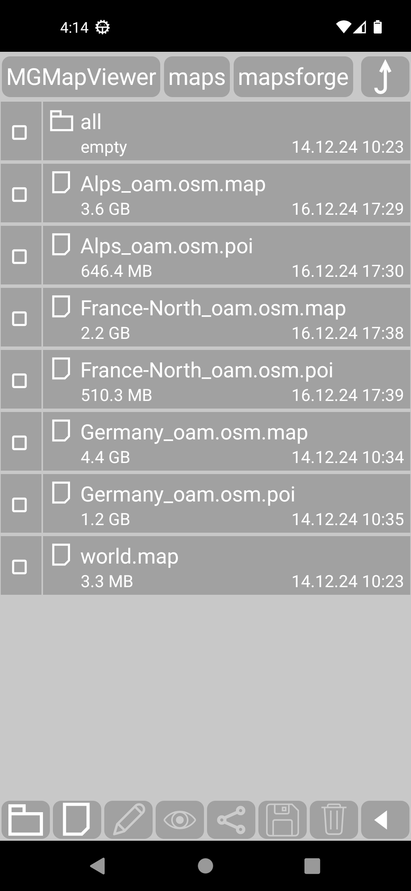
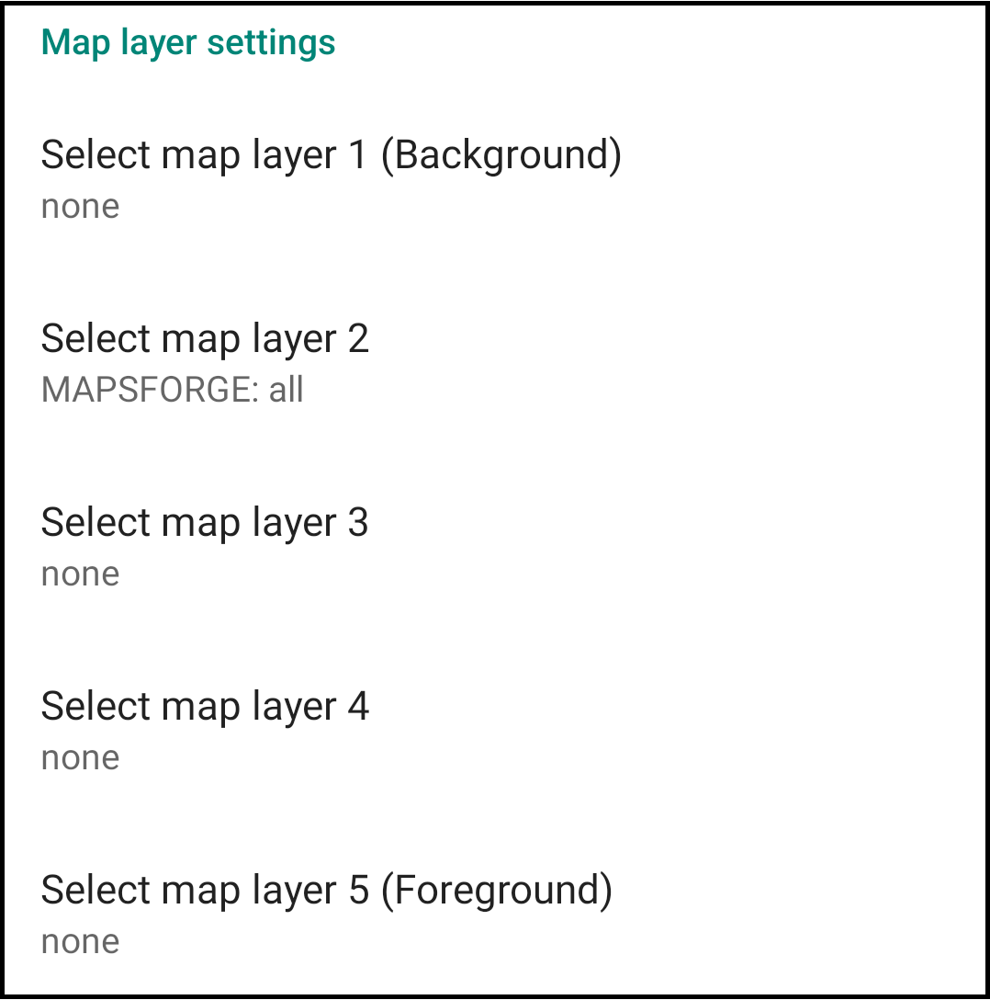
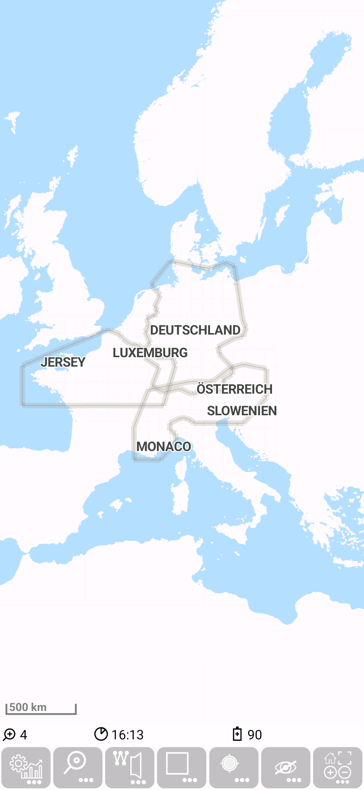
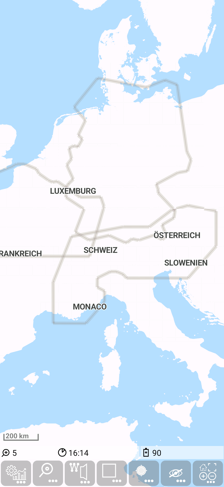
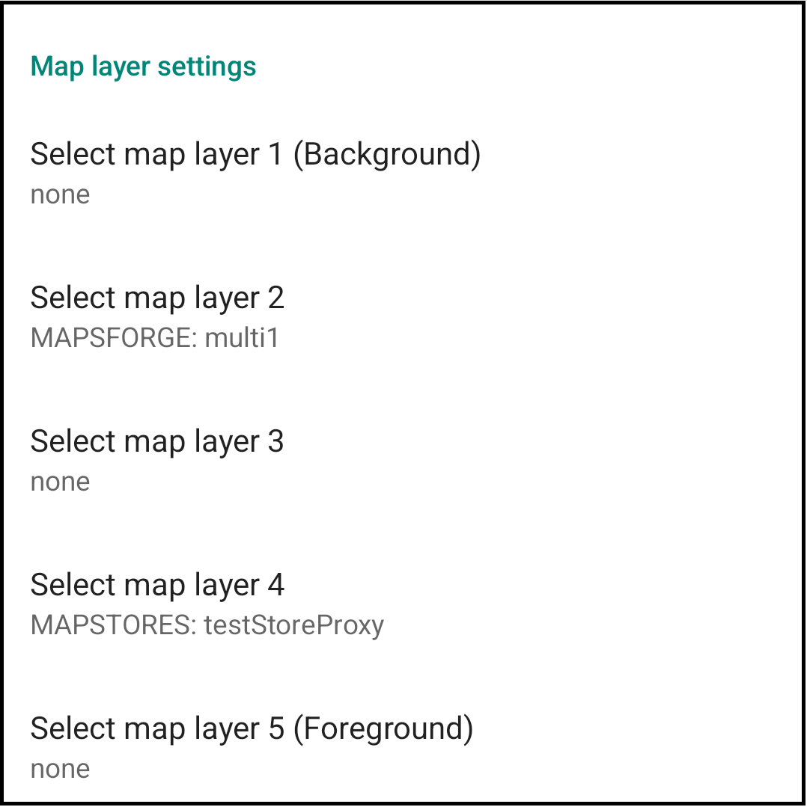
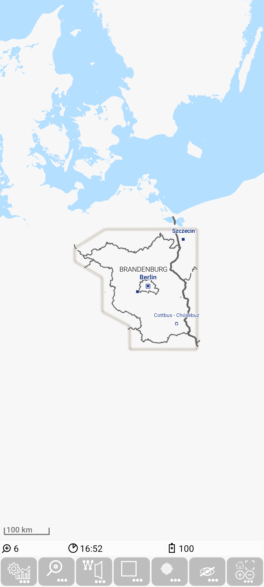

<small><small>[Back to Index](../../../index.md)</small></small>

## Main map Feature: mapsforge multi map

The basics about mapsforge maps are explained [here](../Mapsforge/mapsforge.md).

This feature allows you to visualize multiple maps in one layer. So there is no need to toggle in the configuration between multiple maps anymore.
The standard configuration will take advantage out of this option.

The mapsforge maps will still be placed to the directory `MGMapViewer/maps/mapsforge/`.
Each subdirectory of this directory will be considered as a "mapsforge multi map" definition. 
This subdirectory may contain a configuration with the name `config.properties`.
If there is no such configuration file, then the default will be applied - this means that all map 
file in the mapsforge folder are considered as a part of this multi map.

If e.g. the maps from germany, alps and northern france are loaded and the most simple layer configuration is set (empty subdirectory "all")

then all maps become visual:

If the `config.properties` exists, then only those maps will be consitered, that are explicitely configured, e.g.:

Here the folder name "multi1" represents the definition. In this example only the map from Brandenburg and the world map
become visible:

The general rule behind this is: 
- properties starting with "map" represent an entry for a map that should be part of this config
- properties starting with "prio" define the priority for a map with corresponding name - e.g. "prio1" defines priority for "map1".
- The "policy" property defines the DataPolicy in the MultiMapDataStore. Use this only, if you know what that means.

<small><small>[Back to Index](../../../index.md)</small></small>