## Main map Feature: mapsforge themes

The usage of [mapsforge](../Mapsforge/mapsforge.md) maps requires the usage of rendering themes. As already stated in the
[Getting Started](../../../GettingStartedUsage.md) you need to download the corresponding theme definitions, e.g.
the [elevate theme](https://www.openandromaps.org/wp-content/users/tobias/Elevate.zip).  
Unzip these theme and place it into the ./MGMapViewer/themes/ directory.

Now you can select the installed theme via the menu:

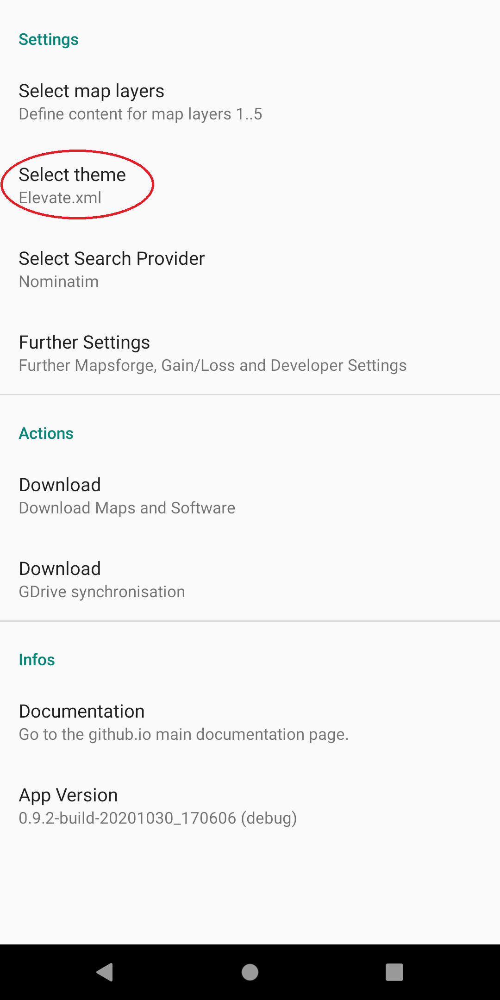
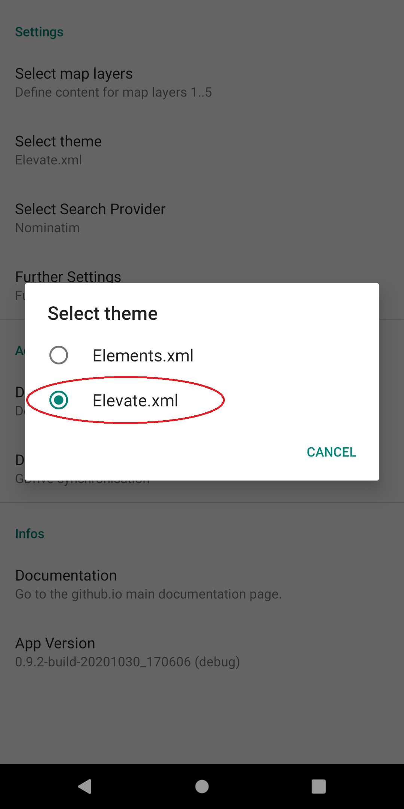  

After installation you can select the language for the themes:

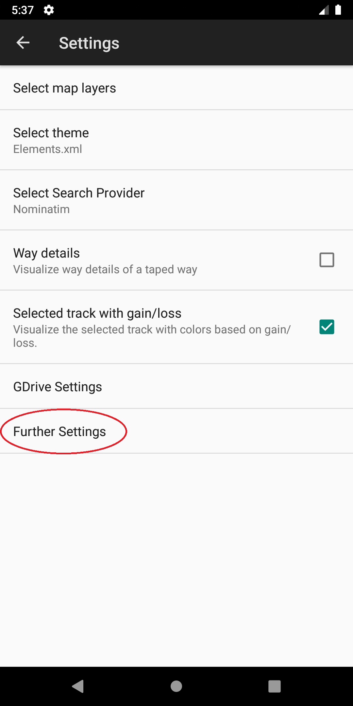
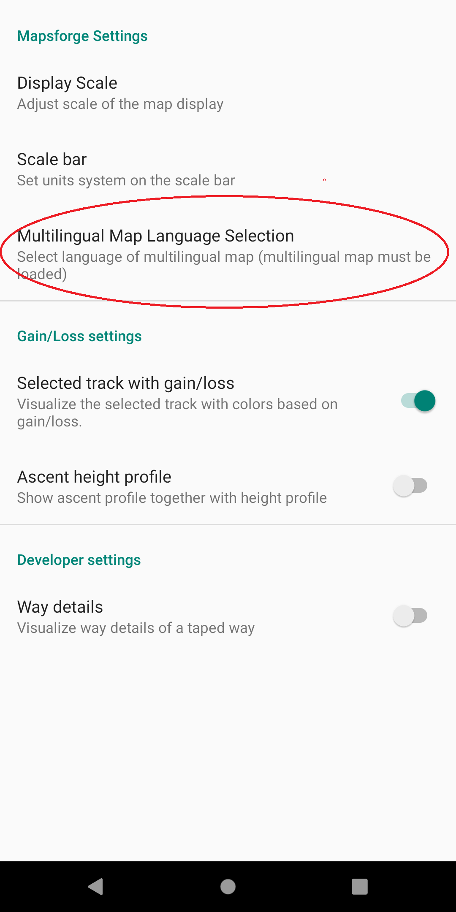
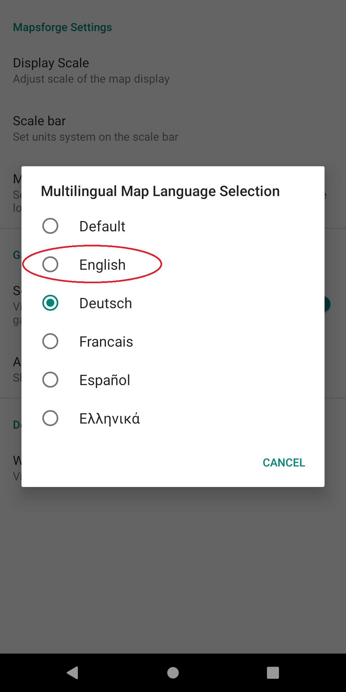  

The elevate theme provides four main modes:
- Hiking (includes e.g. hiking routes)
- City (includes e.g. shopping infos)
- Cycling (includes e.g. biking routes)
- Mountain bike (includes e.g. MTB downhill and uphill scales)

The following images illustrates these four modes:

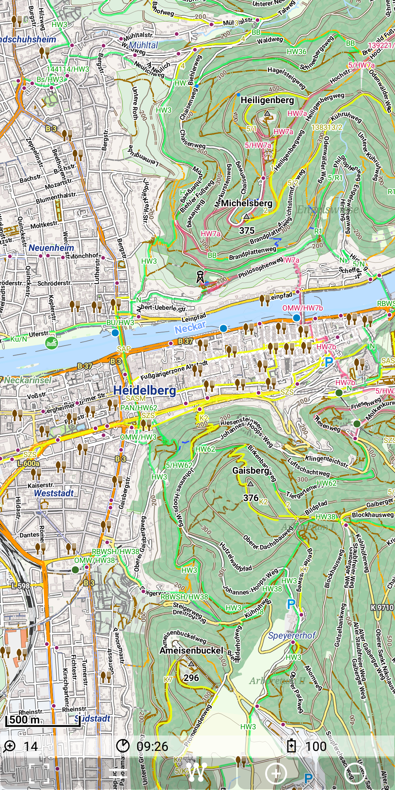
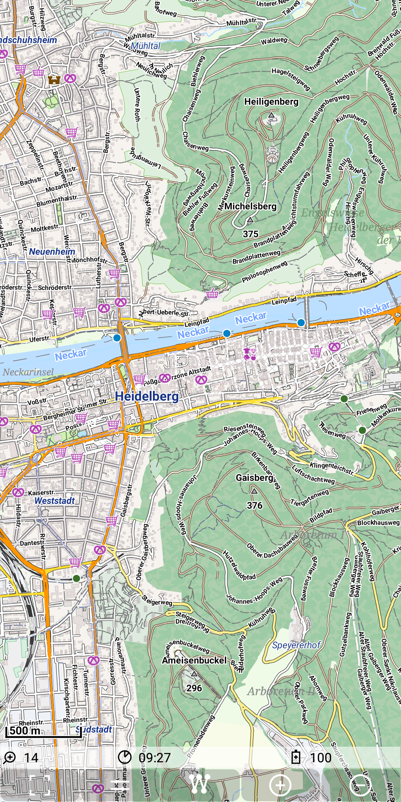  

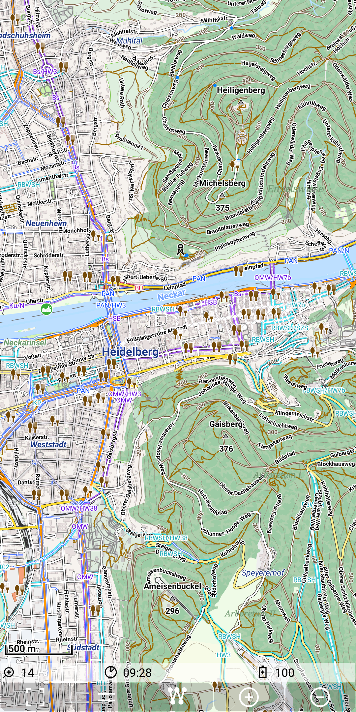
  

To switch the mode use *Menu | Themes*
and then click on the current mode (e.g. Mountainbike) and then you get a popup menu to select one of the four modes.

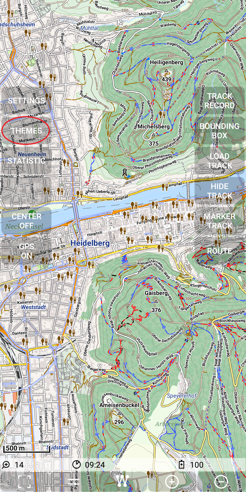
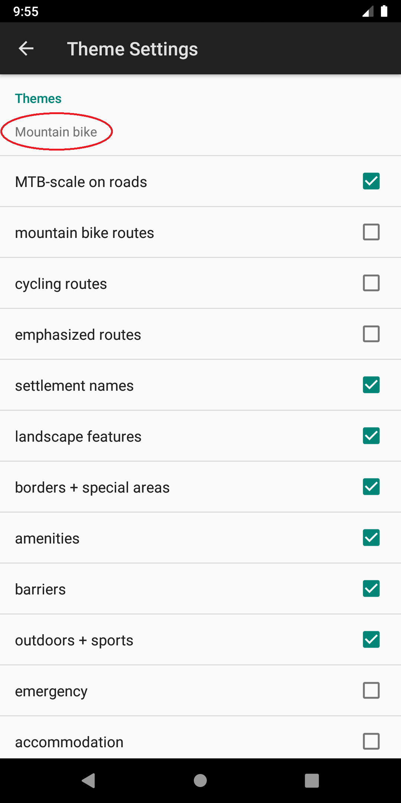
  

Within one of these modes you still can adopt this mode according to your needs, e.g. in the mode "City" you can switch on the public transport
(check public transport network)

 
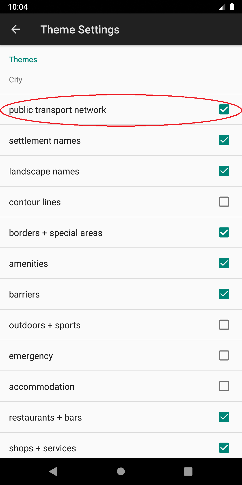 
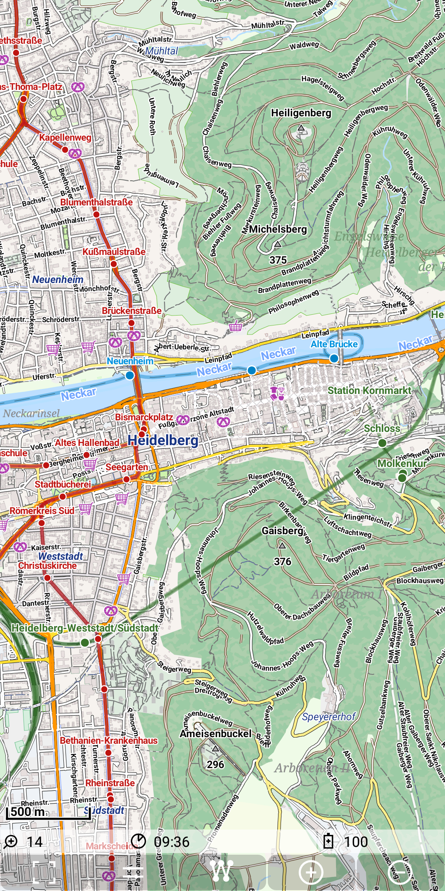 

