<small><small>[Back to Index](../../../index.md)</small></small>

## Main map Feature: mapsforge themes

### Themes and theme definition.

The usage of [mapsforge](../Mapsforge/mapsforge.md) maps requires the usage of rendering themes. The elevate theme definition (in the file elevate.xml) contains four themes:
- Hiking/Wandern (includes e.g. hiking routes)
- City/Stadt (includes e.g. shopping infos)
- Cycling/Radfahren (includes e.g. biking routes)
- Mountain bike/Mountainbike (includes e.g. MTB downhill and uphill scales)

Depending on the selected theme the mapsforge map provides different details and different rendering of some aspects.

To select a theme open the themes menu with  + .
Click on *Select theme* and select the most suitable theme for your current activity.

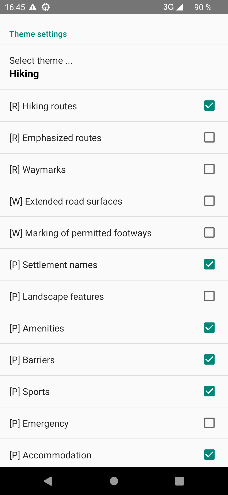&nbsp;
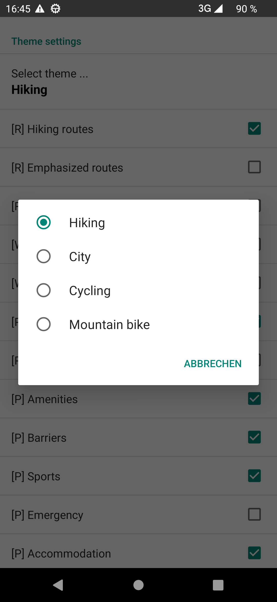&nbsp;
  
The following images illustrates these four themes (in above sequence):

&nbsp;  

&nbsp;  

You can adopt each of these themes according to your needs, e.g. in the theme "City" you can 
switch on the public transport on
(check public transport network)

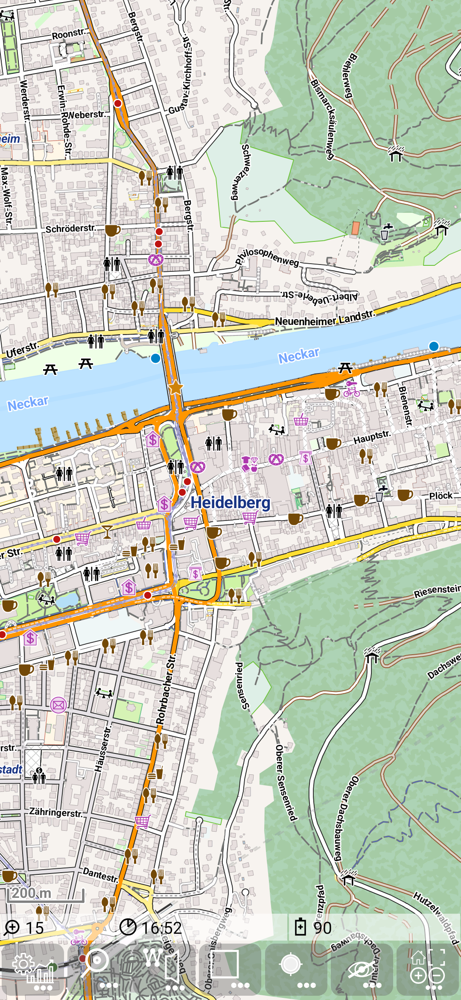&nbsp;
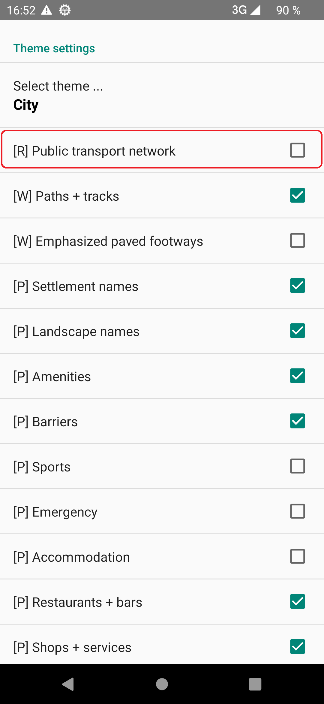&nbsp;
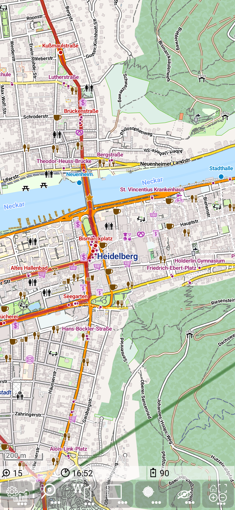

### Default theme definition

A theme definition packages consists typically out of one or more xml files, each representing a theme deinition and a subdirectory containing plenty of svg images.
There is one version of the Elevate Theme definition (provided by Tobias Kühn) already delivered together with this app. 

To see the currently used theme open settings via  +  and 
scroll down to the *Mapsforge settings* section.
Available options can be seen, when you click on the *Select theme definition* entry.

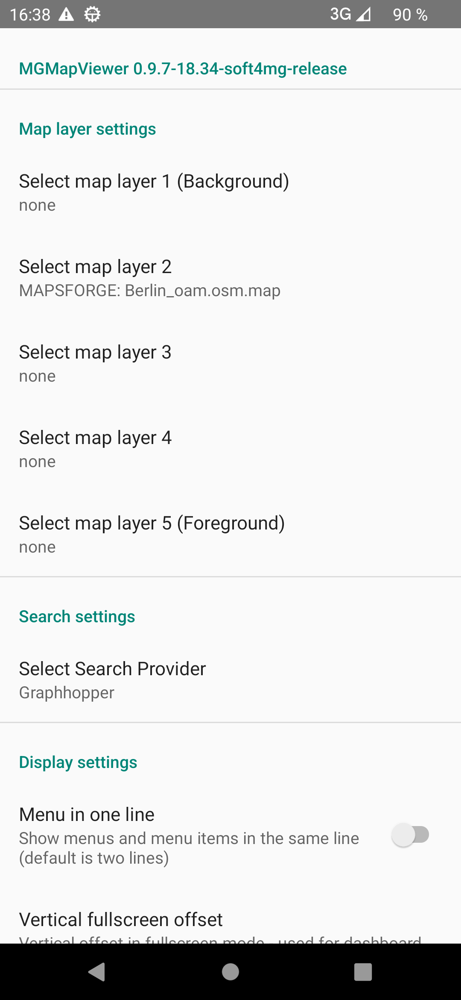&nbsp;
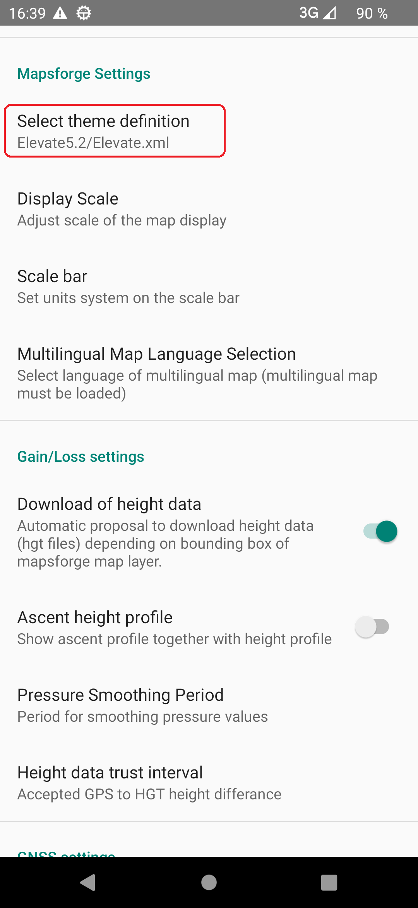&nbsp;

### Download and Installation of theme definition

You can update the [elevate theme definition](https://www.openandromaps.org/kartenlegende/elevation-hike-theme). Download it manually, unzip it and
put it into the *MGMapViewer/themes/* directory (see also [file system structure](../../../GettingStarted/FileSystem.md)).  
   
The easier way is to open via  +  the download settings. Select
*Download Elevate Theme* to open the theme download webpage of openandromaps. Scroll to the Elevate 5 section and select the entry
   *Standard Karten App* entry.

&nbsp;
&nbsp;
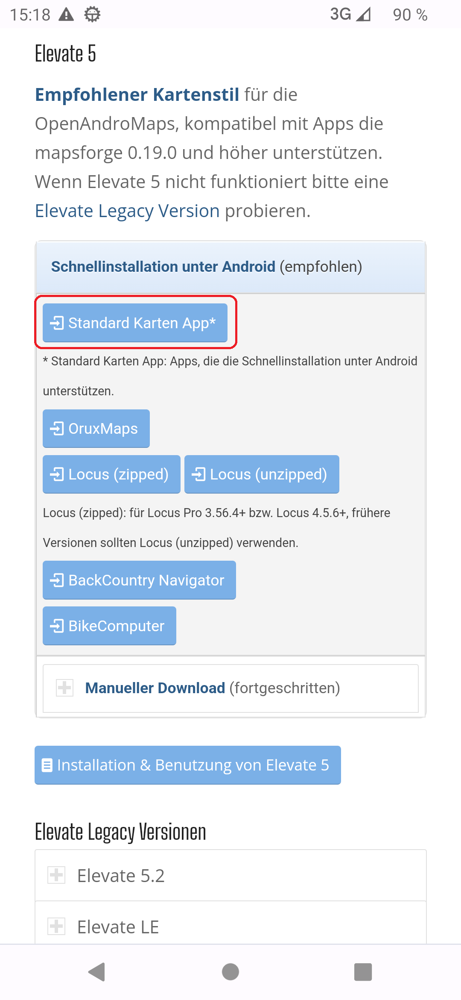&nbsp;

### Usage

Now open again the settings via  + , 
scroll down to the *Mapsforge settings* sectionon and click on the *Select theme definition* entry.
To activate the downloaded theme select the *Elevate.xml* entry.

&nbsp;
&nbsp;

After installation you can select the language for the themes (be aware that the scope of
this language selection is **only** the theme and some multilingual map items). 
To do this open again the settings via  + , 
scroll down to the *Mapsforge settings* sectionon and click on 
the *Multilingual Map Language Selection* entry and select the desired language.

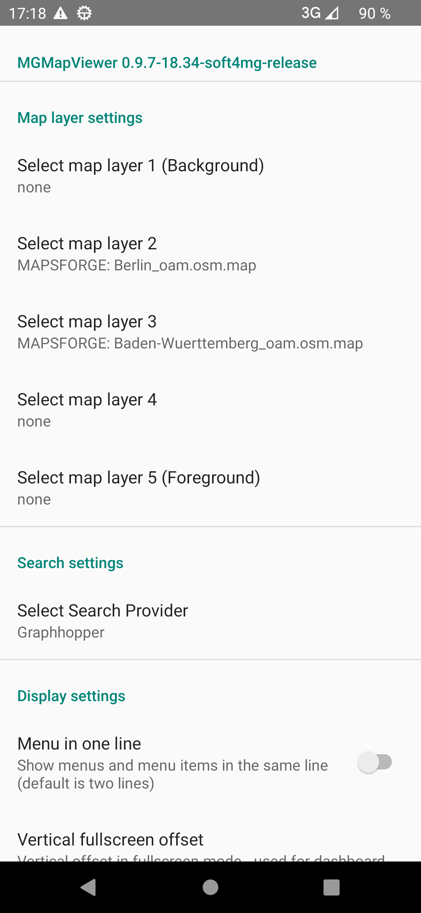&nbsp;
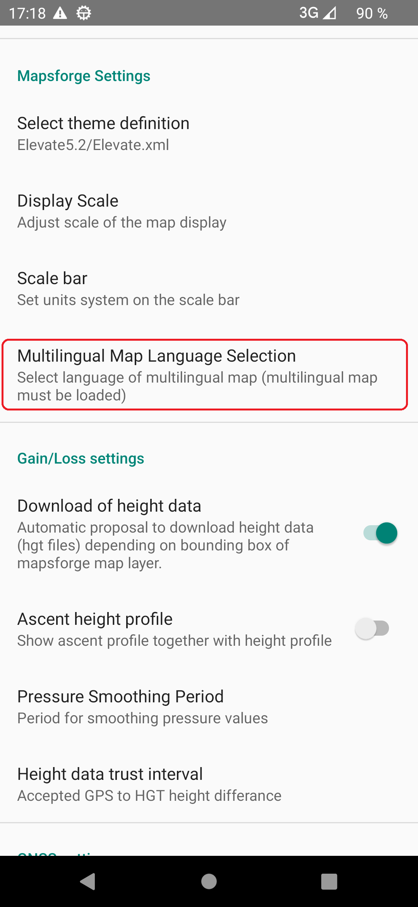&nbsp;
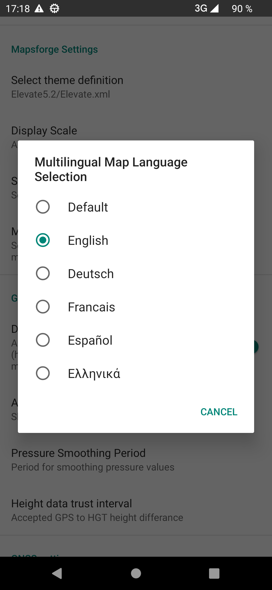
 

<small><small>[Back to Index](../../../index.md)</small></small>