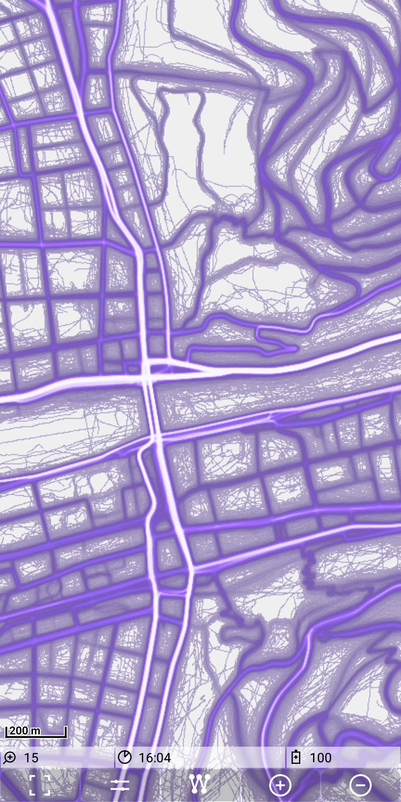

## Main map Feature: mapstore

A mapstore is a directory with the structure \<store_name>/\<zoom_level>/\<x-tile>/\<y-tile>.png. 
This directory will be placed as a subdirectory to "./MGMapViewer/maps/mapstores/".

The following picture shows an example of such a structure:

A mapstore could contain a "normal" map (e.g. downloaded from mapnik), but it could be also something like a heatmap, 
generated from whatever data.

