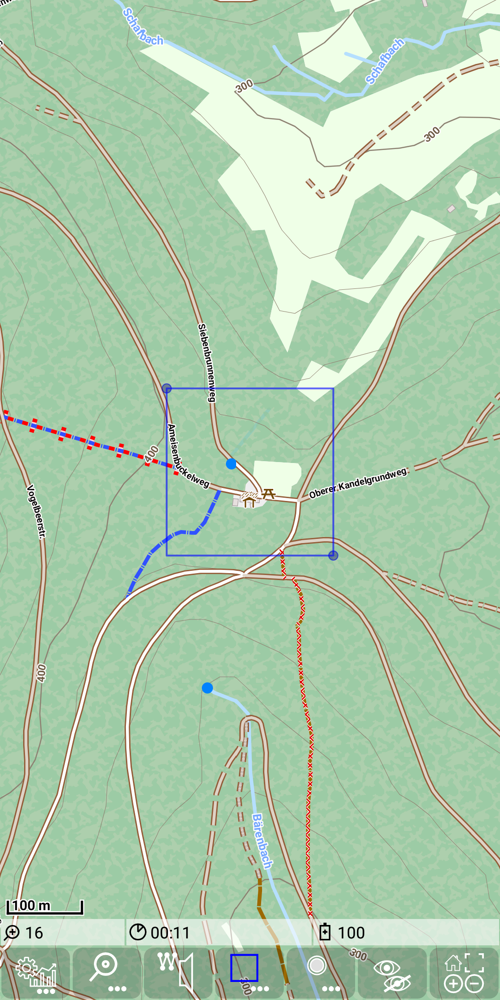
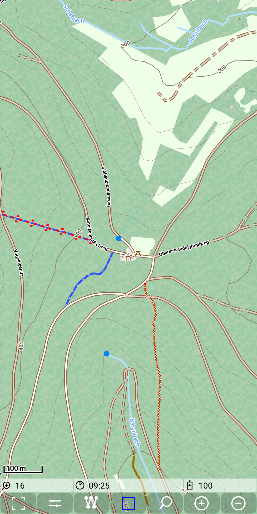
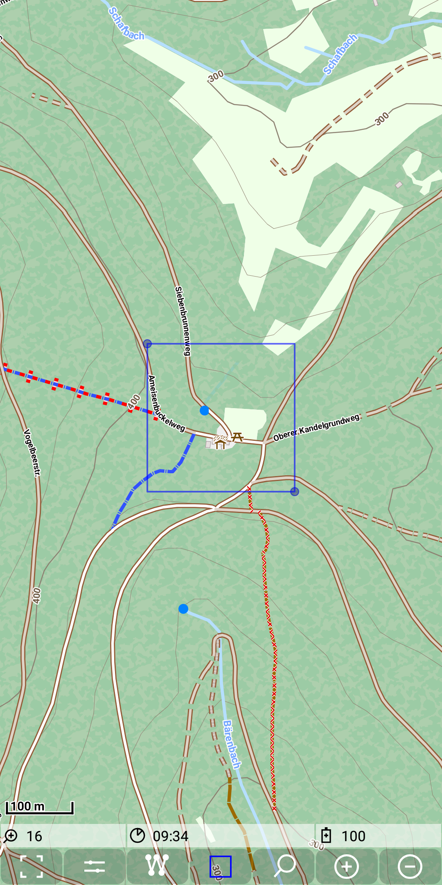
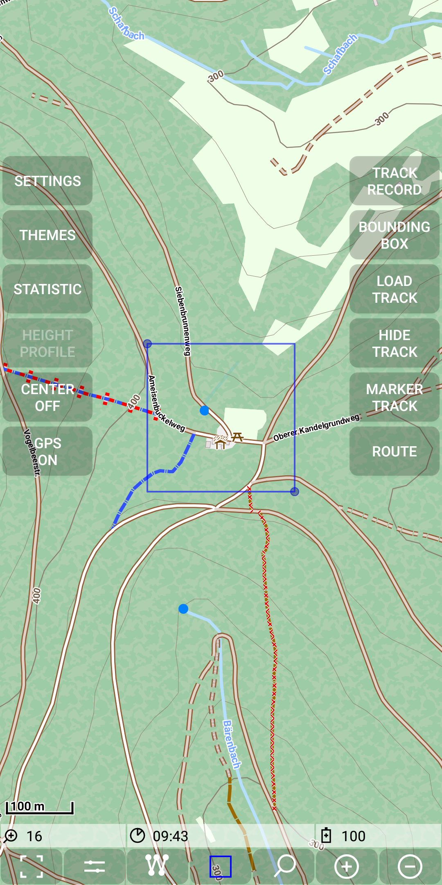
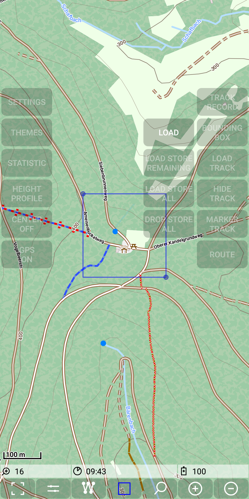
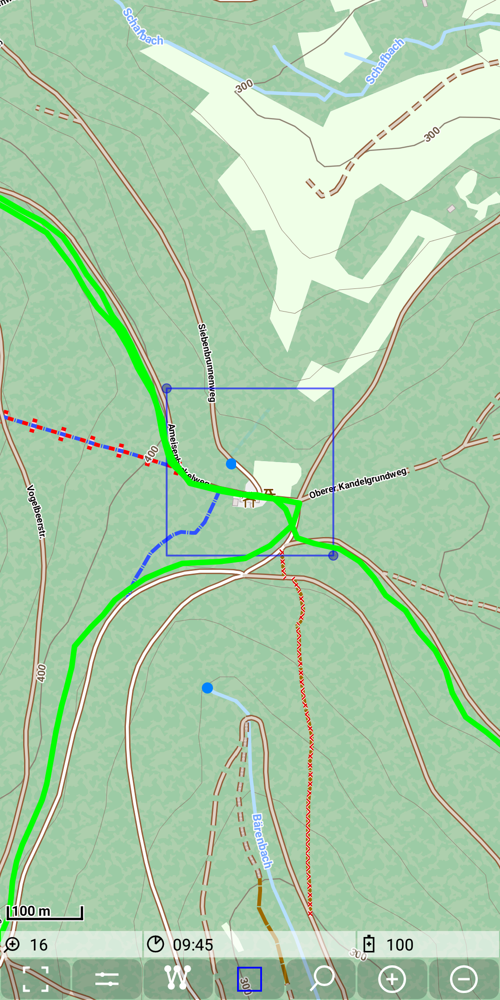
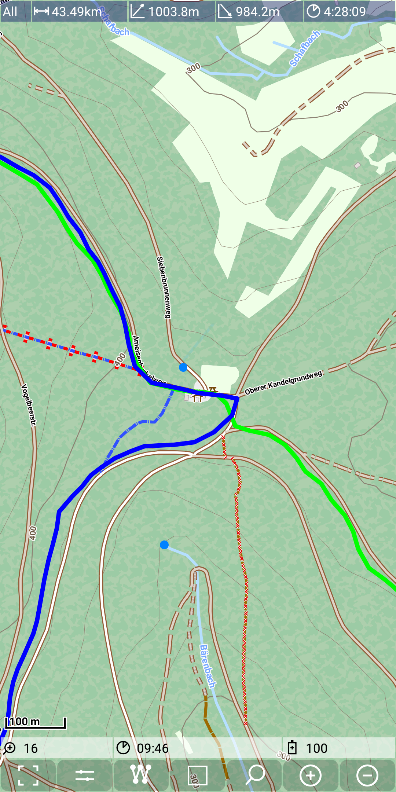

## Main Track Feature: Use a bounding box to search track(s) ... and more

Initially the bounding box feature was intended to provide a simple search for tracks through a marked area.
Meanwhile a couple of other features for mapstores are added.

This page is split into the following sections, which represent typical steps in the bounding box usage.
- switch bounding box feature on and mark a relevant area 
- select and execute the desired action on the bounding box
- switch off the bounding box feature 

### Switch bounding box feature on and mark a relevant area
To switch on the bounding box feature, press the bounding box control (part of the [quick controls](../../FurtherFeatures/QuickControl/quickcontrols.md)).
As a visual feedback you see the quick control in blue color.

&nbsp;
&nbsp;

In fact switching on the bounding box feature creates a bounding box control layer. This control layer allows to mark a relevant area.
There are several intuitive options to mark this area:
- tap on two single points 
- use a drag and drop gesture to stretch out a rectangular.
- drag and drop the corners with small blue circles to resize the rectangular
- long tab of the bounding box control to provide a default central area as bounding box 

**Shortcut**: You can combine switching on and marking a central area, if you just use a long press on the quick control also when the feature is switched off. 
 
The result of this marking action might look like this:

&nbsp;

### Select and execute the desired action on the bounding box

There are several actions for a bounding box available:

- Load tracks that pass through the marked area
- Load all tiles of a marked area
- Load missing tiles of a marked area
- Remove all tiles inside a marked area

All tile store related actions are only available, if at least one mapstore layer with config.xml is configured 
(see  [mapstore](../../MainMapFeatures/MapStore/mapstore.md)).

Additionally to the config.xml there might be a sample of a tile request as a curl command in the file "sample.curl". HTTPConnection request 
parameter are taken over from this sample. If this HTTPConnection request includes a cookie, then you can provide also an cookies.json file as 
it will be provided by typical cookie manager plugins. Then the cookies in the sample.curl will be refreshed with the values from the cookies.json file.

#### Load tracks that pass through the marked area

To trigger this action press *Menu | BoundingBox | Load*

&nbsp;
&nbsp;

As the result all tracks passing through the marked area will be loaded. If there are multiple tracks, you can select one of them just by tapping on it.
With the use of *Menu | Hide Track | Selected* and *Menu | Hide Track | Not Selected* you
can reduce the number of visible tracks to the track(s) you are searching for.

&nbsp;
&nbsp;

**Shortcut**: A long press action inside the marked area triggers also the load action.

#### Load all tiles of a marked area

With the menu item *Menu | BoundingBox | Load Store All* you can trigger a download of all tiles inside the marked area.
Limitations of the zoom level are given by the config.xml file. This option can be used, if there are no tiles for the specified area available yet.
But if the map data will change over the time, this option can also be used to refresh your tiles in the store after som time.

#### Load missing tiles of a marked area

The menu item *Menu | BoundingBox | Load Store Remaining* works similar to the *Load Store All*. 
The difference is, that if a tile is already existing, then no new tile will be loaded.
Imagine you have a region almost available in the app and you want slightly enlarge it without download everything again.

Remark: the tile number for a download request doesn't yet reflect already existing once.

#### Remove all tiles inside a marked area

As your store might grow due to different loading requests, it will require more and more space. Once you realize, that you don't need anymore some data
inside a mapstore, you can drop tiles from it. This can be achieved by *Menu | BoundingBox | Drop Store All*. This command
deletes all tiles which are full included by this given bounding box.

### Switch off the bounding box feature 

Finally, after some bounding box action, you want to leave this feature. This can be done again by a short tap on the bounding box quick control.
Alternatively this mode will be leaved automatically after 15 seconds, if there is no bounding box related action recognized during this time.
