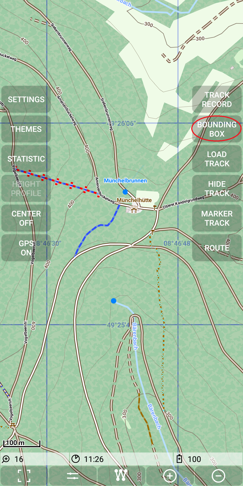
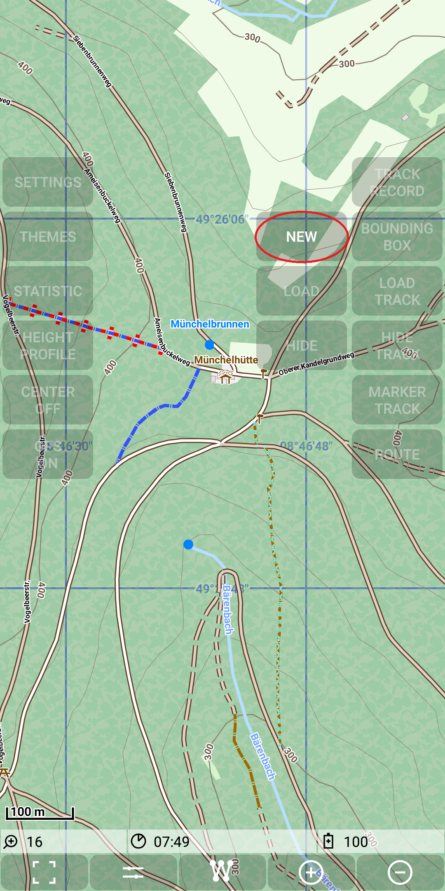
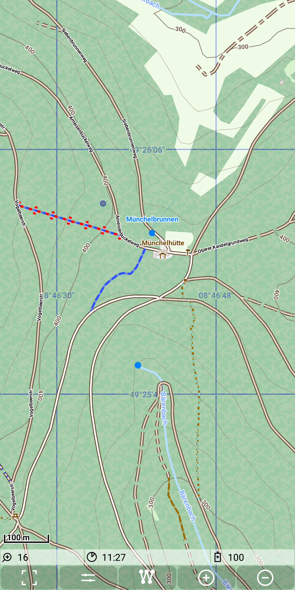
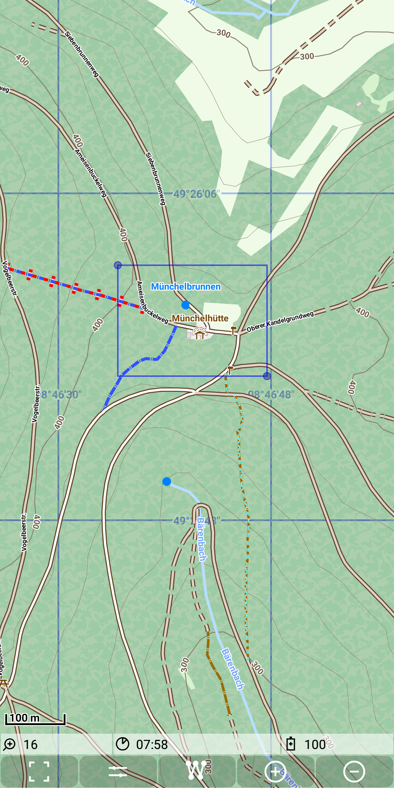
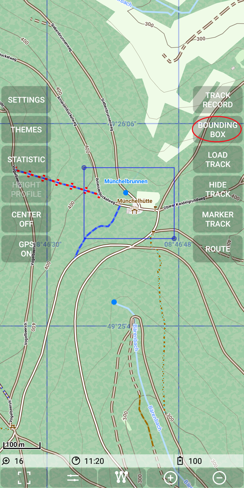
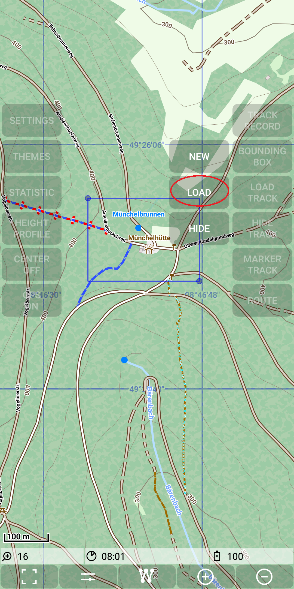
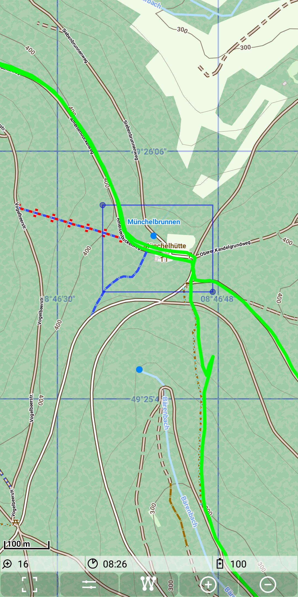
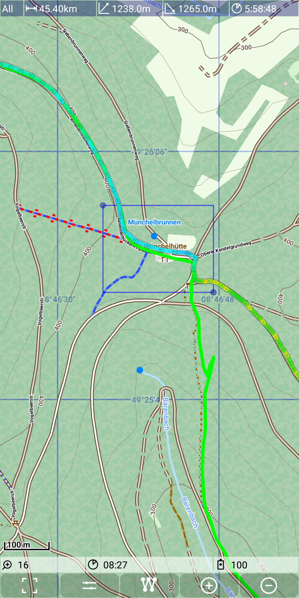
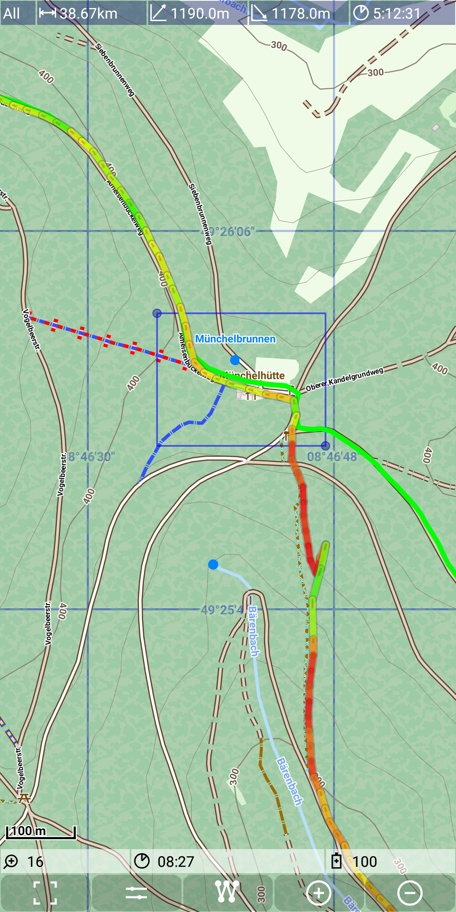

## Main Track Feature: search track(s) by marking a bounding box 

This feature means search all tracks that go through a previously marked rectangular area, also called bounding box.

The first step for the usage is to mark a rectangular area. To do this select the 
*Menu | BoundingBox | New*.

&nbsp;
&nbsp;

Now there are two Options to do the marking:
- first tap to the upper left corner and then to the lower right corner (this option is shown below)
- Make a drag action from the upper left corner to the lower right one

&nbsp;
&nbsp;

Both points (upper left and lower right) can be adjusted with drag and drop actions.

Now use the *Menu | BoundingBox | Load*.

&nbsp;
&nbsp;

As the result all tracks passing through the marked bounding box will be loaded to the set of available tracks.
In the example there are two tracks loaded. 

&nbsp;

Tap on one track to make it the selected track. Tap on the other
track to make it the selected track instead. 

&nbsp;
&nbsp;
 
With *Menu | BoundingBox | Hide* the bounding box will disappear.

Despite the loading of tracks the marking of an BoundingBox does also support the loading of the tiles of an [MapStrore](../../MainMapFeatures/MapStore/mapstore.md).
For this purpose the root directory must contain a [config.xml](../../MainMapFeatures/MapOnline/maponline.png) file with the same structure as for an online map.
Additionally there might be a sample of a tile request as a curl command in the file "sample.curl". Additional HTTPConnection request 
parameter are taken over from this sample.
 
