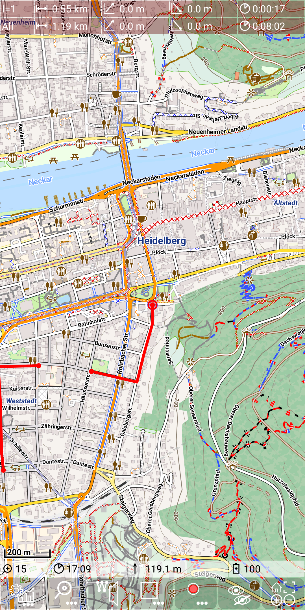
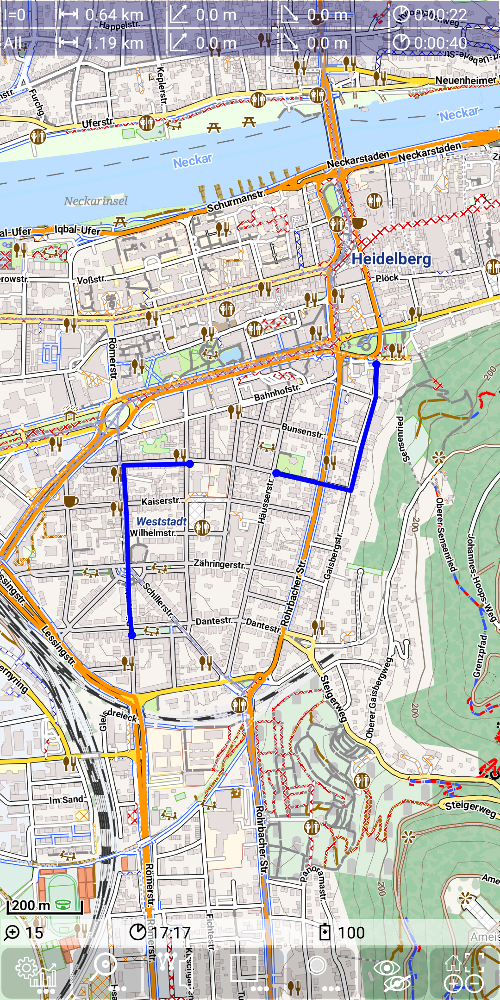

<small><small>[Back to Index](../../../index.md)</small></small>

## Main Track Feature: dashboard

The following snapshot shows one selected track.

&nbsp;

Now we want to focus on the dashboard entry.
Each dashboard entry contains five values:
- Segment indicator: 
  - **All**: covers the whole track, 
  - **I=\<nn>**: indicates, that the statistic covers the segment with index nn
- Distance: the overall length of the track (segment)
- Height gain: the height gain of the track (segment)
- Height loss: the height loss of the track (segment)
- Duration: the duration of the track (segment)

All dashboard entries have the same structure. They are [colored](../../track.md) depending on their type:
- red: statistic of recording track
- blue: statistic of selected track
- purple: statistic of a route

So next figures show some more examples of these dashboard entries:

&nbsp;
&nbsp;
&nbsp;

As we can see with the last example, multiple entries can exist at the same time,
depending on whether there is currently a recording track, a selected track and/or a route track.

If a track has multiple segments, then may have two dashboard entries, one for the whole
track and the second for one of the segments. For a recording track you always see the
whole track statistic and the statistic of the current recording segment:

&nbsp;

For a selected track the segment can be changed by tap on the
desired segment. The next example illustrates a track with two segments:

&nbsp;
&nbsp;

The total values of the track correspond to the sum of the segment values.

<small><small>[Back to Index](../../../index.md)</small></small>