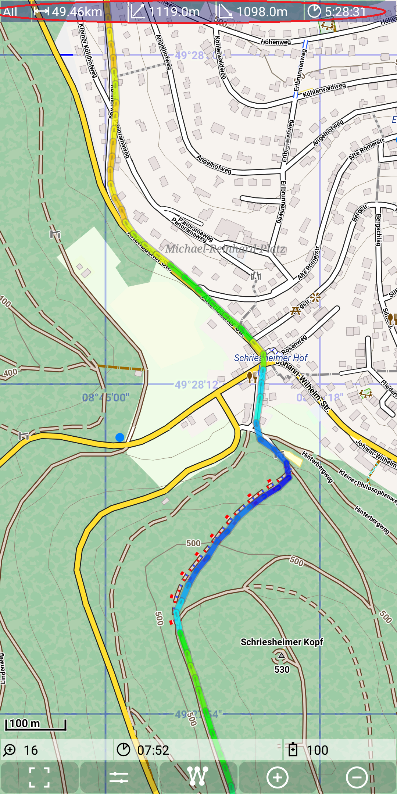
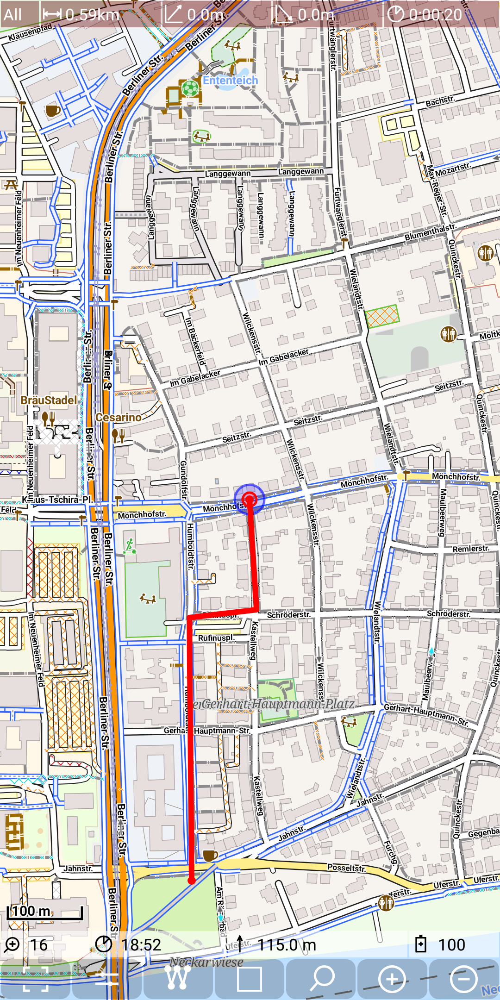
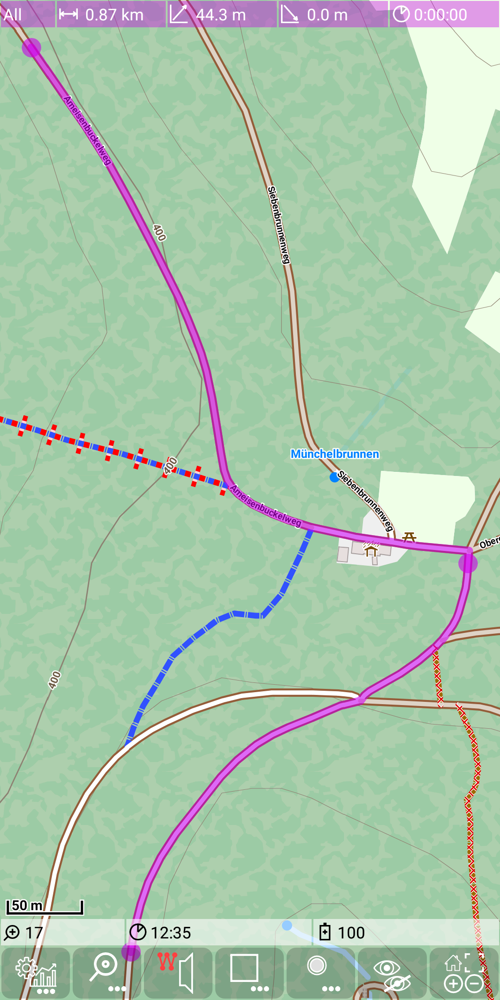
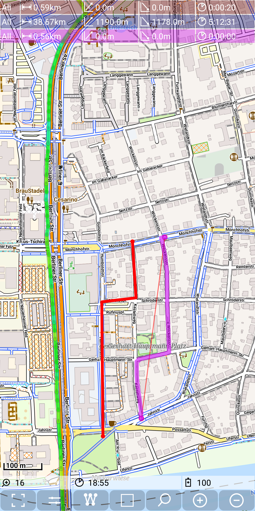
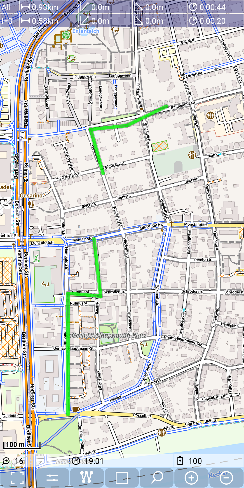

## Main Track Feature: dashboard

The following shopshot is copied from the track visualization feature.

&nbsp;

But now we want to focus on the dashboard entry. 
Each dashboard entry contains five values:
- Segment indicator: 
  - **All**: covers the whole track, 
  - **I=\<nn>**: indicates, that the statistic covers the segment with index nn
- Distance: the overall length of the track (segment)
- Height gain: the height gain of the track (segment)
- Height loss: the height loss of the track (segment)
- Duration: the duration of the track (segment)

All dashboard entries have the same structure. They are colored depending on their type:
- red: statistic of recording track
- blue: statistic of selected track
- purple: statistic of a route

So next figures show some more examples of these dashboards:

&nbsp;
&nbsp;
&nbsp;

As we can see with the last example, there can exist multiple entries at the same time, 
depending on whether the is currently a track recording, a selected track and/or a route.

If a track has multiple segments, then it gets two dashboard entries, one for the whole
track and the second for one of the segments. The segment can by changed by tap on the
desired segment. The next example illustrates a track with two segments:

&nbsp;
&nbsp;

As we can see here the total values correspond to the sum of the segment values.

